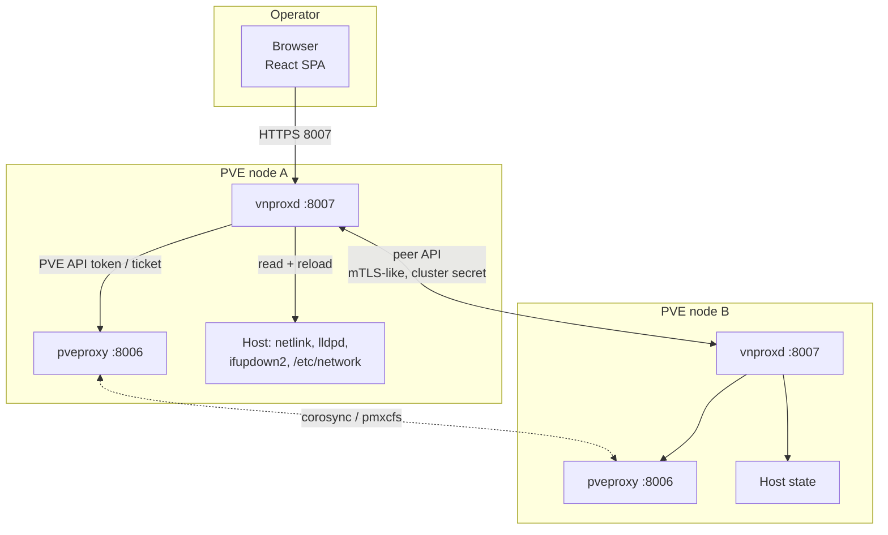
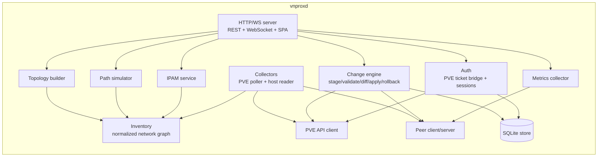
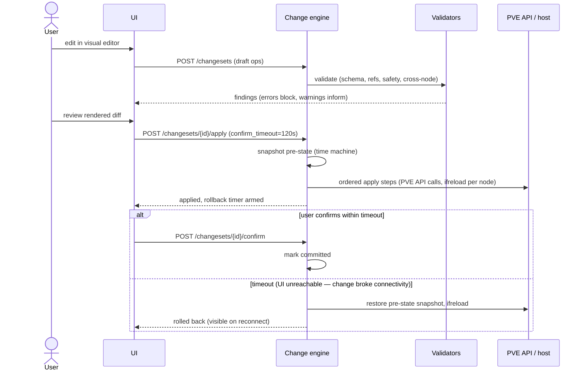

# vnprox architecture

This document is the authoritative technical design. Implementation agents must follow it; deviations require a flagged note, not a silent change.

## 1. System context

vnprox is installed **on every Proxmox VE node** as a single systemd service (`vnprox.service`) running one static Go binary (`vnproxd`). It serves the web UI and REST/WebSocket API over HTTPS on port **8007** (configurable; see §9). It talks to:

- the **PVE API** (`https://localhost:8006/api2/json`) for all cluster-level reads and most writes,
- the **local host** (netlink, `/etc/network/interfaces`, `lldpctl`, `ethtool`, `/proc/net`) for data the PVE API does not expose,
- **peer vnproxd instances** on other cluster nodes for node-local data (LLDP, live stats, drift checks).



**Key property:** any node's UI can view and manage the whole cluster. Cluster-wide config (SDN, firewall, VM NICs) goes through the PVE API from whichever node the user hit; node-local operations (ifreload, LLDP reads, stats) are proxied to the owning node's vnproxd via the peer API.

**Multi-cluster federation (Phase 12, T-1201, `internal/federation/`):** the diagram and description above are the single-cluster topology, which is still what every install runs by default. Optionally, one vnprox instance can be designated **primary** and have any number of *other* PVE clusters' vnprox instances **attached** to it — each attached cluster keeps its own independent peer mesh internally (unchanged from the diagram above) and is reached by the primary over the same kind of authenticated API call, not a new protocol. The primary aggregates reads (topology, audit, IPAM) across all attached clusters into one global view, with per-cluster failure isolation: an unreachable attached cluster is greyed out and flagged `partial`, never blanking or erroring the whole view. Federation is strictly additive — config ownership and all mutation stay per-cluster, there is no cross-cluster write path, and a zero-clusters-attached install is indistinguishable from pre-federation vnprox. A federated cluster can optionally be reached over a `internal/wireguard`-managed tunnel instead of a direct route; tying that tunnel's health into federation's own unreachability handling was specced as T-1407 but was not implemented (see the package layout note below) — today a down tunnel surfaces as ordinary per-surface unreachability, not a single collapsed finding.

## 2. Component architecture (inside vnproxd)



**Deviation flagged by T-303:** the component diagram above doesn't show an `API --> PEER` edge, but `GET /audit` and `GET /snapshots`' cluster fan-out (§7: "Audit/snapshot queries in the UI fan out to peers and merge") needed one — `internal/api` calls `*peer.Client` directly (via the small `PeerAuditSource`/`PeerSnapshotSource` interface seams in `internal/api/clusterfanout.go`) rather than routing through `internal/change`, since audit/snapshot listing isn't change-engine-owned data. This is the same "small interface, real type satisfies it" seam pattern every other cross-package dependency in this diagram already uses; noted here rather than silently diverging from the diagram.

### Package layout (Go)

Core packages (Phases 0–7):

```
cmd/vnproxd/            main: flags, config load, wiring, graceful shutdown
internal/api/           HTTP router, handlers, WS hub, middleware
internal/auth/          PVE ticket bridge, sessions, permission mapping
internal/pve/           PVE API client (typed, minimal)
internal/pvemock/       mock PVE server + fixtures for tests/dev
internal/host/          local host readers: netlink, interfaces(5) parser,
                        lldp, ethtool, stats
internal/inventory/     normalized model + graph, delta computation
internal/topology/      graph -> renderable topology (layers, filters)
internal/change/        changesets, validators, differ, applier, rollback
internal/sim/           path simulator (firewall + routing evaluation)
internal/ipam/          subnet/allocation views, PVE IPAM plugin bridge
internal/metrics/       interface counters, rate computation, history rings
internal/peer/          intra-cluster API (client + server, shared secret)
internal/store/         SQLite (schema, migrations, repositories)
internal/config/        daemon config file parsing/validation
internal/sdn/           zone -> vnet -> subnet SDN cockpit projection
internal/fw/            pure, I/O-free firewall resolution engine (T-501)
internal/evpn/          EVPN/BGP observability (peering, VNIs, exit nodes)
internal/drift/         cross-node config-consistency (drift) engine
internal/neighbor/      ARP/neighbor-table fan-out
internal/dhcp/          dnsmasq lease-file reader fan-out
internal/blueprint/     parameterized topology templates
internal/findings/      unified findings stream (drift, LLDP, IPAM, health)
internal/fwlog/         cluster-wide pve-firewall log viewer
```

Phase 8–12 additions ("Beyond the cluster" — `docs/roadmap-next.md`):

```
internal/collect/       poll loops: PVE poller + host reader fan-out
internal/flow/          flow ingestion engine (stdlib-only wire parsing)
internal/spec/          declarative cluster network spec (T-1101)
internal/probe/         guest-agent live path probe engine
internal/pbs/           Proxmox Backup Server network awareness
internal/switchdrv/     driver abstraction for guarded switch config push
internal/switchmock/    in-memory SwitchDriver test double
internal/federation/    multi-cluster registry, fan-out, failure isolation
internal/apicontract/   T-1106 API-conformance suite (drives the real router)
internal/automation/    webhook half of the automation surface
```

Phase 13–15 additions ("The open platform" arc, part 1 — deep-sight
diagnostics, edge networking, workload awareness):

```
internal/capture/       distributed packet-capture engine (T-1301)
internal/capturemock/   scripted, hardware-free capture agent double
internal/latmesh/       continuous latency & loss mesh (T-1303)
internal/guestinterior/ guest network interior inspector (T-1304)
internal/mtuprobe/      active per-path MTU discovery (T-1306)
internal/diagnose/      guided diagnosis ladder over the above (T-1307)
internal/wireguard/     WireGuard tunnel engine core: app-owned key custody,
                        changeset-integrated apply (T-1401)
internal/edge/          Edge & NAT cockpit projection (T-1403)
internal/ipv6/          IPv6 enablement suite, read side (T-1404)
internal/wan/           WAN & upstream health, per-uplink (T-1405)
internal/ingress/       read-only reverse-proxy discovery (T-1406)
internal/k8s/           Kubernetes overlay mapping engine, read-only (T-1501)
internal/k8smock/       hardware-free k8s API server double
internal/ceph/          Ceph network awareness (T-1503)
internal/qos/           bridge-level per-service traffic shaping (T-1505)
internal/migration/     migration network planner (T-1507)
```

> Note: T-1407 ("tunnel-aware federation transport," linking `internal/federation`
> and `internal/wireguard`) is specced in `planning/tasks/phase-14.md` but was
> **not implemented** — there is no corresponding package.

Phase 16–17 additions ("The open platform" arc, part 2 — findings depth and
the platform surface):

```
internal/baseline/      per-guest/segment traffic baselining (T-1601)
internal/microseg/      microsegmentation planner core (T-1602)
internal/failsim/       failure-impact simulation core (T-1604)
internal/capacity/      capacity forecasting (T-1606)
internal/posture/       cluster-wide security/health posture score (T-1607)
internal/mcp/           read-only Model Context Protocol server (T-1701)
internal/plugin/        capability-scoped extension SDK (T-1702)
internal/tenant/        multi-tenancy & self-service (T-1703)
internal/ha/            active/standby vnproxd HA, lease fencing (T-1704)
internal/hub/           client for the public blueprint/plugin registry (T-1705)
internal/docexport/     "as-built" config documentation export
internal/xnode/         pure cross-node comparison families (drift/apicontract)
```

Phase 27 addition ("Config as code"):

```
internal/gitsync/       git-backed spec sync: a repository as the source of
                        intent, reconciled into a DRAFT changeset (T-2701)
```

**`internal/gitsync` and D5 (T-2701).** Decision D5 — "Proxmox configs remain source of
truth" — is the invariant this package is most able to break, so the boundary is worth
stating here rather than only in the package. A git repository becomes the source of
*intent*; it never becomes authoritative over live config. On each poll the service
fetches one file at one ref over plain HTTPS, runs the existing `internal/spec`
`Parse` + `Import` against the live inventory snapshot, and — if the resulting plan is
non-empty — opens or updates **one** draft changeset and stops. It has no apply path,
and that is structural rather than conventional: the only change-engine surface it
holds is `gitsync.ChangesetStager` (`CreateWithOrigin`/`UpdateDraft`/`List`), which has
no Apply/Confirm/Rollback/Discard method, the same interface-surface boundary
`internal/mcp` (§13.1) and `internal/plugin` (§11) already draw. Sync drafts carry
`origin: "gitsync"`, so they are distinguishable everywhere a changeset is rendered.

**The git-access decision (T-2701, recorded because the arc's risk register asked for
it explicitly).** vnprox neither shells out to a `git` binary nor links a Go git
library. `packaging/debian/control.tmpl` declares no `Depends:` at all, so a `git`
subprocess would add the first hard runtime dependency the .deb has ever had — plus a
subprocess whose argv carries an operator-supplied remote URL, into a design whose
security model enumerates every external command and pins each to a fixed argv (git
remote URLs are a known argument-injection surface). A git *library* is the "large
dependency" the register names, an order of magnitude beyond fetching one file. The
requirement is a read-only fetch of one file at one ref, and it is met with `net/http`
and no new dependency. The consequence is stated rather than hidden: with no git object
graph, commit-signature verification operates on the commit object the host reports
(verified locally against the operator's own allowed-signers file — never the host's
own "verified" flag), and binding file content to that commit's tree would need the git
object protocol. See `docs/security.md`'s "Git spec-sync credential" note for the full
residual.

`web/` — React SPA (see docs/development.md). `packaging/` — deb packaging,
systemd unit, installer script.

## 3. Data flow — read path

1. **Collectors** run on a poll loop (default 10s for PVE API, 5s for local host, 30s for LLDP) and on-demand after any applied change.
2. Results are normalized into the **inventory model** (`docs/data-model.md`): one typed graph of nodes/edges covering physical → virtual → overlay → guest layers.
3. Inventory computes **deltas** between polls; deltas are pushed to subscribed UI clients over WebSocket (`topology.delta` events) so the map updates live without refresh.
4. The **topology builder** projects the inventory graph into the layered, filterable structure the UI renders (per-layer visibility, grouping, saved layouts).

The inventory is in-memory and rebuilt on startup — it is a cache of live state, never persisted as truth.

## 4. Data flow — write path (the change engine)

Every mutation, without exception, is a **changeset**: an ordered list of typed operations (e.g. `bridge.create`, `bond.update`, `sdn.vnet.create`, `fw.rule.move`). The lifecycle:



Design points:

- **Validation** is layered: schema (types/ranges), referential (does `bond0` exist; is `eno1` already enslaved), **safety** (refuses ops that would orphan the node's management IP or the vnprox/corosync links unless explicitly overridden), and **cross-node consistency** (T-801: folds the changeset's projected effect across every cluster node and blocks on same-named bridge divergence, MTU asymmetry, or an SDN zone realization gap the change would introduce or leave uncorrected — the same comparisons the async drift checker runs against live state, shared via `internal/xnode`, run against the would-be state at review time). The earlier "this cross-node class does not exist, cross-node divergence is caught only after the fact by the drift checker" gap (flagged at T-607) is closed; see `docs/features/change-management.md` §2 for the class's position, codes, and fixable/not-fixable split.
- **Apply** produces an explicit ordered plan (visible to the user before apply): per-node steps, PVE API steps, and an SDN apply step where needed. **Correction (flagged, T-607 docs audit):** node-network steps (bridge/bond/VLAN/interface ops) do **not** go through PVE's `PUT /nodes/{node}/network` API as this line previously said — `internal/change`'s `NodeAgent` (`cmd/vnproxd/changeagent.go`) writes `/etc/network/interfaces` directly and execs `ifreload -a` itself (vnprox runs on the node, so it can — and does — write the file vnprox itself will re-read, the same file real PVE's own `pvedaemon` would read/write). The PVE API's node-network endpoint is never called by the apply engine for these ops; `PVEGateway` is used only for cluster-scope SDN ops (`sdn.*`). This distinction is invisible in production (both the write and any later read converge on the same on-disk file) but is real: `internal/pvemock`'s mirrored `PUT /nodes/{node}/network` handler exists and is exercised by that package's own tests, but is dead code from the change engine's perspective — a `bridge.create` applied against pvemock never calls it, so pvemock's in-memory network model and the dev host-writer sandbox (`[safety] dev_interfaces_dir`) can genuinely diverge in a dev/test environment (found via this task's own soak-test harness). Not release-blocking (production has no such gap); noted for anyone extending pvemock/dev-mode testing around node-network changes.
- **Commit-confirm** (Junos-style): after apply, a rollback timer runs *on the node's daemon*, not in the browser. Confirmation requires a round-trip from the user's browser through the API — if the change severed connectivity, confirmation can't arrive and the pre-state is restored automatically.
- **What the unattended rollback can actually revert (T-1805, `docs/roadmap-proven.md` decision D1).** The timer fires inside the daemon with no user session, so the question of *which* mutations it can undo is a question of which need a user credential. Node-file changes, WireGuard, QoS and switch-port pushes are all performed by daemon-level gateways (root file writes, `ifreload`, `wg-quick`, `tc`, the switch driver) and have always reverted unattended. **PVE firewall and SDN writes are different**: §6 makes them go out under the *user's* ticket, so before T-1805 they had no unattended revert at all — a `fw.*`-only changeset that timed out simply stayed applied, and `planning/reports/T-502.md` flagged it as the one genuine hole in this guarantee. D1 closes it by sealing the applying user's PVE ticket into the changeset row (AES-256-GCM, the one session key) *before the first mutating step*, reverting with it on the timeout and crash-recovery paths, and wiping it the instant the changeset leaves `awaiting_confirm` by any path. It is not a second mutation path: the revert runs the same rollback machinery with a credential it previously lacked. Coverage is bounded by the ticket's own ~2h life and is **reported at apply time** (`unattendedRevert` in docs/api.md), so a changeset whose confirm window would outlive the session says so up front rather than silently promising a safety net it does not have.
- **Snapshots** capture, per changeset: `/etc/network/interfaces` per affected node, relevant `/etc/pve/sdn/*.cfg`, and affected firewall files. Stored in SQLite with hashes; power the time machine (diff/restore any point).
- **Concurrency:** one changeset may be in `applying` state cluster-wide at a time (lock via SQLite on the coordinating node + peer advisory check). Drafts are unlimited.

## 5. Cluster model

- vnproxd runs on every node; there is **no elected leader**. Each daemon is capable of coordinating a changeset; the coordinating daemon is simply the one the user's browser is talking to.
- Peer discovery: node list from the PVE API (`/cluster/status`); peers are reached at `https://<node-ip>:8007/api/peer/...`.
- Peer auth: a **cluster secret** generated at first install and distributed via `/etc/pve/priv/vnprox/` (pmxcfs — already cluster-replicated and root-only; specifically under `priv/`, the one pmxcfs subtree that actually enforces 0600, confirmed by hardware validation against a real PVE 9.2.4 node — see `internal/peer/secret.go`). Peer requests are authenticated with an HMAC of the request over this secret plus TLS.
- Single-node (no cluster) works identically with zero peers.
- Version skew: peers exchange versions; a daemon refuses to coordinate changes involving a peer with an incompatible schema version (upgrade prompt in UI).

## 6. Auth model

- Users log in with their **existing Proxmox credentials** (any realm: PAM, PVE, LDAP/AD, OIDC) — vnproxd forwards to PVE `POST /access/ticket`, then issues its own HttpOnly session cookie. The PVE ticket (+ CSRF token) is held server-side per session and renewed before its 2h expiry.
- **Authorization is delegated to PVE**: writes are performed with the *user's* ticket, so PVE ACLs are enforced by PVE itself. vnprox additionally maps PVE privileges (`Sys.Modify`, `Sys.Audit`, `SDN.Allocate`, `SDN.Audit`, ...) to UI capability flags so users see read-only views instead of failing writes.
- Host-level operations that bypass the PVE API (LLDP read, stats, interface file snapshot/restore) run as root inside the daemon and are gated on the session holding the equivalent PVE privilege (`Sys.Modify` on `/nodes/{node}` for writes, `Sys.Audit` for reads).
- **The consequence for unattended rollback, and D1's answer (T-1805).** "Writes are performed with the *user's* ticket" is the reason vnprox cannot exceed a user's PVE ACLs — and also the reason a `fw.*`/`sdn.*` change had no way to revert itself once the request that applied it ended: the daemon holds no PVE write credential of its own (the single privileged internal identity, `vnprox@pve!daemon`, is read-only and must stay that way). Two answers were rejected before D1: a **standing daemon-held scoped token** — a permanent privileged credential at rest, and a revert that acts as vnprox rather than as the user, breaking both this section's delegation model and PVE's own audit attribution — and **confirm-only with a warning**, truthful but leaving the core safety promise holed. D1 instead scopes a credential to one changeset and one window: the applying user's ticket is sealed at apply time, is reachable only from that changeset's own revert path (no route, MCP tool, or plugin capability can unseal it — verified by a registry-enumeration test, not by convention), authorizes nothing but the ops that changeset already applied under the same identity, and is wiped the moment the window closes. PVE still enforces its own ACLs on every revert call, because the revert *is* the user. See `docs/security.md`'s "Apply-time revert ticket" note for the full credential lifecycle.
- Full details and threat model: `docs/security.md`.

## 7. Storage

SQLite (embedded, WAL mode) at `/var/lib/vnprox/vnprox.db`, one DB per node. Contents are **node-local app data only**:

| Data | Notes |
|---|---|
| sessions | id, user, PVE ticket (encrypted at rest), expiry |
| changesets | ops JSON, status, validation findings, apply log |
| snapshots | config file blobs + hashes, linked to changesets |
| audit log | who/what/when/result for every mutation |
| layouts | per-user saved topology layouts/filters |
| metrics rings | short-horizon (24h) counter history |
| kv | schema version, install id, settings |
| ingress_targets | operator-configured reverse-proxy discovery targets (T-1406): kind, address, encrypted credential — never a snapshot of the target's own discovered state, which is polled fresh on every `GET /ingress/status` |

Cluster-shared data is intentionally minimal (the cluster secret under `/etc/pve/priv/vnprox/` and instance settings under `/etc/pve/vnprox/`, both replicated by pmxcfs). Audit/snapshot queries in the UI fan out to peers and merge.

## 8. Frontend architecture

- React 18 + TypeScript strict + Vite; embedded into `vnproxd` via Go `embed.FS` (single-binary deploy).
- **Topology canvas:** `@xyflow/react` (React Flow) with a custom layered layout (elkjs), custom node types per entity kind, layer toggles (physical / L2 / SDN-overlay / guests), and edge bundling for VLAN trunks.
- Server state: TanStack Query + a WebSocket bridge that applies `*.delta` events into query caches. Client state: zustand (canvas UI state only).
- Styling: Tailwind CSS + Radix primitives; dark mode default (matches PVE admin ergonomics), light mode supported.
- All user-facing mutations flow through a single **ChangesetDrawer** UX: edits accumulate in a draft basket → review diff → apply with confirm countdown. No fire-and-forget edit dialogs anywhere.

## 9. Ports and coexistence

- Default **8007/tcp HTTPS**. This is also Proxmox Backup Server's port: the installer detects a listener on 8007 (or an installed PBS) and prompts for an alternative (suggested: 8008), writing it to `/etc/vnprox/vnprox.toml`. All docs refer to 8007 as default.
- TLS: reuses the node's PVE certificate (`/etc/pve/local/pve-ssl.pem` + key, or `pveproxy-ssl.pem` if a custom cert is installed) so the browser trust story matches PVE; auto-reloaded on renewal. Override possible in config.
- WebSocket shares 8007 (`/api/ws`).
- **Peer-API CA pinning (T-1906).** The certificate above is what a peer daemon *presents*, so it is also what a peer daemon must be *checked against*. `internal/peer.Client` pins the cluster's own root CA — `/etc/pve/pve-root-ca.pem` by default, `[peer] ca_file` to override — as the sole trust anchor for every `https://<node-ip>:8007/api/peer/...` connection. The system certificate pool is not consulted at all. Before this, the peer client inherited `net/http`'s default trust store, which meant a certificate from **any** publicly-trusted CA, plus a position on the management network, was enough to impersonate a peer daemon — and the peer API is a mutation surface (cross-node changeset application, distributed rollback timers, host writes). Four properties make the pin real rather than decorative:
  - **Fail closed.** With no readable anchor, every peer is unverifiable: requests fail before a byte is sent, with `peer_untrusted`. There is no fallback to the system pool, ever.
  - **Degradation is configured, never inferred.** A host that genuinely has no `/etc/pve` can select `[peer] tls_trust = "system"` or `"insecure"`, but only together with that mode's own exact `tls_trust_ack` literal (a two-key interlock, the same shape `[switches]` uses), and the daemon logs a `WARN` naming what was given up on **every** startup. A missing file, an unset key, or a typo can never produce an unpinned daemon — it produces a refusal to start.
  - **Rotation without a restart.** The anchor file is re-read on a bounded cadence (30 s) and the transport's pooled connections are dropped when its bytes change, so `pvecm updatecerts -f` does not require restarting `vnproxd`.
  - **Untrusted ≠ unreachable.** A peer that fails verification and a peer that does not answer produce different findings (`peer_untrusted`, error, vs `peer_unreachable`, warning), so an operator can tell an attack from a cable. Both still satisfy `errors.Is(err, peer.ErrPeerUnreachable)`, so every existing degrade-around-a-dead-peer path is unchanged.

## 10. Key decisions (locked)

| # | Decision | Rationale |
|---|---|---|
| D1 | Go single binary, on-node deployment | No runtime deps on PVE hosts; direct host access needed for LLDP/ifreload/rollback; appliance-grade ops |
| D2 | React + TS + React Flow frontend, embedded | Modern interactive canvas is the core product surface |
| D3 | PVE API with user's ticket for writes | PVE ACLs enforced by PVE; no privilege escalation through vnprox |
| D4 | All mutations via change engine with commit-confirm | The core safety differentiator; non-negotiable |
| D5 | Proxmox configs remain source of truth; SQLite for app data only | vnprox must never fight pvecfg/pmxcfs; uninstalling vnprox leaves a working cluster |
| D6 | Peerless symmetric cluster design (no leader) | Simplicity; PVE already provides cluster membership and pmxcfs |
| D7 | Port 8007 default with PBS conflict detection | Product requirement; PBS coexistence handled at install |
| D8 | Support Linux bridges + OVS + full SDN stack | "All networking in Proxmox," not a subset |
| D9 | Target PVE 8.2+ and 9.x (10.x/11.x forward target for the v3.0 arc) | ifupdown2 default, SDN GA, DHCP/IPAM present; each PVE major gets a validation pass within one phase of its release |
| D10 | **Platform API freeze at v3.0** — the MCP tool surface (T-1701), the plugin SDK interfaces (T-1702), and the WebSocket `"events"` stream schema (T-1104) become stable, documented compatibility contracts | v3.0 is the platform release (`docs/roadmap-universal.md`, Compatibility & versioning). Same deprecation policy the changeset API adopted at v1.7: additive-only within a version; a breaking change mints a new version and keeps the old accepted for ≥1 minor release. The frozen surfaces are enumerated in §13 |
| D11 | **Peer wire protocol stays at version 2 across v3.0** — T-1704's `POST /api/peer/ha/replicate` is additive at protocol 2, not a bump | An HA pair runs the same build; the route is 503-nil-safe on any peer that does not serve it, so it follows the same additive-route precedent as every observability peer route (only routes the cross-node write/coordination path depends on force a bump — §5, `docs/api.md` Peer API). See §13 |

## 11. Plugin SDK extension points (T-1702)

`internal/plugin` freezes a small, versioned set of extension points third parties
can implement — the read/discovery/ingest/render seams, plus the write-adjacent
switch-driver seam bounded by the change engine. The frozen v1 surface:

| Extension point | v1 interface | Class | Min capability |
|---|---|---|---|
| `switchDriver` | `internal/switchdrv.SwitchDriver` (reused verbatim) | write-adjacent, dark-by-default | `netWrite` |
| `flowIngestor` | `plugin.FlowIngestor` | read-only decode | `netRead` |
| `findingProducer` | `plugin.FindingProducer` | read-only | `netRead` |
| `ingressDiscoverer` | `internal/ingress.IngressDiscoverer` (reused verbatim) | read-only | `netRead` |
| `dashboardTile` | `plugin.DashboardTileProvider` | read-only | `netRead` |

**API-stability contract.** These interfaces are frozen at `plugin.APIVersion == "v1"`.
A plugin records the api version it was built against; the registry refuses one it
does not understand. Two of the five points reuse an already-shipped interface
verbatim (switchdrv, ingress) rather than forking it.

**Deprecation policy.** A v1 interface is never edited in place — widening or changing
a method signature is a breaking change that mints a new `APIVersion` ("v2"), with v1
kept accepted for at least one minor release before removal, and the deprecation noted
here and in `docs/api.md`. Adding a new *extension point* (a new `ExtensionPoint`
constant + interface) is additive and does not bump the api version. This mirrors D3/D4:
the plugin surface is a compatibility contract, designed conservatively — easier to
widen later than to narrow.

**The one boundary.** Plugins never gain an apply path. The only change-engine surface
handed to plugin code is `plugin.Stager` (Create/Validate — stage-only); no
Apply/Confirm/Rollback method is reachable, in-process or over the out-of-process
transport (D4 holds for plugins too). A plugin's declared capabilities are a *ceiling*
checked against `internal/auth`'s existing vocabulary — the SDK adds no new privilege.
Out-of-process plugins (`internal/plugin/procshim`) run as supervised subprocesses with
no DB/file access, speaking a length-delimited JSON wire protocol over stdio.
## 12. HA topology (active/standby)

T-1704 adds an **optional** active/standby daemon pair so vnproxd itself is not the single
point of failure a failure simulation would flag. It is disabled by default (`[ha] enabled =
false`); a single-daemon deployment behaves exactly as before.

**Single-writer via a fenced lease.** An `ha_lease` singleton row (`holder`, `term`,
`expiresAt` — see `docs/data-model.md`) is the sole source of truth for who may drive
apply/confirm/rollback. The active renews it on a short interval; a standby promotes **only**
after the last-observed lease has expired past a fencing margin — never on a transient
replication blip. `term` is a monotonic fencing token: a promotion always writes a
strictly-higher term, an isolated active that cannot confirm its lease with the peer for a
whole lease TTL self-demotes (fail-safe), and a demoted former-active that later observes a
newer term takes no apply/confirm/rollback action. `change.Service`'s unattended timer
callbacks consult a `LeaderGuard` (the manager's `IsLeader`) and fire as no-ops off the leader,
so two daemons can never both drive the same changeset.

**State replication.** The active pushes changesets, `changeset_schedules`, `api_tokens`, the
audit log, and the in-flight pre-apply snapshots a rollback depends on (`snapshots` +
`snapshot_files` + `blobs`) to the standby over `internal/peer`'s existing TLS+HMAC channel
(`POST /api/peer/ha/replicate`). Metrics rings are excluded (bounded/ephemeral). Because
`confirm_deadline` and the schedule windows are absolute unix timestamps, they replicate
verbatim; on promotion the new active re-arms every timer **through T-205/T-1103's existing
`ArmPendingRollbacks`/`TickSchedules` re-arm path** — reproducing the same absolute deadline,
never a fresh one — and reconciles with T-304's node-local rollback timers rather than fighting
them.

**Failover trigger.** `[ha] mode = "vip"|"dns"` selects an operator-provided integration point
vnprox merely triggers on promotion: VIP mode runs an operator command (e.g. a script that moves
a virtual IP with a gratuitous ARP); DNS mode POSTs to an operator webhook that repoints a
service record. vnprox neither ships nor manages the VIP/ARP/DNS mechanism itself — no new
daemon dependency. `GET /ha/status` reports role/term/lease-expiry/replication-lag, and a
standby lagging past a configured threshold raises the `ha_replication_degraded` finding.

**Relationship to D6.** This does not reintroduce a cluster leader: D6's peerless symmetric
model still governs cluster-wide read/write coordination. The HA lease governs only *daemon*
failover within an optional active/standby pair.

**Hub install path (T-1705).** The Blueprint & plugin hub (`internal/hub`, §Hub in `docs/api.md`)
is how a plugin is installed from a public registry. It is a catalog/install-orchestration
layer, not a widening of this boundary: it downloads a `{manifest, signature}` artifact,
verifies the Ed25519 signature against the same trust store blueprint bundles use, and only
then installs the manifest through **this** registry's `Install` — which re-validates the
capability scope. No Hub path reaches `Registry.Install` without that scope check, and only
out-of-process (`grpc`) plugins are installable this way (an in-process plugin is build-time
Go code that cannot be materialized from a downloaded manifest).

## 13. Platform API freeze (v3.0, T-1707)

v3.0 is the platform release. Three programmable surfaces that opened during Phases 11–17 —
the **MCP tool surface**, the **plugin SDK interfaces**, and the **WebSocket `"events"` stream
schema** — become stable, documented compatibility contracts (decision D10). This section is the
authoritative enumeration of exactly what is frozen; a reviewer can check it against the code and
against `docs/api.md`. Nothing outside this list is a frozen contract.

**The deprecation policy (identical to the changeset API's, declared at v1.7).** A frozen surface
is **additive-only** within its version: new optional fields, new optional tool parameters, new
tools/events/extension points may be added without a version bump, but no field/tool/event is ever
renamed or removed and no method signature is changed in place. Any breaking change mints a new
version (`v2`), announced here and in `docs/api.md`, with the previous version kept accepted for at
least one minor release before removal.

### 13.1 MCP tool manifest — frozen v1 (T-1701)

The MCP server (`internal/mcp`, `docs/api.md` "MCP server") exposes a **fixed, enumerable** nine-tool
allowlist; this is itself the security boundary (`docs/security.md`, "MCP stage-only boundary"), not
merely an API-stability statement. The frozen v1 manifest:

| Tool | Required scope | Class |
|---|---|---|
| `topology.get` | `netRead` | read |
| `findings.list` | `netRead` | read |
| `flows.query` | `netRead` | read |
| `ipam.subnets.list` | `netRead` | read |
| `simulate.path` | `netRead` | read (static analysis) |
| `diagnose.run` | `netRead` | read/advisory (never escalates to capture over MCP) |
| `changesets.diff` | `netRead` | read |
| `changesets.create` | `netWrite` | **stage-only** (`origin: "mcp"`, never applied) |
| `changesets.validate` | `netWrite` | stage-only |

No `apply`/`confirm`/`rollback`/`discard` tool exists or can be added — a package-load check rejects
any tool whose name matches those verbs, and the change-engine seam handed to the server has no
mutation method (interface-surface test). Freezing this manifest at v1 means: a new read/stage tool
may be added additively; a mutating tool never can. The negotiated protocol version string
(`2025-06-18`) is the MCP wire protocol, independent of this v1 manifest freeze.

### 13.2 Plugin SDK interfaces — frozen v1 (T-1702)

The five extension-point interfaces in §11 are frozen at `plugin.APIVersion == "v1"` with the
deprecation policy already stated there (widening mints a new `APIVersion`; a new extension point is
additive). Restated here as a frozen v3.0 contract for completeness: `switchDriver`, `flowIngestor`,
`findingProducer`, `ingressDiscoverer`, `dashboardTile`, each with the capability-ceiling and
stage-only `Stager` boundary §11 describes. The registry refuses a plugin built against an
`APIVersion` it does not understand.

### 13.3 Event-stream schema — frozen v1 (T-1104)

The WebSocket `"events"` topic (`docs/api.md` "WebSocket `/api/ws`") is frozen: the **flat**
`{"event": "<name>", ...payload}` envelope (no nested payload wrapper), and the event set the
`"events"` topic delivers — `changeset.status`, `drift.changed`, `findings.changed`,
`audit.appended` (the automation-scope-gated superset), plus the per-topic producers
`topology.delta`, `metrics.sample`, `firewall.log.batch`, `flow.batch`. Freezing means a new event
may be added and a payload may gain a new optional field, but the envelope shape and every existing
event/field name are stable — the same promise `internal/topology/hub.go`'s "all future event
producers must keep this envelope" comment already makes, now a versioned contract. The
`internal/apicontract` golden-fixture suite (`make check`) is this repo's enforcement of the
changeset-API half of the freeze; the MCP registry-enumeration test and the plugin interface-surface
test enforce the other two.

### 13.4 Peer wire protocol — compatibility stance (T-1704)

The internal peer protocol (`internal/peer`, `docs/api.md` "Peer API") is **not** part of the public
platform freeze — it is an internal-only, same-build-to-same-build contract (`GET /api/peer/version`
gates cross-node coordination on an exact `ProtocolVersion` match). For v3.0 it stays at
**version 2** (decision D11): T-1704's `POST /api/peer/ha/replicate` is additive at protocol 2, not a
bump, because an HA active/standby pair always runs the same build and the route is 503-nil-safe on
any peer that does not serve it — the same additive-route precedent every observability peer route
follows (only routes the cross-node write/coordination path depends on force a bump). Non-HA
deployments and mixed-version rolling upgrades are unaffected: a peer that does not serve
`ha/replicate` is simply never asked to (HA replication only ever targets the operator-configured
standby, never an arbitrary cluster peer).
