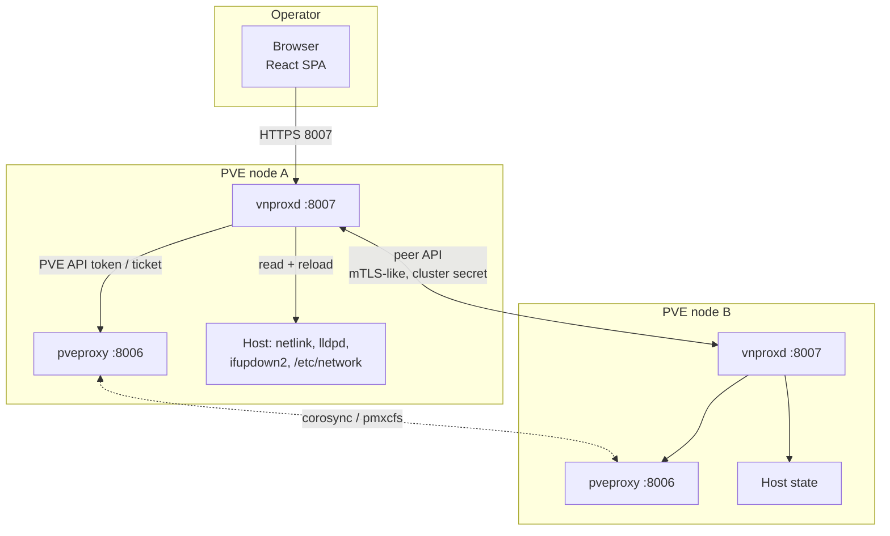
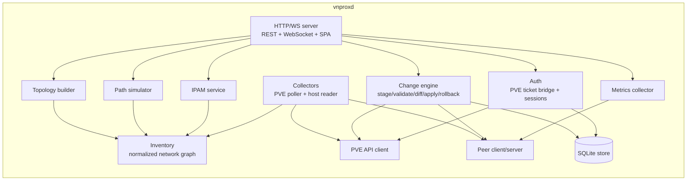
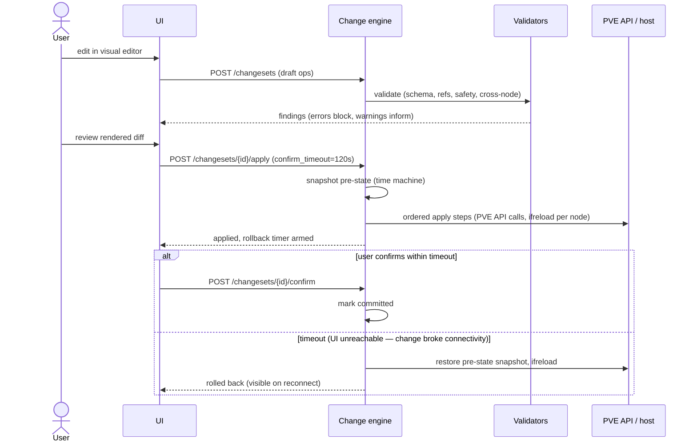

# vnprox architecture

This document is the authoritative technical design. Implementation agents must follow it; deviations require a flagged note, not a silent change.

## 1. System context

vnprox is installed **on every Proxmox VE node** as a single systemd service (`vnprox.service`) running one static Go binary (`vnproxd`). It serves the web UI and REST/WebSocket API over HTTPS on port **8007** (configurable; see §9). It talks to:

- the **PVE API** (`https://localhost:8006/api2/json`) for all cluster-level reads and most writes,
- the **local host** (netlink, `/etc/network/interfaces`, `lldpctl`, `ethtool`, `/proc/net`) for data the PVE API does not expose,
- **peer vnproxd instances** on other cluster nodes for node-local data (LLDP, live stats, drift checks).



**Key property:** any node's UI can view and manage the whole cluster. Cluster-wide config (SDN, firewall, VM NICs) goes through the PVE API from whichever node the user hit; node-local operations (ifreload, LLDP reads, stats) are proxied to the owning node's vnproxd via the peer API.

## 2. Component architecture (inside vnproxd)



**Deviation flagged by T-303:** the component diagram above doesn't show an `API --> PEER` edge, but `GET /audit` and `GET /snapshots`' cluster fan-out (§7: "Audit/snapshot queries in the UI fan out to peers and merge") needed one — `internal/api` calls `*peer.Client` directly (via the small `PeerAuditSource`/`PeerSnapshotSource` interface seams in `internal/api/clusterfanout.go`) rather than routing through `internal/change`, since audit/snapshot listing isn't change-engine-owned data. This is the same "small interface, real type satisfies it" seam pattern every other cross-package dependency in this diagram already uses; noted here rather than silently diverging from the diagram.

### Package layout (Go)

```
cmd/vnproxd/            main: flags, config load, wiring, graceful shutdown
internal/api/           HTTP router, handlers, WS hub, middleware
internal/auth/          PVE ticket bridge, sessions, permission mapping
internal/pve/           PVE API client (typed, minimal)
internal/pvemock/       mock PVE server + fixtures for tests/dev
internal/host/          local host readers: netlink, interfaces(5) parser,
                        lldp, ethtool, stats
internal/inventory/     normalized model + graph, delta computation
internal/topology/      graph -> renderable topology (layers, filters)
internal/change/        changesets, validators, differ, applier, rollback
internal/sim/           path simulator (firewall + routing evaluation)
internal/ipam/          subnet/allocation views, PVE IPAM plugin bridge
internal/metrics/       interface counters, rate computation, history rings
internal/peer/          intra-cluster API (client + server, shared secret)
internal/store/         SQLite (schema, migrations, repositories)
internal/config/        daemon config file parsing/validation
web/                    React SPA (see docs/development.md)
packaging/              deb packaging, systemd unit, installer script
```

## 3. Data flow — read path

1. **Collectors** run on a poll loop (default 10s for PVE API, 5s for local host, 30s for LLDP) and on-demand after any applied change.
2. Results are normalized into the **inventory model** (`docs/data-model.md`): one typed graph of nodes/edges covering physical → virtual → overlay → guest layers.
3. Inventory computes **deltas** between polls; deltas are pushed to subscribed UI clients over WebSocket (`topology.delta` events) so the map updates live without refresh.
4. The **topology builder** projects the inventory graph into the layered, filterable structure the UI renders (per-layer visibility, grouping, saved layouts).

The inventory is in-memory and rebuilt on startup — it is a cache of live state, never persisted as truth.

## 4. Data flow — write path (the change engine)

Every mutation, without exception, is a **changeset**: an ordered list of typed operations (e.g. `bridge.create`, `bond.update`, `sdn.vnet.create`, `fw.rule.move`). The lifecycle:



Design points:

- **Validation** is layered: schema (types/ranges), referential (does `bond0` exist; is `eno1` already enslaved), **safety** (refuses ops that would orphan the node's management IP or the vnprox/corosync links unless explicitly overridden), and **cross-node consistency** (T-801: folds the changeset's projected effect across every cluster node and blocks on same-named bridge divergence, MTU asymmetry, or an SDN zone realization gap the change would introduce or leave uncorrected — the same comparisons the async drift checker runs against live state, shared via `internal/xnode`, run against the would-be state at review time). The earlier "this cross-node class does not exist, cross-node divergence is caught only after the fact by the drift checker" gap (flagged at T-607) is closed; see `docs/features/change-management.md` §2 for the class's position, codes, and fixable/not-fixable split.
- **Apply** produces an explicit ordered plan (visible to the user before apply): per-node steps, PVE API steps, and an SDN apply step where needed. **Correction (flagged, T-607 docs audit):** node-network steps (bridge/bond/VLAN/interface ops) do **not** go through PVE's `PUT /nodes/{node}/network` API as this line previously said — `internal/change`'s `NodeAgent` (`cmd/vnproxd/changeagent.go`) writes `/etc/network/interfaces` directly and execs `ifreload -a` itself (vnprox runs on the node, so it can — and does — write the file vnprox itself will re-read, the same file real PVE's own `pvedaemon` would read/write). The PVE API's node-network endpoint is never called by the apply engine for these ops; `PVEGateway` is used only for cluster-scope SDN ops (`sdn.*`). This distinction is invisible in production (both the write and any later read converge on the same on-disk file) but is real: `internal/pvemock`'s mirrored `PUT /nodes/{node}/network` handler exists and is exercised by that package's own tests, but is dead code from the change engine's perspective — a `bridge.create` applied against pvemock never calls it, so pvemock's in-memory network model and the dev host-writer sandbox (`[safety] dev_interfaces_dir`) can genuinely diverge in a dev/test environment (found via this task's own soak-test harness). Not release-blocking (production has no such gap); noted for anyone extending pvemock/dev-mode testing around node-network changes.
- **Commit-confirm** (Junos-style): after apply, a rollback timer runs *on the node's daemon*, not in the browser. Confirmation requires a round-trip from the user's browser through the API — if the change severed connectivity, confirmation can't arrive and the pre-state is restored automatically.
- **Snapshots** capture, per changeset: `/etc/network/interfaces` per affected node, relevant `/etc/pve/sdn/*.cfg`, and affected firewall files. Stored in SQLite with hashes; power the time machine (diff/restore any point).
- **Concurrency:** one changeset may be in `applying` state cluster-wide at a time (lock via SQLite on the coordinating node + peer advisory check). Drafts are unlimited.

## 5. Cluster model

- vnproxd runs on every node; there is **no elected leader**. Each daemon is capable of coordinating a changeset; the coordinating daemon is simply the one the user's browser is talking to.
- Peer discovery: node list from the PVE API (`/cluster/status`); peers are reached at `https://<node-ip>:8007/api/peer/...`.
- Peer auth: a **cluster secret** generated at first install and distributed via `/etc/pve/priv/vnprox/` (pmxcfs — already cluster-replicated and root-only; specifically under `priv/`, the one pmxcfs subtree that actually enforces 0600, confirmed by hardware validation against a real PVE 9.2.4 node — see `internal/peer/secret.go`). Peer requests are authenticated with an HMAC of the request over this secret plus TLS.
- Single-node (no cluster) works identically with zero peers.
- Version skew: peers exchange versions; a daemon refuses to coordinate changes involving a peer with an incompatible schema version (upgrade prompt in UI).

## 6. Auth model

- Users log in with their **existing Proxmox credentials** (any realm: PAM, PVE, LDAP/AD, OIDC) — vnproxd forwards to PVE `POST /access/ticket`, then issues its own HttpOnly session cookie. The PVE ticket (+ CSRF token) is held server-side per session and renewed before its 2h expiry.
- **Authorization is delegated to PVE**: writes are performed with the *user's* ticket, so PVE ACLs are enforced by PVE itself. vnprox additionally maps PVE privileges (`Sys.Modify`, `Sys.Audit`, `SDN.Allocate`, `SDN.Audit`, ...) to UI capability flags so users see read-only views instead of failing writes.
- Host-level operations that bypass the PVE API (LLDP read, stats, interface file snapshot/restore) run as root inside the daemon and are gated on the session holding the equivalent PVE privilege (`Sys.Modify` on `/nodes/{node}` for writes, `Sys.Audit` for reads).
- Full details and threat model: `docs/security.md`.

## 7. Storage

SQLite (embedded, WAL mode) at `/var/lib/vnprox/vnprox.db`, one DB per node. Contents are **node-local app data only**:

| Data | Notes |
|---|---|
| sessions | id, user, PVE ticket (encrypted at rest), expiry |
| changesets | ops JSON, status, validation findings, apply log |
| snapshots | config file blobs + hashes, linked to changesets |
| audit log | who/what/when/result for every mutation |
| layouts | per-user saved topology layouts/filters |
| metrics rings | short-horizon (24h) counter history |
| kv | schema version, install id, settings |
| ingress_targets | operator-configured reverse-proxy discovery targets (T-1406): kind, address, encrypted credential — never a snapshot of the target's own discovered state, which is polled fresh on every `GET /ingress/status` |

Cluster-shared data is intentionally minimal (the cluster secret under `/etc/pve/priv/vnprox/` and instance settings under `/etc/pve/vnprox/`, both replicated by pmxcfs). Audit/snapshot queries in the UI fan out to peers and merge.

## 8. Frontend architecture

- React 18 + TypeScript strict + Vite; embedded into `vnproxd` via Go `embed.FS` (single-binary deploy).
- **Topology canvas:** `@xyflow/react` (React Flow) with a custom layered layout (elkjs), custom node types per entity kind, layer toggles (physical / L2 / SDN-overlay / guests), and edge bundling for VLAN trunks.
- Server state: TanStack Query + a WebSocket bridge that applies `*.delta` events into query caches. Client state: zustand (canvas UI state only).
- Styling: Tailwind CSS + Radix primitives; dark mode default (matches PVE admin ergonomics), light mode supported.
- All user-facing mutations flow through a single **ChangesetDrawer** UX: edits accumulate in a draft basket → review diff → apply with confirm countdown. No fire-and-forget edit dialogs anywhere.

## 9. Ports and coexistence

- Default **8007/tcp HTTPS**. This is also Proxmox Backup Server's port: the installer detects a listener on 8007 (or an installed PBS) and prompts for an alternative (suggested: 8008), writing it to `/etc/vnprox/vnprox.toml`. All docs refer to 8007 as default.
- TLS: reuses the node's PVE certificate (`/etc/pve/local/pve-ssl.pem` + key, or `pveproxy-ssl.pem` if a custom cert is installed) so the browser trust story matches PVE; auto-reloaded on renewal. Override possible in config.
- WebSocket shares 8007 (`/api/ws`).

## 10. Key decisions (locked)

| # | Decision | Rationale |
|---|---|---|
| D1 | Go single binary, on-node deployment | No runtime deps on PVE hosts; direct host access needed for LLDP/ifreload/rollback; appliance-grade ops |
| D2 | React + TS + React Flow frontend, embedded | Modern interactive canvas is the core product surface |
| D3 | PVE API with user's ticket for writes | PVE ACLs enforced by PVE; no privilege escalation through vnprox |
| D4 | All mutations via change engine with commit-confirm | The core safety differentiator; non-negotiable |
| D5 | Proxmox configs remain source of truth; SQLite for app data only | vnprox must never fight pvecfg/pmxcfs; uninstalling vnprox leaves a working cluster |
| D6 | Peerless symmetric cluster design (no leader) | Simplicity; PVE already provides cluster membership and pmxcfs |
| D7 | Port 8007 default with PBS conflict detection | Product requirement; PBS coexistence handled at install |
| D8 | Support Linux bridges + OVS + full SDN stack | "All networking in Proxmox," not a subset |
| D9 | Target PVE 8.2+ and 9.x | ifupdown2 default, SDN GA, DHCP/IPAM present |

## 11. Plugin SDK extension points (T-1702)

`internal/plugin` freezes a small, versioned set of extension points third parties
can implement — the read/discovery/ingest/render seams, plus the write-adjacent
switch-driver seam bounded by the change engine. The frozen v1 surface:

| Extension point | v1 interface | Class | Min capability |
|---|---|---|---|
| `switchDriver` | `internal/switchdrv.SwitchDriver` (reused verbatim) | write-adjacent, dark-by-default | `netWrite` |
| `flowIngestor` | `plugin.FlowIngestor` | read-only decode | `netRead` |
| `findingProducer` | `plugin.FindingProducer` | read-only | `netRead` |
| `ingressDiscoverer` | `internal/ingress.IngressDiscoverer` (reused verbatim) | read-only | `netRead` |
| `dashboardTile` | `plugin.DashboardTileProvider` | read-only | `netRead` |

**API-stability contract.** These interfaces are frozen at `plugin.APIVersion == "v1"`.
A plugin records the api version it was built against; the registry refuses one it
does not understand. Two of the five points reuse an already-shipped interface
verbatim (switchdrv, ingress) rather than forking it.

**Deprecation policy.** A v1 interface is never edited in place — widening or changing
a method signature is a breaking change that mints a new `APIVersion` ("v2"), with v1
kept accepted for at least one minor release before removal, and the deprecation noted
here and in `docs/api.md`. Adding a new *extension point* (a new `ExtensionPoint`
constant + interface) is additive and does not bump the api version. This mirrors D3/D4:
the plugin surface is a compatibility contract, designed conservatively — easier to
widen later than to narrow.

**The one boundary.** Plugins never gain an apply path. The only change-engine surface
handed to plugin code is `plugin.Stager` (Create/Validate — stage-only); no
Apply/Confirm/Rollback method is reachable, in-process or over the out-of-process
transport (D4 holds for plugins too). A plugin's declared capabilities are a *ceiling*
checked against `internal/auth`'s existing vocabulary — the SDK adds no new privilege.
Out-of-process plugins (`internal/plugin/procshim`) run as supervised subprocesses with
no DB/file access, speaking a length-delimited JSON wire protocol over stdio.
