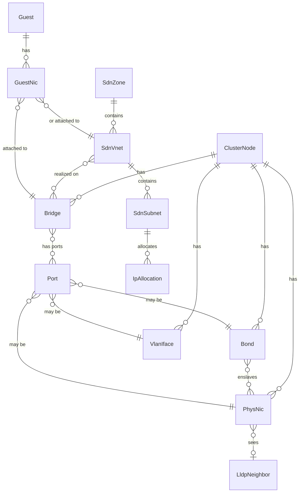

# Data model

Two distinct models exist and must not be conflated:

1. The **inventory model** — an in-memory, typed graph of live network state, rebuilt from collectors. Never persisted as truth.
2. The **app store** — SQLite tables for vnprox-owned data (changesets, snapshots, sessions, audit, layouts, metrics).

## 1. Inventory model

### Entity kinds



### Core types (Go, `internal/inventory`)

Every entity embeds `Ref`:

```go
type Ref struct {
    Kind Kind   // "physnic","bond","bridge","vlan","ovs-bridge","ovs-bond",
                // "sdn-zone","sdn-vnet","sdn-subnet","guest","guest-nic",
                // "lldp-neighbor","fw-ruleset","node"
    Node string // "" for cluster-scoped entities (SDN, cluster firewall)
    ID   string // stable within (Kind,Node), e.g. "vmbr0", "eno1", "zone1/vnet1"
}
```

Selected entities (full field lists are the implementing task's responsibility; these fields are the contract other packages rely on):

| Type | Key fields |
|---|---|
| `PhysNic` | name, mac, driver, speedMbps, duplex, linkUp, mtu, pciAddr, sriovVFs, pending |
| `Bond` | name, mode (802.3ad, active-backup, ...), slaves []string, lacpRate, xmitHashPolicy, miiStatus, activeSlave, mtu, pending, slaveDetail []BondSlave (per-slave runtime status, host-netlink-only) |
| `BondSlave` | name, miiStatus, permHWAddr, linkFailureCount, active bool — plus (T-804) LACP actor/partner detail decoded from `/proc/net/bonding/<name>`'s "details actor/partner lacp pdu" block, opportunistically refined by netlink AD-info attributes where the kernel exposes them (`internal/host/bonding.go`, `internal/host/netlink_linux.go`): actorSystemID, actorSystemPriority, actorKey, actorSynchronized/actorCollecting/actorDistributing bool (the decoded 802.3ad port-state bits — "bond is up" vs. "bond is negotiated correctly"), partnerSystemID, partnerSystemPriority, partnerKey, lacpDetailSet bool (false — every field above at its zero value — for a bond not running 802.3ad, or an older kernel/driver that never emits the block; best-effort, not a hard requirement) |
| `Bridge` | name, kind (linux|ovs), ports []Ref, vlanAware bool, vids []VidRange, stp, mtu, addresses []CIDR, gateway, comments, pending, fdb []FDBEntry (T-306, added retroactively per docs/development.md's definition-of-done #4: `{mac, port, vlan, master bool, permanent bool, stale bool}`, host-netlink-only — excluded from the merge/provenance/delta machinery every other field here goes through, since FDB churns on every poll and has only one contributing source; see `internal/topology.FDB`/`FDBSearch` for the cluster-wide, ownership-labeled view built from it) |
| `VlanIface` | name, parent Ref, vid, addresses, mtu, pending, virt ("" \| "ovs", T-407: distinguishes a plain 802.1q VLAN sub-interface from an OVS Int Port — OVSIntPort has no dedicated `Kind` of its own the way OVSBridge/OVSBond do, so `virt` carries the distinction, mirroring `Bridge.virt`'s exact shape/precedence), trunks []VidRange (T-407, OVS-only: additional trunked VLAN ranges alongside `vid`'s single access tag, from ovs-vsctl's Port `trunks` column / the interfaces(5) `ovs_options trunks=...` token) |
| `SdnZone` | id, type (simple|vlan|qinq|vxlan|evpn), bridge, mtu, nodes []string, exitNodes []string (evpn), peers []string (vxlan/evpn underlay peer addresses), controller, vrfVxlan, ipam |
| `SdnVnet` | id, zone, tag, alias, vlanAware |
| `SdnSubnet` | id (cidr), vnet, gateway, snat bool, dhcpRanges, dnsZonePrefix |
| `Guest` | vmid, name, type (qemu|lxc), node, status |
| `GuestNic` | guest Ref, key ("net0"), bridgeOrVnet Ref, vid, model, mac, firewall bool, rateMbps, linkDown bool |
| `LldpNeighbor` | localNic Ref, chassisName, chassisId, portId, portDescr, mgmtIP, vlan info, ttl |
| `FwRuleset` | scope (cluster|node|guest), ref, enabled, defaultIn/Out policy, rules []FwRule, aliases []FwAlias, ipsets []FwIPSet, groups []FwGroup |
| `FwRule` | pos, enabled, direction, action, proto, source, dest, sport, dport, iface, macro, log, comment |
| `FwAlias` (T-501) | name, cidr, comment — scoped to the FwRuleset that defines it; a cluster-scope alias is visible from every scope, node/guest-scope aliases only within their own ruleset (real pve-firewall's visibility rule) |
| `FwIPSet` (T-501) | name, comment, entries []FwIPSetEntry — same scope-visibility rule as FwAlias |
| `FwIPSetEntry` (T-501) | cidr, comment, noMatch |
| `FwGroup` (T-501) | name, comment, rules []FwRule — a reusable, cluster-scope-only security group (real PVE has no node/guest-scope groups); only ever populated on the cluster-scope FwRuleset, referenced from any rule anywhere via a rule whose direction is "group" and whose action names the group |

`pending` (added by T-305, `PhysNic`/`Bond`/`Bridge`/`VlanIface` only) mirrors PVE's own `pending` marker on `GET /nodes/{node}/network` (`""`\|`"new"`\|`"changed"`\|`"deleted"`) — a staged `interfaces.new` edit that was never applied via reload. It is exclusively `pve-network`-sourced (no other collector observes PVE's staging concept), which is what T-305's `pending_interfaces` drift check reads.

T-401 adds the identical `pending` field (same `""`\|`"new"`\|`"changed"`\|`"deleted"` marker, `pve-sdn`-sourced) to `SdnZone`/`SdnVnet`/`SdnSubnet`, for the same reason: PVE stages SDN edits until `PUT /cluster/sdn` applies them. It is structural/badge-only on these entities (topology map painting, `GET /sdn` tree rows) — the authoritative, field-level staged-vs-running diff `GET /sdn` renders (docs/api.md's `PendingDiff`) is computed live against PVE by `internal/sdn.Service`, not read off this field, since a diff view must never be stale relative to what an apply would actually do.

### Graph and deltas

`inventory.Graph` holds all entities plus typed edges (`enslaved-by`, `port-of`, `tagged-on`, `realizes`, `attached-to`, `lldp-adjacent`). It exposes:

- `Snapshot() Graph` — immutable copy for readers,
- `ApplyPoll(source, entities)` — collector ingestion, returns `Delta{Added, Updated, Removed []Ref}`,
- Deltas fan out to the WS hub as `topology.delta`.

## 2. App store (SQLite)

Schema managed by embedded migrations (`internal/store/migrations/NNNN_*.sql`). WAL mode, foreign keys on.

```sql
-- 0001_init.sql (shape contract; implementing task owns exact DDL)
CREATE TABLE sessions (
  id TEXT PRIMARY KEY, username TEXT NOT NULL, realm TEXT NOT NULL,
  pve_ticket_enc BLOB NOT NULL, csrf_token_enc BLOB NOT NULL,
  caps_json TEXT NOT NULL, created_at INTEGER, expires_at INTEGER
);

CREATE TABLE changesets (
  id TEXT PRIMARY KEY,               -- ULID
  title TEXT, author TEXT NOT NULL,
  status TEXT NOT NULL,              -- draft|validated|applying|awaiting_confirm|
                                     -- committed|rolled_back|failed|discarded
  ops_json TEXT NOT NULL,            -- ordered []Op
  findings_json TEXT,                -- validation results
  plan_json TEXT,                    -- ordered apply steps (rendered pre-apply)
  apply_log_json TEXT,               -- per-step outcomes
  confirm_deadline INTEGER,          -- unix; NULL unless awaiting_confirm
  created_at INTEGER, updated_at INTEGER
);

CREATE TABLE snapshots (
  id TEXT PRIMARY KEY, changeset_id TEXT REFERENCES changesets(id),
  taken_at INTEGER NOT NULL, kind TEXT NOT NULL,      -- pre|post|manual|scheduled
  files_json TEXT NOT NULL           -- [{node,path,sha256,content_zstd}]
);

CREATE TABLE audit_log (
  id INTEGER PRIMARY KEY AUTOINCREMENT, at INTEGER NOT NULL,
  username TEXT NOT NULL, action TEXT NOT NULL, target TEXT,
  changeset_id TEXT, result TEXT NOT NULL, detail_json TEXT
);

CREATE TABLE layouts (
  username TEXT NOT NULL, name TEXT NOT NULL,
  layout_json TEXT NOT NULL, updated_at INTEGER,
  PRIMARY KEY (username, name)
);

CREATE TABLE annotations (           -- T-907: entity-pinned sticky notes
  id TEXT PRIMARY KEY,               -- ULID
  ref TEXT NOT NULL,                 -- pinned entity's Ref string
  content TEXT NOT NULL,             -- free text; opaque to vnproxd
  created_by TEXT NOT NULL, created_at INTEGER NOT NULL, updated_at INTEGER NOT NULL
);

CREATE TABLE metric_samples (
  ref TEXT NOT NULL, at INTEGER NOT NULL,
  rx_bytes INTEGER, tx_bytes INTEGER, rx_pkts INTEGER, tx_pkts INTEGER,
  rx_errs INTEGER, tx_errs INTEGER, rx_drop INTEGER, tx_drop INTEGER,
  PRIMARY KEY (ref, at)
);  -- pruned to 24h; longer horizons are out of scope for v1

CREATE TABLE flow_samples (        -- T-1002: internal/store/migrations/0007_flows.sql
  id INTEGER PRIMARY KEY AUTOINCREMENT,
  at INTEGER NOT NULL, node TEXT NOT NULL,
  src_ip TEXT NOT NULL, dst_ip TEXT NOT NULL,
  src_port INTEGER NOT NULL DEFAULT 0, dst_port INTEGER NOT NULL DEFAULT 0,
  proto INTEGER NOT NULL DEFAULT 0, bytes INTEGER NOT NULL DEFAULT 0, packets INTEGER NOT NULL DEFAULT 0,
  vlan INTEGER NOT NULL DEFAULT 0,
  src_ref TEXT NOT NULL DEFAULT '', dst_ref TEXT NOT NULL DEFAULT '',
  ingress_if INTEGER NOT NULL DEFAULT 0, egress_if INTEGER NOT NULL DEFAULT 0,
  source TEXT NOT NULL              -- "sflow"|"netflow5"|"netflow9"|"ipfix"|"conntrack"
);  -- bounded: pruned to [flows] retention_minutes (default 60) AND a hard
    -- row cap ([flows] max_rows, default 2,000,000), whichever is smaller
    -- prunes first — see internal/flow's package doc comment. NOT a
    -- long-term warehouse; export to Prometheus (T-1001) or a real flow
    -- collector/TSDB is the answer for anything longer.

CREATE TABLE kv (k TEXT PRIMARY KEY, v TEXT NOT NULL);

CREATE TABLE alert_rules (            -- T-1005: webhook routing rules
  id TEXT PRIMARY KEY,                -- ULID
  name TEXT NOT NULL, enabled INTEGER NOT NULL,
  source_filter_json TEXT,            -- JSON []string, NULL/[] = any source
  severity_filter_json TEXT,          -- JSON []string, NULL/[] = any severity
  target_kind TEXT NOT NULL,          -- generic|gotify|ntfy|slack
  target_url TEXT NOT NULL,
  target_secret_enc BLOB,             -- AES-256-GCM ciphertext, NULL if unset
  created_at INTEGER NOT NULL, updated_at INTEGER NOT NULL
);

CREATE TABLE alert_deliveries (        -- T-1005: one row per delivery attempt
  id TEXT PRIMARY KEY, rule_id TEXT NOT NULL, finding_id TEXT NOT NULL,
  at INTEGER NOT NULL, attempt INTEGER NOT NULL,
  status TEXT NOT NULL,                -- retrying|delivered|failed
  error TEXT
);

CREATE TABLE finding_events (          -- T-1007: internal/store/migrations/0009_finding_events.sql
  id INTEGER PRIMARY KEY AUTOINCREMENT,
  finding_id TEXT NOT NULL, at INTEGER NOT NULL,
  transition TEXT NOT NULL             -- "new"|"escalated"|"resolved"
);  -- pruned to the same window as metric_samples (store.MetricRetention, 24h)

CREATE TABLE changeset_schedules (     -- T-1103: internal/store/migrations/0010_changeset_schedules.sql
  changeset_id TEXT PRIMARY KEY,
  window_start INTEGER NOT NULL, window_end INTEGER NOT NULL,
  confirm_timeout_sec INTEGER NOT NULL,
  missed_window_policy TEXT NOT NULL,  -- "skip"|"applyImmediately"
  callback_token_hash TEXT NOT NULL,   -- sha256 hex of the one-time-delivered token, never the token itself
  status TEXT NOT NULL,                -- pending|fired|missed|blocked|failed|cancelled
  created_by TEXT NOT NULL, created_at INTEGER NOT NULL,
  fired_at INTEGER, cancelled_at INTEGER
);
```

**`layouts` / `annotations` (T-907: saved views & annotations, docs/api.md's "Saved views & annotations" section).** Both are strictly app-owned UI state — never a shadow copy of any PVE-authoritative config, per this doc's top-level rule. `layouts` (T-107) already held the auto-persisted canvas-position/filter blob under the reserved name `"topology"` (and `"onboarding"`'s walkthrough progress); T-907 reuses the identical mechanism for **named saved views** — a user-chosen `name` whose `layout_json` is a frontend-owned, backend-opaque blob shaped `{kind: "view", layers, vlanFilter?, zoom, viewport: {x, y}, selection?, view}` (docs/api.md documents the exact shape). The `kind: "view"` tag is how the frontend tells a saved view apart from the reserved auto-layout blobs when listing — vnproxd itself never inspects `layout_json`'s contents either way. `annotations` is a **new** table rather than a further extension of `layouts`: an entity-pinned sticky note is naturally many-rows-per-user (indeed many-rows-per-entity, shared across every user, not one blob overwritten in place), so it doesn't fit `layouts`' per-`(username, name)` single-blob shape — see `internal/store/migrations/0006_annotations.sql`'s doc comment for the full reasoning. `ref` is the pinned entity's `Ref` string (kind:node:id); `content` is free text vnproxd never interprets; `created_by` is the authoring user, kept for display/audit only — annotations are a shared team scratchpad visible to every `netRead`-capable user, not private per-user data like `layouts`.

**`alert_rules` / `alert_deliveries` (T-1005: alert routing, docs/api.md's "Alert Rules" section, migration `internal/store/migrations/0008_alert_rules.sql`).** Both app-owned per this doc's top-level rule. `alert_rules` routes findings/drift transitions (`internal/findings/notify.go`'s existing once-per-transition firing, unchanged by this task) to a webhook target; `source_filter_json`/`severity_filter_json` are JSON string arrays, `NULL`/`[]` both meaning "no filter on that dimension" — the same optional/ANDed filter convention `GET /findings`' own `?source=&severity=` uses. `target_secret_enc` is AES-256-GCM ciphertext (`internal/store/cipher.go`'s `SessionCipher` — the identical cipher/key `sessions.pve_ticket_enc` uses, not a second key pair), `NULL` when the target needs no secret. `alert_deliveries` logs one row per delivery *attempt* (not one row per logical delivery — `attempt` is the 1-based sequence number within a rule+finding retry sequence): `status` is `"retrying"` (this attempt failed, another is scheduled), `"delivered"`/`"failed"` (both terminal). Bounded by construction (a fixed max-attempt count, `internal/findings/webhook.go`'s `DefaultMaxAttempts`), so — unlike `metric_samples`, which needs an explicit prune job — this table only grows by real delivery events and needs none; note for the next agent touching this area: migration numbering skips `0007`, reserved for a sibling Phase 10 task (T-1002, flow ingestion) landing independently.

**`flow_samples` (T-1002: flow ingestion engine, docs/api.md's "Flows" section, `internal/store/migrations/0007_flows.sql`).** One row per decoded `flow.Record` (sFlow v5, NetFlow v5/v9, or IPFIX — `source` names which), observed by this node's own opt-in UDP listeners (`[flows]` in `vnprox.toml`, off by default per node). T-1004's `internal/flow/hostsample` package feeds this exact same table for nodes with no external exporter (`source = "conntrack"`, also opt-in/off-by-default via `[flows] conntrack_sampling_enabled`/`ebpf_sampling_enabled`) — no second storage path. Unlike `metric_samples`' `(ref, at)` natural key, there is no dedup key here — many distinct flow observations legitimately share the same `(node, src, dst, port, at)` tuple at one-second resolution, so `id` is a plain autoincrement surrogate, also used as `GET /api/peer/flows`' cluster-merge pagination tiebreak (docs/api.md's `FlowRecord.id`). `src_ref`/`dst_ref` are inventory `Ref` strings, populated only when `src_ip`/`dst_ip` resolves against a known bridge or SDN subnet in the live inventory graph (`internal/flow.GraphResolver`) — empty otherwise, never guessed. Bounded by **both** a retention window (`[flows] retention_minutes`, default 60) **and** a hard row cap (`[flows] max_rows`, default 2,000,000), whichever is smaller prunes first, on the same tick-based prune-loop pattern `metric_samples`' `RunPruneLoop` already establishes — this is explicitly **not** a long-term flow warehouse (docs/roadmap-next.md's carried-forward invariant); see `internal/flow`'s package doc comment.

**`finding_events` (T-1007: history playback, docs/api.md's "History" section, migration `internal/store/migrations/0009_finding_events.sql`).** App-owned per this doc's top-level rule — vnprox's own record of when its findings stream changed, never a shadow copy of PVE state. One row per finding transition (`"new"`\|`"escalated"`\|`"resolved"`), written by `internal/findings/findingevents.go`'s `FindingEventsNotifier` — a `Notifier` (the same interface `PVENotifier`/`WebhookNotifier` implement, `internal/findings/notify.go`) composed alongside them at the `cmd/vnproxd` composition root, so this table is populated from `notify.go`'s **existing** transition detection (`evaluateNotifications`/`fireNotification`, unchanged by this task) rather than a second, duplicated detector. `id` is a plain autoincrement surrogate (like `flow_samples`, unlike `metric_samples`' natural key): the same `finding_id` legitimately transitions more than once within the retention window. Bounded and pruned to the exact same window as `metric_samples` (`store.MetricRetention`, 24h) on the same cadence, per this task's card — `GET /history/events` merges this table with a changeset-lifecycle-filtered slice of `audit_log` into one timeline-marker feed for `web/src/topology/history/HistoryTimeline.tsx`'s scrubber; see that route's own doc comment (docs/api.md) for the merged shape.

**`changeset_schedules` (T-1103: scheduled changesets & maintenance windows, docs/api.md's "Scheduled changesets & maintenance windows" section, migration `internal/store/migrations/0010_changeset_schedules.sql`).** App-owned per this doc's top-level rule — one row per changeset that currently has (or most recently had) a schedule; `changeset_id` is the primary key, so scheduling a changeset again after an earlier schedule resolved (fired/missed/blocked/failed/cancelled) replaces that row rather than accumulating history — the changeset's own audit trail (`changeset.schedule_create`/`_cancel`/`_fire`/`_fire_blocked`/`_missed`) is the durable history of what happened, exactly like every other T-205 apply-engine transition. `callback_token_hash` is a sha256 hex digest of the single-use signed callback token (docs/api.md) — the token itself is never persisted anywhere, only delivered once in the creating `POST /changesets/{id}/schedule` response. `status` moves `pending` → exactly one of `fired`/`missed`/`blocked`/`failed` (stamping `fired_at`) or `cancelled` (stamping `cancelled_at`) — never back, and never more than once (`change.Service.TickSchedules`' own `WHERE status = pending` guard on every resolving write).

## 3. Changeset operations

`Op` is a tagged union serialized as `{"op": "<type>", "target": Ref, "params": {...}}`. The v1 op vocabulary:

| Group | Ops |
|---|---|
| iface | `iface.update` (mtu, comments, addresses, gateway, autostart), `iface.rename` (newName; issue #2 — renames a logical bridge/bond/vlan in place, rewriting the stanza header, its auto/allow-* references, and every in-file reference to the old name; blocked when guests are still attached to the old name, since guest `bridge=` bindings live in PVE guest config a rename doesn't rewrite; physical-NIC/udev renames are out of scope), `iface.raw.replace` (node + full file content; T-208's raw editor escape hatch — target is a `node` Ref, not one entity; validated by diffing the parsed entity delta between the live file and the new content through the same referential/safety/advisory checks — see docs/features/change-management.md §7) |
| bond | `bond.create`, `bond.update`, `bond.delete` |
| bridge | `bridge.create`, `bridge.update`, `bridge.delete`, `bridge.port.add`, `bridge.port.remove` |
| vlan | `vlan.create`, `vlan.update`, `vlan.delete` |
| bridge/bond kind | OVS bridges/bonds reuse the same op names above with `target.kind` = `ovs-bridge`/`ovs-bond` (Kind alone disambiguates Linux vs OVS for these two, per Ref's closed kind set) — no separate op types. `bond.create`'s params carry an OVS-only `bridge` field (the OVS bridge this bond attaches to, rendered as `ovs_bridge`; required when `target.kind` is `ovs-bond`, ignored otherwise) — this is the "params carry ovs-specific fields" case data-model review flagged for T-407. |
| vlan kind | `KindVlan` has no dedicated OVS sibling (an OVS Int Port is a `VlanIface` with `virt: "ovs"` — see the entity table above), so `vlan.create`'s params instead carry `ovs` (bool: true selects `ovs_type=OVSIntPort`/`ovs_bridge`/`ovs_options` instead of `vlan-raw-device`; `parent` then names an OVS bridge) and `trunks` (`[]VidRange`, OVS-only, rejected when `ovs` is false: additional trunked VLAN ranges alongside `vid`'s single access tag). T-407. |
| sdn | `sdn.zone.create/update/delete`, `sdn.vnet.create/update/delete`, `sdn.subnet.create/update/delete`, `sdn.apply` |
| guest | `guest.nic.update` (reattach bridge/vnet, vid, rate, firewall flag) |
| fw | `fw.rule.create/update/delete/move`, `fw.options.update`, `fw.alias.*`, `fw.ipset.*`, `fw.group.*` |
| ipam | `ipam.alloc.create/delete` |

Each op maps to one or more **apply steps**; the planner orders steps: (1) cluster-scope PVE API calls, (2) per-node interface file staging, (3) per-node `ifreload -a` (executed directly by vnproxd's own `NodeAgent` — **correction, T-607 docs audit:** not "via PVE's network reload endpoint" as this line previously said; `cmd/vnproxd/changeagent.go` writes `/etc/network/interfaces` and execs `ifreload` itself, since vnproxd runs on the node — see `docs/architecture.md` §4 for the fuller correction), (4) `sdn.apply` last when present. Rollback executes the inverse from the pre-snapshot in reverse order.

## 4. Blueprints (`internal/blueprint`, T-603)

A `Blueprint` (docs/api.md's Blueprints section has the full field-by-field shape) is app-owned data — a template a user wrote, captured, or copied from a starter — never a shadow copy of PVE config. The five bundled starters are compiled into the binary (`internal/blueprint.Starters`), not stored rows; only user-authored/captured/copied blueprints live in the `blueprints` table (`internal/store/migrations/0004_blueprints.sql`):

```sql
CREATE TABLE blueprints (
  id TEXT PRIMARY KEY, name TEXT NOT NULL,
  blueprint_json TEXT NOT NULL,      -- the full Blueprint (id/name kept in sync)
  created_by TEXT NOT NULL, created_at INTEGER NOT NULL, updated_at INTEGER NOT NULL
);
```

Instantiation (`blueprint.Instantiate`) is a pure function of `(Blueprint, params, target nodes, inventory.Snapshot)` → `[]change.Op`: it expands each `EntityTemplate` across its node selector, substitutes `{{param}}` placeholders, then diffs each expanded entity against the snapshot — absent → a `*.create` op, present-and-matching → no op, present-and-divergent → a `*.update` op naming only the diverging fields (bridge port membership divergence is the one exception: it always becomes `bridge.port.add`/`bridge.port.remove` ops, since `BridgeUpdateParams` has no `ports` field — port membership changes go through those dedicated ops everywhere else in this codebase too). It never persists or applies anything itself; the caller (`internal/api`'s instantiate handler) hands the returned ops to `change.Service.Create`, the same "compute an op patch, let the normal changeset lifecycle own it" pattern `internal/drift`'s `FixOps` already established.

## 5. Live path probe divergence findings (`internal/store`, T-806)

Every other producer in the unified findings stream (docs/api.md's `GET /findings`) is recomputed fresh from continuously-polled state on every call — nothing needs to persist it. A `sim_divergence` finding is different: it records the outcome of a specific, user-triggered `POST /simulate/verify` call (docs/api.md's Live path probe section), and nothing re-runs that live guest-agent probe on its own, so there is no "continuously polled state" to recompute it from. It therefore gets a table of its own (`internal/store/migrations/0005_sim_divergence_findings.sql`):

```sql
CREATE TABLE sim_divergence_findings (
  id                TEXT PRIMARY KEY,   -- content-derived: "probe:sim_divergence|<src>|<dstKind>:<dstRefOrIp>|<proto>|<port>"
  src_ref           TEXT NOT NULL,      -- guest-nic Ref string (the probed src)
  dst_kind          TEXT NOT NULL,      -- guest-nic|ip|external
  dst_ref           TEXT NOT NULL DEFAULT '',  -- set iff dst_kind = guest-nic
  dst_ip            TEXT NOT NULL DEFAULT '',  -- set iff dst_kind = ip
  proto             TEXT NOT NULL,      -- tcp|icmp
  port              INTEGER NOT NULL DEFAULT 0,
  simulated_verdict TEXT NOT NULL,
  observed_outcome  TEXT NOT NULL,
  detail            TEXT NOT NULL DEFAULT '',
  created_at        INTEGER NOT NULL,   -- unix seconds, first time this tuple diverged
  updated_at        INTEGER NOT NULL    -- unix seconds, most recent divergence
);
```

Row lifecycle, driven entirely by `internal/api`'s `POST /simulate/verify` handler (`internal/store.SimDivergenceRepo`): a `diverges: true` response upserts the row keyed by `id` (re-verifying the identical tuple refreshes `updated_at`/`observed_outcome`/`detail` in place rather than accumulating a duplicate row — `created_at` is preserved across an upsert); a `diverges: false` response for a tuple that previously had a row clears it (the finding should not keep claiming a divergence the most recent live check no longer shows). `cmd/vnproxd`'s `probeFindingsAdapter` reads this table fresh on every `GET /findings` call and maps each row to the unified `Finding` shape (`Source: "probe"`, `Check: "sim_divergence"`) — the table is this producer's *source of truth*, not a cache the in-memory engine also holds a separate copy of.

## 6. Declarative cluster network spec (`internal/spec`, T-1101)

> Numbering note: the card called for a "new §5"; §5 was already taken by T-806's live-probe table by the time this landed, so the spec schema is §6.

The **Spec** is blueprints v2: one versionable YAML document capturing cluster-wide L2/SDN network intent — per-node bonds, bridges and plain 802.1q VLAN sub-interfaces, plus cluster-scoped SDN zones/vnets/subnets. It is **not** persisted anywhere as authoritative state (Proxmox remains the source of truth, D5): `Export` renders it fresh from a live `inventory.Snapshot`, and `Import` diffs a supplied document back against live. The document is the transport for a GitOps flow (commit the exported spec to git; a PR's diff is the review; `POST /spec/import` on merge produces the changeset), so two properties are load-bearing:

- **Byte-stable serialization.** `Spec` has **no embedded timestamp** and is a tree of typed structs with fixed struct-tag field order (never a `map[string]any`, whose Go iteration order is randomized). `Export` additionally sorts every collection by a stable key (nodes by name; bonds/bridges/vlans by name; SDN objects by id; set-valued fields — ports, slaves, zone nodes, dhcp ranges, vids — sorted). Two exports of identical live state are therefore **byte-identical**, which is what makes `git diff` on an unchanged cluster's committed spec empty (T-1101 AC2/AC4). Freshness comes from the changeset/commit metadata, not the document.
- **Import never applies and never prunes.** `Import(Spec, live) ([]change.Op, notInSpec []Ref, error)` returns ordinary `change.Op`s (the caller hands them to `change.Service.Create` → a **draft** changeset through the normal stage → validate → diff → apply → confirm/rollback lifecycle) plus `notInSpec`: the refs of managed-kind entities present live but absent from the document. Entities in `notInSpec` are **reported, never deleted** — there is no implicit prune (T-1101 AC5). The op set is create/update/port-add/port-remove only.

The per-entity diff mirrors `blueprint.Instantiate`'s absent→create / divergent→update / matching→noop pattern (§4), extended from one blueprint's node-selected set to every cluster-wide entity of the **managed kinds**: `bond`, `bridge`, `vlan`, `sdn-zone`, `sdn-vnet`, `sdn-subnet`. Entities of any other kind (physical NICs, guests, LLDP neighbours, firewall rulesets, **OVS** bridges/bonds and OVS Int Ports) are neither exported nor reconciled nor reported in `notInSpec` — they are outside the v1 spec's scope. **Firewall rulesets and IPAM allocations are deliberately not in the v1 spec** (firewall rule ordering/move reconcile is a separate effort the blueprint diff engine this mirrors never covered); a later `specVersion` may add them additively.

Field semantics follow the same **omitempty = "not managed by this spec"** convention `blueprint.capture`/`adapters` already use: `Export` emits only non-zero declared fields (`Bridge.DeclaredPortNames`, `Bond.DeclaredSlaves`, `*.MTUDeclared`, …), and `Import` leaves an omitted/zero field untouched on an existing entity (and takes the OS/PVE default on a created one). This applies to booleans too — a `false`/omitted `vlanAware`/`stp`/`snat`/vnet-`vlanAware` means "don't manage this flag", so only a spec value of `true` diverging from live produces an op; **reconciling a flag back to `false` is not expressible in v1** (the conservative choice keeps a partial hand-edit from silently emitting a disable op). Parent/Vid on a VLAN, Type on a zone, Zone on a vnet, and Vnet/CIDR on a subnet are identity, not editable in place — a change there is a delete+create in PVE, so the diff never emits an update for them (matching the corresponding `*UpdateParams` shapes in §3).

Schema (`specVersion: 1`; every field except identity is `omitempty`):

```yaml
specVersion: 1
nodes:                        # sorted by name
  - name: pve1
    bonds:                    # Linux bonds only; sorted by name
      - {name, mode, slaves[], lacpRate, xmitHashPolicy, mtu}
    bridges:                  # Linux bridges only; sorted by name
      - {name, ports[], vlanAware, vids[], addresses[], gateway, mtu, stp, comments}
    vlans:                    # plain 802.1q sub-interfaces; sorted by name
      - {name, parent, vid, addresses[], mtu}
sdn:                          # omitted entirely when the cluster has no SDN objects
  zones:                      # sorted by id
    - {id, type, bridge, controller, ipam, nodes[], exitNodes[], peers[], vrfVxlan, mtu}
  vnets:                      # sorted by id ("zone/vnet" path)
    - {id, zone, alias, tag, vlanAware}
  subnets:                    # sorted by id (CIDR)
    - {id, vnet, gateway, dnsZonePrefix, dhcpRanges[], snat}
```

`vids` are the inventory `VidRange` string forms (`"100"`, `"2-4094"`), sorted. `Parse` rejects any `specVersion` other than `1` (an absent field is `0` and is rejected too), so an operator never reconciles against a schema this daemon can't fully honor.
