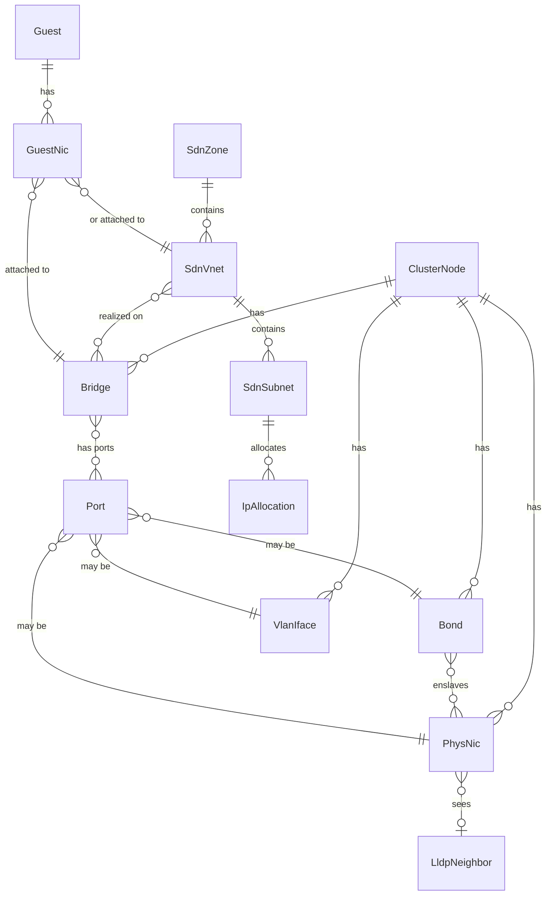

# Data model

Two distinct models exist and must not be conflated:

1. The **inventory model** — an in-memory, typed graph of live network state, rebuilt from collectors. Never persisted as truth.
2. The **app store** — SQLite tables for vnprox-owned data (changesets, snapshots, sessions, audit, layouts, metrics).

## 1. Inventory model

### Entity kinds



### Core types (Go, `internal/inventory`)

Every entity embeds `Ref`:

```go
type Ref struct {
    Kind Kind   // "physnic","bond","bridge","vlan","ovs-bridge","ovs-bond",
                // "sdn-zone","sdn-vnet","sdn-subnet","guest","guest-nic",
                // "lldp-neighbor","fw-ruleset","node"
    Node string // "" for cluster-scoped entities (SDN, cluster firewall)
    ID   string // stable within (Kind,Node), e.g. "vmbr0", "eno1", "zone1/vnet1"
}
```

Selected entities (full field lists are the implementing task's responsibility; these fields are the contract other packages rely on):

| Type | Key fields |
|---|---|
| `PhysNic` | name, mac, driver, speedMbps, duplex, linkUp, mtu, pciAddr, sriovVFs, pending |
| `Bond` | name, mode (802.3ad, active-backup, ...), slaves []string, lacpRate, xmitHashPolicy, miiStatus, activeSlave, mtu, pending, slaveDetail []BondSlave (per-slave runtime status, host-netlink-only) |
| `BondSlave` | name, miiStatus, permHWAddr, linkFailureCount, active bool — plus (T-804) LACP actor/partner detail decoded from `/proc/net/bonding/<name>`'s "details actor/partner lacp pdu" block, opportunistically refined by netlink AD-info attributes where the kernel exposes them (`internal/host/bonding.go`, `internal/host/netlink_linux.go`): actorSystemID, actorSystemPriority, actorKey, actorSynchronized/actorCollecting/actorDistributing bool (the decoded 802.3ad port-state bits — "bond is up" vs. "bond is negotiated correctly"), partnerSystemID, partnerSystemPriority, partnerKey, lacpDetailSet bool (false — every field above at its zero value — for a bond not running 802.3ad, or an older kernel/driver that never emits the block; best-effort, not a hard requirement) |
| `Bridge` | name, kind (linux|ovs), ports []Ref, vlanAware bool, vids []VidRange, stp, mtu, addresses []CIDR, gateway, comments, pending, fdb []FDBEntry (T-306, added retroactively per docs/development.md's definition-of-done #4: `{mac, port, vlan, master bool, permanent bool, stale bool}`, host-netlink-only — excluded from the merge/provenance/delta machinery every other field here goes through, since FDB churns on every poll and has only one contributing source; see `internal/topology.FDB`/`FDBSearch` for the cluster-wide, ownership-labeled view built from it) |
| `VlanIface` | name, parent Ref, vid, addresses, mtu, pending, virt ("" \| "ovs", T-407: distinguishes a plain 802.1q VLAN sub-interface from an OVS Int Port — OVSIntPort has no dedicated `Kind` of its own the way OVSBridge/OVSBond do, so `virt` carries the distinction, mirroring `Bridge.virt`'s exact shape/precedence), trunks []VidRange (T-407, OVS-only: additional trunked VLAN ranges alongside `vid`'s single access tag, from ovs-vsctl's Port `trunks` column / the interfaces(5) `ovs_options trunks=...` token) |
| `SdnZone` | id, type (simple|vlan|qinq|vxlan|evpn), bridge, mtu, nodes []string, exitNodes []string (evpn), peers []string (vxlan/evpn underlay peer addresses), controller, vrfVxlan, ipam |
| `SdnVnet` | id, zone, tag, alias, vlanAware |
| `SdnSubnet` | id (cidr), vnet, gateway, snat bool, dhcpRanges, dnsZonePrefix |
| `Guest` | vmid, name, type (qemu|lxc), node, status |
| `GuestNic` | guest Ref, key ("net0"), bridgeOrVnet Ref, vid, model, mac, firewall bool, rateMbps, linkDown bool |
| `LldpNeighbor` | localNic Ref, chassisName, chassisId, portId, portDescr, mgmtIP, vlan info, ttl |
| `FwRuleset` | scope (cluster|node|guest), ref, enabled, defaultIn/Out policy, rules []FwRule, aliases []FwAlias, ipsets []FwIPSet, groups []FwGroup |
| `FwRule` | pos, enabled, direction, action, proto, source, dest, sport, dport, iface, macro, log, comment |
| `FwAlias` (T-501) | name, cidr, comment — scoped to the FwRuleset that defines it; a cluster-scope alias is visible from every scope, node/guest-scope aliases only within their own ruleset (real pve-firewall's visibility rule) |
| `FwIPSet` (T-501) | name, comment, entries []FwIPSetEntry — same scope-visibility rule as FwAlias |
| `FwIPSetEntry` (T-501) | cidr, comment, noMatch |
| `FwGroup` (T-501) | name, comment, rules []FwRule — a reusable, cluster-scope-only security group (real PVE has no node/guest-scope groups); only ever populated on the cluster-scope FwRuleset, referenced from any rule anywhere via a rule whose direction is "group" and whose action names the group |

`pending` (added by T-305, `PhysNic`/`Bond`/`Bridge`/`VlanIface` only) mirrors PVE's own `pending` marker on `GET /nodes/{node}/network` (`""`\|`"new"`\|`"changed"`\|`"deleted"`) — a staged `interfaces.new` edit that was never applied via reload. It is exclusively `pve-network`-sourced (no other collector observes PVE's staging concept), which is what T-305's `pending_interfaces` drift check reads.

T-401 adds the identical `pending` field (same `""`\|`"new"`\|`"changed"`\|`"deleted"` marker, `pve-sdn`-sourced) to `SdnZone`/`SdnVnet`/`SdnSubnet`, for the same reason: PVE stages SDN edits until `PUT /cluster/sdn` applies them. It is structural/badge-only on these entities (topology map painting, `GET /sdn` tree rows) — the authoritative, field-level staged-vs-running diff `GET /sdn` renders (docs/api.md's `PendingDiff`) is computed live against PVE by `internal/sdn.Service`, not read off this field, since a diff view must never be stale relative to what an apply would actually do.

### Graph and deltas

`inventory.Graph` holds all entities plus typed edges (`enslaved-by`, `port-of`, `tagged-on`, `realizes`, `attached-to`, `lldp-adjacent`). It exposes:

- `Snapshot() Graph` — immutable copy for readers,
- `ApplyPoll(source, entities)` — collector ingestion, returns `Delta{Added, Updated, Removed []Ref}`,
- Deltas fan out to the WS hub as `topology.delta`.

## 2. App store (SQLite)

Schema managed by embedded migrations (`internal/store/migrations/NNNN_*.sql`). WAL mode, foreign keys on.

```sql
-- 0001_init.sql (shape contract; implementing task owns exact DDL)
CREATE TABLE sessions (
  id TEXT PRIMARY KEY, username TEXT NOT NULL, realm TEXT NOT NULL,
  pve_ticket_enc BLOB NOT NULL, csrf_token_enc BLOB NOT NULL,
  caps_json TEXT NOT NULL, created_at INTEGER, expires_at INTEGER
);

CREATE TABLE changesets (
  id TEXT PRIMARY KEY,               -- ULID
  title TEXT, author TEXT NOT NULL,
  status TEXT NOT NULL,              -- draft|validated|applying|awaiting_confirm|
                                     -- committed|rolled_back|failed|discarded
  ops_json TEXT NOT NULL,            -- ordered []Op
  findings_json TEXT,                -- validation results
  plan_json TEXT,                    -- ordered apply steps (rendered pre-apply)
  apply_log_json TEXT,               -- per-step outcomes
  confirm_deadline INTEGER,          -- unix; NULL unless awaiting_confirm
  created_at INTEGER, updated_at INTEGER
);

CREATE TABLE snapshots (
  id TEXT PRIMARY KEY, changeset_id TEXT REFERENCES changesets(id),
  taken_at INTEGER NOT NULL, kind TEXT NOT NULL,      -- pre|post|manual|scheduled
  files_json TEXT NOT NULL           -- [{node,path,sha256,content_zstd}]
);

CREATE TABLE audit_log (
  id INTEGER PRIMARY KEY AUTOINCREMENT, at INTEGER NOT NULL,
  username TEXT NOT NULL, action TEXT NOT NULL, target TEXT,
  changeset_id TEXT, result TEXT NOT NULL, detail_json TEXT
);

CREATE TABLE layouts (
  username TEXT NOT NULL, name TEXT NOT NULL,
  layout_json TEXT NOT NULL, updated_at INTEGER,
  PRIMARY KEY (username, name)
);

CREATE TABLE metric_samples (
  ref TEXT NOT NULL, at INTEGER NOT NULL,
  rx_bytes INTEGER, tx_bytes INTEGER, rx_pkts INTEGER, tx_pkts INTEGER,
  rx_errs INTEGER, tx_errs INTEGER, rx_drop INTEGER, tx_drop INTEGER,
  PRIMARY KEY (ref, at)
);  -- pruned to 24h; longer horizons are out of scope for v1

CREATE TABLE kv (k TEXT PRIMARY KEY, v TEXT NOT NULL);
```

## 3. Changeset operations

`Op` is a tagged union serialized as `{"op": "<type>", "target": Ref, "params": {...}}`. The v1 op vocabulary:

| Group | Ops |
|---|---|
| iface | `iface.update` (mtu, comments, addresses, gateway, autostart), `iface.rename` (newName; issue #2 — renames a logical bridge/bond/vlan in place, rewriting the stanza header, its auto/allow-* references, and every in-file reference to the old name; blocked when guests are still attached to the old name, since guest `bridge=` bindings live in PVE guest config a rename doesn't rewrite; physical-NIC/udev renames are out of scope), `iface.raw.replace` (node + full file content; T-208's raw editor escape hatch — target is a `node` Ref, not one entity; validated by diffing the parsed entity delta between the live file and the new content through the same referential/safety/advisory checks — see docs/features/change-management.md §7) |
| bond | `bond.create`, `bond.update`, `bond.delete` |
| bridge | `bridge.create`, `bridge.update`, `bridge.delete`, `bridge.port.add`, `bridge.port.remove` |
| vlan | `vlan.create`, `vlan.update`, `vlan.delete` |
| bridge/bond kind | OVS bridges/bonds reuse the same op names above with `target.kind` = `ovs-bridge`/`ovs-bond` (Kind alone disambiguates Linux vs OVS for these two, per Ref's closed kind set) — no separate op types. `bond.create`'s params carry an OVS-only `bridge` field (the OVS bridge this bond attaches to, rendered as `ovs_bridge`; required when `target.kind` is `ovs-bond`, ignored otherwise) — this is the "params carry ovs-specific fields" case data-model review flagged for T-407. |
| vlan kind | `KindVlan` has no dedicated OVS sibling (an OVS Int Port is a `VlanIface` with `virt: "ovs"` — see the entity table above), so `vlan.create`'s params instead carry `ovs` (bool: true selects `ovs_type=OVSIntPort`/`ovs_bridge`/`ovs_options` instead of `vlan-raw-device`; `parent` then names an OVS bridge) and `trunks` (`[]VidRange`, OVS-only, rejected when `ovs` is false: additional trunked VLAN ranges alongside `vid`'s single access tag). T-407. |
| sdn | `sdn.zone.create/update/delete`, `sdn.vnet.create/update/delete`, `sdn.subnet.create/update/delete`, `sdn.apply` |
| guest | `guest.nic.update` (reattach bridge/vnet, vid, rate, firewall flag) |
| fw | `fw.rule.create/update/delete/move`, `fw.options.update`, `fw.alias.*`, `fw.ipset.*`, `fw.group.*` |
| ipam | `ipam.alloc.create/delete` |

Each op maps to one or more **apply steps**; the planner orders steps: (1) cluster-scope PVE API calls, (2) per-node interface file staging, (3) per-node `ifreload -a` (executed directly by vnproxd's own `NodeAgent` — **correction, T-607 docs audit:** not "via PVE's network reload endpoint" as this line previously said; `cmd/vnproxd/changeagent.go` writes `/etc/network/interfaces` and execs `ifreload` itself, since vnproxd runs on the node — see `docs/architecture.md` §4 for the fuller correction), (4) `sdn.apply` last when present. Rollback executes the inverse from the pre-snapshot in reverse order.

## 4. Blueprints (`internal/blueprint`, T-603)

A `Blueprint` (docs/api.md's Blueprints section has the full field-by-field shape) is app-owned data — a template a user wrote, captured, or copied from a starter — never a shadow copy of PVE config. The five bundled starters are compiled into the binary (`internal/blueprint.Starters`), not stored rows; only user-authored/captured/copied blueprints live in the `blueprints` table (`internal/store/migrations/0004_blueprints.sql`):

```sql
CREATE TABLE blueprints (
  id TEXT PRIMARY KEY, name TEXT NOT NULL,
  blueprint_json TEXT NOT NULL,      -- the full Blueprint (id/name kept in sync)
  created_by TEXT NOT NULL, created_at INTEGER NOT NULL, updated_at INTEGER NOT NULL
);
```

Instantiation (`blueprint.Instantiate`) is a pure function of `(Blueprint, params, target nodes, inventory.Snapshot)` → `[]change.Op`: it expands each `EntityTemplate` across its node selector, substitutes `{{param}}` placeholders, then diffs each expanded entity against the snapshot — absent → a `*.create` op, present-and-matching → no op, present-and-divergent → a `*.update` op naming only the diverging fields (bridge port membership divergence is the one exception: it always becomes `bridge.port.add`/`bridge.port.remove` ops, since `BridgeUpdateParams` has no `ports` field — port membership changes go through those dedicated ops everywhere else in this codebase too). It never persists or applies anything itself; the caller (`internal/api`'s instantiate handler) hands the returned ops to `change.Service.Create`, the same "compute an op patch, let the normal changeset lifecycle own it" pattern `internal/drift`'s `FixOps` already established.

## 5. Live path probe divergence findings (`internal/store`, T-806)

Every other producer in the unified findings stream (docs/api.md's `GET /findings`) is recomputed fresh from continuously-polled state on every call — nothing needs to persist it. A `sim_divergence` finding is different: it records the outcome of a specific, user-triggered `POST /simulate/verify` call (docs/api.md's Live path probe section), and nothing re-runs that live guest-agent probe on its own, so there is no "continuously polled state" to recompute it from. It therefore gets a table of its own (`internal/store/migrations/0005_sim_divergence_findings.sql`):

```sql
CREATE TABLE sim_divergence_findings (
  id                TEXT PRIMARY KEY,   -- content-derived: "probe:sim_divergence|<src>|<dstKind>:<dstRefOrIp>|<proto>|<port>"
  src_ref           TEXT NOT NULL,      -- guest-nic Ref string (the probed src)
  dst_kind          TEXT NOT NULL,      -- guest-nic|ip|external
  dst_ref           TEXT NOT NULL DEFAULT '',  -- set iff dst_kind = guest-nic
  dst_ip            TEXT NOT NULL DEFAULT '',  -- set iff dst_kind = ip
  proto             TEXT NOT NULL,      -- tcp|icmp
  port              INTEGER NOT NULL DEFAULT 0,
  simulated_verdict TEXT NOT NULL,
  observed_outcome  TEXT NOT NULL,
  detail            TEXT NOT NULL DEFAULT '',
  created_at        INTEGER NOT NULL,   -- unix seconds, first time this tuple diverged
  updated_at        INTEGER NOT NULL    -- unix seconds, most recent divergence
);
```

Row lifecycle, driven entirely by `internal/api`'s `POST /simulate/verify` handler (`internal/store.SimDivergenceRepo`): a `diverges: true` response upserts the row keyed by `id` (re-verifying the identical tuple refreshes `updated_at`/`observed_outcome`/`detail` in place rather than accumulating a duplicate row — `created_at` is preserved across an upsert); a `diverges: false` response for a tuple that previously had a row clears it (the finding should not keep claiming a divergence the most recent live check no longer shows). `cmd/vnproxd`'s `probeFindingsAdapter` reads this table fresh on every `GET /findings` call and maps each row to the unified `Finding` shape (`Source: "probe"`, `Check: "sim_divergence"`) — the table is this producer's *source of truth*, not a cache the in-memory engine also holds a separate copy of.
