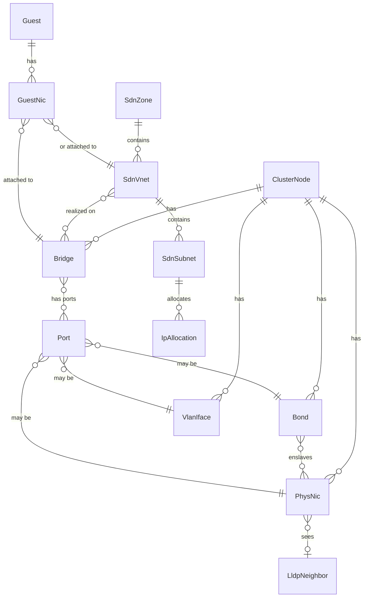

# Data model

Two distinct models exist and must not be conflated:

1. The **inventory model** — an in-memory, typed graph of live network state, rebuilt from collectors. Never persisted as truth.
2. The **app store** — SQLite tables for vnprox-owned data (changesets, snapshots, sessions, audit, layouts, metrics).

## 1. Inventory model

### Entity kinds



### Core types (Go, `internal/inventory`)

Every entity embeds `Ref`:

```go
type Ref struct {
    Kind Kind   // "physnic","bond","bridge","vlan","ovs-bridge","ovs-bond",
                // "sdn-zone","sdn-vnet","sdn-subnet","guest","guest-nic",
                // "lldp-neighbor","fw-ruleset","node",
                // "wg-tunnel","wg-peer" (T-1401: app-owned WireGuard op
                // targets, not live-polled inventory entities),
                // "nat-rule","static-route" (T-1403: Edge & NAT op targets)
                // "vf" (T-1506: an SR-IOV virtual function's own identity —
                // "<pfName>/vf<index>" — not a merge/provenance-tracked
                // graph entity itself, see PhysNic.sriovVFs below)
                // "ceph-osd" (T-1503: a Ceph OSD's own identity — "osd<id>"
                // scoped to its hosting node — same "has a Ref, never
                // itself graph-tracked" pattern as "vf" above; internal/ceph
                // computes its bond attribution live against the graph
                // rather than ingesting OSDs as a collector-owned entity)
    Node string // "" for cluster-scoped entities (SDN, cluster firewall)
    ID   string // stable within (Kind,Node), e.g. "vmbr0", "eno1", "zone1/vnet1"
}
```

Selected entities (full field lists are the implementing task's responsibility; these fields are the contract other packages rely on):

| Type | Key fields |
|---|---|
| `PhysNic` | name, mac, driver, speedMbps, duplex, linkUp, mtu, pciAddr, sriovVFs []VirtualFunction (T-1506, given full shape below — host-netlink-only, excluded from the merge/provenance/delta machinery exactly like Bridge.fdb below, since it is one contributing source's live hardware/driver state, not a config value multiple sources could disagree on), pending |
| `VirtualFunction` (T-1506) | ref (Kind `vf`, "<pfName>/vf<index>"), pf Ref (the owning PhysNic), macAddr, vlan, spoofCheck bool, trust bool, pciAddr, assignedGuest Ref (resolved live against guest `hostpci` config by `internal/topology.ResolveVFAssignments` — never baked into the collector-owned field, "never guessed": the zero Ref when no guest's hostpci config resolves to this VF's pciAddr) |
| `Bond` | name, mode (802.3ad, active-backup, ...), slaves []string, lacpRate, xmitHashPolicy, miiStatus, activeSlave, mtu, pending, slaveDetail []BondSlave (per-slave runtime status, host-netlink-only) |
| `BondSlave` | name, miiStatus, permHWAddr, linkFailureCount, active bool — plus (T-804) LACP actor/partner detail decoded from `/proc/net/bonding/<name>`'s "details actor/partner lacp pdu" block, opportunistically refined by netlink AD-info attributes where the kernel exposes them (`internal/host/bonding.go`, `internal/host/netlink_linux.go`): actorSystemID, actorSystemPriority, actorKey, actorSynchronized/actorCollecting/actorDistributing bool (the decoded 802.3ad port-state bits — "bond is up" vs. "bond is negotiated correctly"), partnerSystemID, partnerSystemPriority, partnerKey, lacpDetailSet bool (false — every field above at its zero value — for a bond not running 802.3ad, or an older kernel/driver that never emits the block; best-effort, not a hard requirement) |
| `Bridge` | name, kind (linux|ovs), ports []Ref, vlanAware bool, vids []VidRange, stp, mtu, addresses []CIDR, gateway, comments, pending, fdb []FDBEntry (T-306, added retroactively per docs/development.md's definition-of-done #4: `{mac, port, vlan, master bool, permanent bool, stale bool}`, host-netlink-only — excluded from the merge/provenance/delta machinery every other field here goes through, since FDB churns on every poll and has only one contributing source; see `internal/topology.FDB`/`FDBSearch` for the cluster-wide, ownership-labeled view built from it) |
| `VlanIface` | name, parent Ref, vid, addresses, mtu, pending, virt ("" \| "ovs", T-407: distinguishes a plain 802.1q VLAN sub-interface from an OVS Int Port — OVSIntPort has no dedicated `Kind` of its own the way OVSBridge/OVSBond do, so `virt` carries the distinction, mirroring `Bridge.virt`'s exact shape/precedence), trunks []VidRange (T-407, OVS-only: additional trunked VLAN ranges alongside `vid`'s single access tag, from ovs-vsctl's Port `trunks` column / the interfaces(5) `ovs_options trunks=...` token) |
| `SdnZone` | id, type (simple|vlan|qinq|vxlan|evpn), bridge, mtu, nodes []string, exitNodes []string (evpn), peers []string (vxlan/evpn underlay peer addresses), controller, vrfVxlan, ipam |
| `SdnVnet` | id, zone, tag, alias, vlanAware |
| `SdnSubnet` | id (cidr), vnet, gateway, snat bool, dhcpRanges, dnsZonePrefix |
| `Guest` | vmid, name, type (qemu|lxc), node, status, hostPci map[string]string (T-1506: raw `hostpciN` PCI-passthrough config verbatim from PVE guest config, e.g. `{"hostpci0": "0000:01:00.1,pcie=1"}` — read by `internal/topology.ResolveVFAssignments` to correlate against VF inventory; a resource-mapping form like `"mapping=<name>"` is left uncorrelated, never guessed) |
| `GuestNic` | guest Ref, key ("net0"), bridgeOrVnet Ref, vid, model, mac, firewall bool, rateMbps, linkDown bool |
| `LldpNeighbor` | localNic Ref, chassisName, chassisId, portId, portDescr, mgmtIP, vlan info, ttl |
| `FwRuleset` | scope (cluster|node|guest), ref, enabled, defaultIn/Out policy, rules []FwRule, aliases []FwAlias, ipsets []FwIPSet, groups []FwGroup |
| `FwRule` | pos, enabled, direction, action, proto, source, dest, sport, dport, iface, macro, log, comment |
| `FwAlias` (T-501) | name, cidr, comment — scoped to the FwRuleset that defines it; a cluster-scope alias is visible from every scope, node/guest-scope aliases only within their own ruleset (real pve-firewall's visibility rule) |
| `FwIPSet` (T-501) | name, comment, entries []FwIPSetEntry — same scope-visibility rule as FwAlias |
| `FwIPSetEntry` (T-501) | cidr, comment, noMatch |
| `FwGroup` (T-501) | name, comment, rules []FwRule — a reusable, cluster-scope-only security group (real PVE has no node/guest-scope groups); only ever populated on the cluster-scope FwRuleset, referenced from any rule anywhere via a rule whose direction is "group" and whose action names the group |

`pending` (added by T-305, `PhysNic`/`Bond`/`Bridge`/`VlanIface` only) mirrors PVE's own `pending` marker on `GET /nodes/{node}/network` (`""`\|`"new"`\|`"changed"`\|`"deleted"`) — a staged `interfaces.new` edit that was never applied via reload. It is exclusively `pve-network`-sourced (no other collector observes PVE's staging concept), which is what T-305's `pending_interfaces` drift check reads.

T-401 adds the identical `pending` field (same `""`\|`"new"`\|`"changed"`\|`"deleted"` marker, `pve-sdn`-sourced) to `SdnZone`/`SdnVnet`/`SdnSubnet`, for the same reason: PVE stages SDN edits until `PUT /cluster/sdn` applies them. It is structural/badge-only on these entities (topology map painting, `GET /sdn` tree rows) — the authoritative, field-level staged-vs-running diff `GET /sdn` renders (docs/api.md's `PendingDiff`) is computed live against PVE by `internal/sdn.Service`, not read off this field, since a diff view must never be stale relative to what an apply would actually do.

### Graph and deltas

`inventory.Graph` holds all entities plus typed edges (`enslaved-by`, `port-of`, `tagged-on`, `realizes`, `attached-to`, `lldp-adjacent`). It exposes:

- `Snapshot() Graph` — immutable copy for readers,
- `ApplyPoll(source, entities)` — collector ingestion, returns `Delta{Added, Updated, Removed []Ref}`,
- Deltas fan out to the WS hub as `topology.delta`.

## 2. App store (SQLite)

Schema managed by embedded migrations (`internal/store/migrations/NNNN_*.sql`). WAL mode, foreign keys on.

```sql
-- 0001_init.sql (shape contract; implementing task owns exact DDL)
CREATE TABLE sessions (
  id TEXT PRIMARY KEY, username TEXT NOT NULL, realm TEXT NOT NULL,
  pve_ticket_enc BLOB NOT NULL, csrf_token_enc BLOB NOT NULL,
  caps_json TEXT NOT NULL, created_at INTEGER, expires_at INTEGER
);

CREATE TABLE changesets (
  id TEXT PRIMARY KEY,               -- ULID
  title TEXT, author TEXT NOT NULL,
  status TEXT NOT NULL,              -- draft|validated|applying|awaiting_confirm|
                                     -- committed|rolled_back|failed|discarded
  cluster_id TEXT NOT NULL DEFAULT '', -- T-1201: attached cluster this changeset is scoped to;
                                     -- '' = implicit default/local cluster (single-cluster deployments)
  origin TEXT NOT NULL DEFAULT 'ui', -- T-1701 (migration 0028): who staged this changeset —
                                     -- 'ui'|'mcp'|'cli'; default 'ui' backfills every pre-0028 row
  origin_token_id TEXT,              -- T-1701: staging bearer token's api_tokens.id; NULL unless token-staged (mcp/cli)
  origin_tool TEXT,                  -- T-2705 (migration 0039): the MCP tool that staged it
                                     -- ('changesets.stage.bridge', …); NULL for anything else.
                                     -- Written once at insert, never by UPDATE — provenance
                                     -- (origin/origin_token_id/origin_tool) cannot be rewritten.
  ops_json TEXT NOT NULL,            -- ordered []Op
  findings_json TEXT,                -- validation results
  plan_json TEXT,                    -- ordered apply steps (rendered pre-apply)
  apply_log_json TEXT,               -- per-step outcomes
  confirm_deadline INTEGER,          -- unix; NULL unless awaiting_confirm
  revert_ticket_enc BLOB,            -- T-1805 (migration 0033): the applying user's PVE ticket,
                                     -- AES-256-GCM-sealed for the commit-confirm window so a
                                     -- fw.*/sdn.* changeset can revert itself with no live
                                     -- session. NULL unless mid-apply/awaiting_confirm.
  revert_ticket_expires_at INTEGER,  -- T-1805: unix; when that sealed ticket stops being usable
                                     -- (a bound, not a secret — see below)
  created_at INTEGER, updated_at INTEGER
);

-- T-2003 (migration 0034): the change-review surface — per-op/changeset
-- comments and the review-approval gate, generalizing T-1703's
-- changeset_requests approval queue to every changeset rather than only
-- tenant requests.
CREATE TABLE changeset_comments (
  id TEXT PRIMARY KEY,               -- ULID
  changeset_id TEXT NOT NULL REFERENCES changesets(id) ON DELETE CASCADE,
  op_id TEXT NOT NULL DEFAULT '',    -- matches an Op.id (§3); '' = changeset-level comment
  author TEXT NOT NULL, body TEXT NOT NULL,
  created_at INTEGER NOT NULL
);

CREATE TABLE changeset_approvals (
  changeset_id TEXT PRIMARY KEY REFERENCES changesets(id) ON DELETE CASCADE,
  status TEXT NOT NULL,              -- approved|rejected (absent row = "none", the implicit default)
  decided_by TEXT NOT NULL, reason TEXT NOT NULL DEFAULT '',
  decided_at INTEGER NOT NULL
);

-- T-2604 (migration 0040): the enforced two-person rule on protected op
-- classes, and its emergency override. changeset_approvals above records the
-- LATEST review decision; it cannot answer "have two DIFFERENT PEOPLE
-- approved this?", which is the only question a two-person rule asks.
--
-- One row per (changeset, PRINCIPAL) — never per session, per token, or per
-- click. The primary key IS the distinct-approver guarantee: one person
-- approving through two API tokens (whose identity is their creating user)
-- upserts one row twice rather than inserting two, so the row count is the
-- people count. Cleared wholesale when a draft's ops are replaced, and one
-- row is removed when its principal later rejects — an endorsement withdrawn
-- is not an endorsement.
CREATE TABLE changeset_signoffs (
  changeset_id TEXT NOT NULL REFERENCES changesets(id) ON DELETE CASCADE,
  principal TEXT NOT NULL,           -- the approving identity (session username)
  decided_at INTEGER NOT NULL,       -- unix; most recent approval by this principal
  PRIMARY KEY (changeset_id, principal)
);

-- One row per changeset that has had emergency break-glass invoked on it.
-- NEVER deleted by an edit, an apply, a rollback, or a discard: it is the
-- evidence trail behind the change_break_glass finding, whose 24-hour
-- acknowledgement floor would otherwise be defeated by deleting the row it is
-- computed from. Only the changeset's own deletion cascades it away.
-- ops_fingerprint pins the override to the ops it was invoked for, so a later
-- edit cannot inherit it (apply refuses a mismatch and a fresh override — and
-- therefore a fresh finding — must be taken).
CREATE TABLE changeset_breakglass (
  changeset_id TEXT PRIMARY KEY REFERENCES changesets(id) ON DELETE CASCADE,
  reason TEXT NOT NULL,              -- required, non-empty (refused above this layer)
  invoked_by TEXT NOT NULL,
  invoked_at INTEGER NOT NULL,       -- unix; the 24h ack floor counts from here
  ops_fingerprint TEXT NOT NULL DEFAULT ''
);

-- T-2601 (migration 0037): declarative policy-as-code guardrails — the
-- organisational rules the change engine refuses (or annotates) a changeset
-- for, at the validate stage. App-owned intent; PVE has no notion of these.
-- Cluster-scoped, one row per attached cluster ('' = implicit local one).
CREATE TABLE policy_sets (
  cluster_id TEXT PRIMARY KEY,       -- '' = implicit local/default cluster
  revision INTEGER NOT NULL,         -- monotonic document revision, stamped by the daemon
                                     -- (NOT the document format version, which lives inside
                                     -- rules_json as `version`)
  rules_json TEXT NOT NULL,          -- {version, rules: [{id, description, severity, match, assert, tags}]}
  updated_by TEXT NOT NULL DEFAULT '', updated_at INTEGER NOT NULL
);  -- No per-revision history table: every update writes a policy.update audit
    -- entry carrying the FULL rule-set diff (both sides of every changed rule),
    -- so the audit log alone reconstructs what changed — the same
    -- "current state here, history in the audit log" split changeset_approvals uses.

CREATE TABLE policy_rule_stats (
  cluster_id TEXT NOT NULL, rule_id TEXT NOT NULL,
  first_seen_at INTEGER NOT NULL,       -- first evaluation this rule took part in
  last_matched_at INTEGER NOT NULL DEFAULT 0,  -- 0 = has never matched an op
  eval_count INTEGER NOT NULL DEFAULT 0, match_count INTEGER NOT NULL DEFAULT 0,
  PRIMARY KEY (cluster_id, rule_id)
);  -- Backs "a policy that matches nothing is an error, not a silent pass": a rule
    -- that has never matched, over enough evaluations and a long enough window, is
    -- reported as probablyMisconfigured on GET /policies. Pure derived bookkeeping.

-- T-2602 (migration 0038): the PAUSED STATE of a staged (canary) apply — the
-- one row that exists between the canary stage completing and the sequence
-- being either promoted or aborted. It is a table, not an in-memory map,
-- because a daemon killed mid-hold must come back and resolve the pause per
-- the strategy it recorded: a half-applied changeset with nothing recording
-- which half is exactly the unknown state a staged apply exists to prevent.
-- A changeset with no row here was applied the ordinary all-at-once way,
-- which is the default and what every pre-T-2602 changeset is.
CREATE TABLE changeset_apply_stages (
  changeset_id TEXT PRIMARY KEY REFERENCES changesets(id) ON DELETE CASCADE,
  state TEXT NOT NULL,               -- canary_hold | promoting
  strategy_json TEXT NOT NULL,       -- {mode, gate, canaryNodes, holdForSec} as requested and normalized
  applied_nodes TEXT NOT NULL,       -- JSON array: nodes whose steps have run (an abort restores exactly these)
  pending_nodes TEXT NOT NULL,       -- JSON array: nodes not yet contacted for a write (an abort never touches these)
  author TEXT NOT NULL DEFAULT '',
  hold_started_at INTEGER NOT NULL,
  hold_deadline INTEGER NOT NULL,    -- always <= confirm_deadline: a hold may never outlive its window
  confirm_deadline INTEGER NOT NULL  -- the WHOLE sequence's commit-confirm deadline, set once at its start
);

-- T-2702: the pull request a changeset was proposed as, against the spec
-- repository ([gitsync]). App-owned bookkeeping about an EXTERNAL object —
-- never a shadow of PVE state and never a credential (the push token has no
-- column here and no writer of this row ever holds one).
--
-- ONE ROW PER CHANGESET, by primary key: that is the "proposing twice updates
-- the existing request rather than opening a second" rule expressed in the
-- schema, since there is nowhere to put a second proposal. It is a side table
-- rather than columns on `changesets` so the ordinary changeset UPDATE — which
-- rewrites status/ops/plan on every lifecycle step — can never clobber it.
CREATE TABLE changeset_proposals (
  changeset_id TEXT PRIMARY KEY,
  remote TEXT NOT NULL,              -- credential-free description, as GET /gitsync/status renders it
  branch TEXT NOT NULL,              -- "vnprox/changeset-<id>": deterministic, so re-proposing finds it
  path TEXT NOT NULL,                -- the spec document's path within the repository
  commit_sha TEXT NOT NULL DEFAULT '',  -- '' when the branch already carried byte-identical content
  pr_id TEXT NOT NULL DEFAULT '',    -- the host's own id (GitHub pull number, GitLab MR iid), as text
  pr_url TEXT NOT NULL DEFAULT '',   -- the page the review surface links to
  proposed_by TEXT NOT NULL DEFAULT '',
  created_at INTEGER NOT NULL,       -- the FIRST proposal's time; re-proposing preserves it
  updated_at INTEGER NOT NULL
);

CREATE TABLE snapshots (
  id TEXT PRIMARY KEY, changeset_id TEXT REFERENCES changesets(id),
  taken_at INTEGER NOT NULL, kind TEXT NOT NULL,      -- pre|post|manual|scheduled
  files_json TEXT NOT NULL           -- [{node,path,sha256,content_zstd}]
);  -- THE ROLLBACK SAFETY NET (T-1905): pruned to [retention]
    -- snapshot_keep_days (default 90) UNLESS the linked changeset is
    -- currently applying/awaiting_confirm (never pruned, regardless of
    -- age — the in-flight guardrail, internal/store.SnapshotRepo.Prune's
    -- own doc comment) or committed and taken within
    -- snapshot_pin_days (default 7, the manual-rollback window). See §13.

CREATE TABLE audit_log (
  id INTEGER PRIMARY KEY AUTOINCREMENT, at INTEGER NOT NULL,
  username TEXT NOT NULL, action TEXT NOT NULL, target TEXT,
  changeset_id TEXT, result TEXT NOT NULL, detail_json TEXT,
  cluster_id TEXT NOT NULL DEFAULT '',  -- T-1201: attached cluster the action targeted;
                                        -- '' = implicit default/local cluster. GET /audit's
                                        -- cluster dimension (docs/architecture §7) filters/tags on this.
  ip TEXT NOT NULL DEFAULT ''           -- T-2902 (0047): requesting client's source IP, stamped by
                                        -- internal/api's audit-IP middleware; '' = no HTTP client
                                        -- behind the row (pre-0047 rows, timers, system actions).
);  -- COMPLIANCE ARTIFACT (T-1905): pruned by age only to [retention]
    -- audit_keep_days (default 730d/2y — internal/store.
    -- DefaultAuditRetentionDays' own doc comment has the argument); no
    -- in-flight/pin guardrail (contrast snapshots above) — an audit row is
    -- a historical record no live rollback reads back from. See §13.

CREATE TABLE layouts (
  username TEXT NOT NULL, name TEXT NOT NULL,
  layout_json TEXT NOT NULL, updated_at INTEGER,
  PRIMARY KEY (username, name)
);

CREATE TABLE annotations (           -- T-907: entity-pinned sticky notes
  id TEXT PRIMARY KEY,               -- ULID
  ref TEXT NOT NULL,                 -- pinned entity's Ref string
  content TEXT NOT NULL,             -- free text; opaque to vnproxd
  created_by TEXT NOT NULL, created_at INTEGER NOT NULL, updated_at INTEGER NOT NULL,
  expires_at INTEGER NOT NULL DEFAULT 0  -- T-2806; 0 = never, judged at READ time
);

CREATE TABLE map_regions (           -- T-2806: internal/store/migrations/0045_map_annotations.sql
  id TEXT PRIMARY KEY,               -- ULID
  label TEXT NOT NULL,               -- free text; opaque to vnproxd
  x REAL NOT NULL, y REAL NOT NULL, w REAL NOT NULL, h REAL NOT NULL,  -- canvas GRAPH space
  color TEXT NOT NULL DEFAULT '',    -- optional client palette key
  created_by TEXT NOT NULL, created_at INTEGER NOT NULL, updated_at INTEGER NOT NULL,
  expires_at INTEGER NOT NULL DEFAULT 0
);  -- deliberately NOT inside layouts' per-user blob: see §2's note below

CREATE TABLE metric_samples (
  ref TEXT NOT NULL, at INTEGER NOT NULL,
  rx_bytes INTEGER, tx_bytes INTEGER, rx_pkts INTEGER, tx_pkts INTEGER,
  rx_errs INTEGER, tx_errs INTEGER, rx_drop INTEGER, tx_drop INTEGER,
  PRIMARY KEY (ref, at)
);  -- pruned to 24h; longer horizons are out of scope for v1

CREATE TABLE flow_samples (        -- T-1002: internal/store/migrations/0007_flows.sql
  id INTEGER PRIMARY KEY AUTOINCREMENT,
  at INTEGER NOT NULL, node TEXT NOT NULL,
  src_ip TEXT NOT NULL, dst_ip TEXT NOT NULL,
  src_port INTEGER NOT NULL DEFAULT 0, dst_port INTEGER NOT NULL DEFAULT 0,
  proto INTEGER NOT NULL DEFAULT 0, bytes INTEGER NOT NULL DEFAULT 0, packets INTEGER NOT NULL DEFAULT 0,
  vlan INTEGER NOT NULL DEFAULT 0,
  src_ref TEXT NOT NULL DEFAULT '', dst_ref TEXT NOT NULL DEFAULT '',
  ingress_if INTEGER NOT NULL DEFAULT 0, egress_if INTEGER NOT NULL DEFAULT 0,
  source TEXT NOT NULL              -- "sflow"|"netflow5"|"netflow9"|"ipfix"|"conntrack"
);  -- bounded: pruned to [flows] retention_minutes (default 60) AND a hard
    -- row cap ([flows] max_rows, default 2,000,000), whichever is smaller
    -- prunes first — see internal/flow's package doc comment. NOT a
    -- long-term warehouse; export to Prometheus (T-1001) or a real flow
    -- collector/TSDB is the answer for anything longer.

CREATE TABLE latency_samples (      -- T-1303: internal/store/migrations/0013_latency_samples.sql
  id INTEGER PRIMARY KEY AUTOINCREMENT,
  link_id TEXT NOT NULL,            -- internal/latmesh.Pair.LinkID, e.g. "corosync:ring0|pve1->pve2"
  fabric TEXT NOT NULL,             -- "corosync"|"guest"
  from_node TEXT NOT NULL, to_node TEXT NOT NULL,
  at INTEGER NOT NULL,
  rtt_ms REAL NOT NULL DEFAULT 0, loss_pct REAL NOT NULL DEFAULT 0
);  -- bounded: pruned to [latmesh] retention_minutes (default 60) AND a
    -- hard row cap ([latmesh] max_rows, default 500,000), whichever is
    -- smaller prunes first — the same tick-based prune-loop pattern
    -- flow_samples already establishes. NOT a long-term warehouse.

CREATE TABLE capacity_aggregates (  -- T-1606: internal/store/migrations/0026_capacity_samples.sql
  ref TEXT NOT NULL,                -- link: inventory Ref string; ipam_pool: subnet CIDR
  kind TEXT NOT NULL,              -- "link"|"ipam_pool"
  bucket_at INTEGER NOT NULL,      -- start-of-day (UTC) unix seconds — one bucket per ref per day
  avg_utilization REAL NOT NULL DEFAULT 0,  -- mean daily utilization, percent (0-100)
  max_utilization REAL NOT NULL DEFAULT 0,  -- peak daily utilization, percent (0-100)
  created_at INTEGER NOT NULL,
  PRIMARY KEY (ref, kind, bucket_at)  -- re-running a day's rollup upserts, never duplicates
);  -- THE ARC'S ONE DELIBERATE RETENTION EXCEPTION (contrast metric_samples'
    -- 24h / flow_samples' 60m rings above): a DOWNSAMPLED daily rollup kept
    -- for [capacity] aggregate_retention_days (default 400, ~13 months) so a
    -- growth curve can be fit for a "vmbr1 uplink full in ~5 weeks" forecast.
    -- Still explicitly bounded and pruned on the same tick-based cadence; NOT
    -- a raw-data warehouse. Exportable via GET /capacity/export (docs/api.md's
    -- "Capacity forecasting" section). See §2's capacity_aggregates prose note.
CREATE TABLE baseline_profiles (  -- T-1601: internal/store/migrations/0025_flow_baselines.sql
  ref TEXT PRIMARY KEY,           -- inventory Ref string (guest or segment)
  profile_json TEXT NOT NULL,     -- serialized internal/baseline.Profile
  window_start INTEGER NOT NULL, window_end INTEGER NOT NULL,  -- learning window
  updated_at INTEGER NOT NULL     -- when this profile was (re)learned
);  -- one row per Ref (upsert on re-learn, NOT a time-series ring). App-owned
    -- SUMMARY data that deliberately OUTLIVES flow_samples: pruned by age to
    -- [baseline] profile_retention_days (default 90), the same tick-based
    -- prune-loop pattern metric_samples establishes.

CREATE TABLE posture_scores (  -- T-1607: internal/store/migrations/0027_posture_scores.sql
  id INTEGER PRIMARY KEY AUTOINCREMENT,
  computed_at INTEGER NOT NULL,   -- when this score was computed (unix seconds, UTC)
  overall INTEGER NOT NULL,       -- overall 0..100 score (weighted mean of evaluated factors)
  qualified INTEGER NOT NULL DEFAULT 0,  -- 1 => partial/uncertain; never a clean bill of health
  factors_json TEXT NOT NULL      -- serialized []posture.Factor (name/weight/value/scorePct/contribution/evaluated/caveat)
);  -- one row per scheduled computation (default daily). App-owned computed
    -- summary of vnprox's own read-models (SPOF inventory, anomaly findings,
    -- applied segmentation, resolved firewall view, open drift), never a shadow
    -- copy of PVE config — always recomputable from live state. BOUNDED (NOT a
    -- warehouse; contrast capacity_aggregates' deliberate exception): keep the
    -- last DefaultPostureKeepCount (90) computations OR DefaultPostureRetentionDays
    -- (400) by age, whichever is smaller, pruned on the same tick-based cadence
    -- finding_events/metric_samples establish. See §2's posture_scores prose note.

CREATE TABLE plugins (  -- T-1702: internal/store/migrations/0029_plugins.sql
  id TEXT PRIMARY KEY,                    -- stable plugin id (reverse-dns style)
  name TEXT NOT NULL,
  version TEXT NOT NULL DEFAULT '',       -- plugin's own version (opaque to vnprox)
  api_version TEXT NOT NULL,              -- frozen SDK interface version built against ("v1")
  extension_points_json TEXT NOT NULL,    -- serialized []string of attached extension points
  capabilities_json TEXT NOT NULL,        -- serialized []string capability scope (the ceiling)
  transport TEXT NOT NULL,                -- "in-process" | "grpc" (out-of-process subprocess)
  endpoint TEXT NOT NULL DEFAULT '',      -- out-of-process launch hint; '' for in-process
  enabled INTEGER NOT NULL DEFAULT 1,
  installed_by TEXT NOT NULL,             -- identity that installed it (for the audit trail)
  installed_at INTEGER NOT NULL           -- unix seconds, UTC
);  -- App-owned registry of vnprox's own extension points, never a shadow of PVE
    -- config. The capability scope recorded here is a CEILING: a plugin can only
    -- reach the seams its capabilities cover and never an apply/confirm/rollback
    -- path (docs/security.md's plugin capability-scope model). Both JSON columns
    -- are validated against fixed vocabularies (auth AllCaps; the five extension
    -- points) on install before a row is written.

CREATE TABLE kv (k TEXT PRIMARY KEY, v TEXT NOT NULL);

CREATE TABLE alert_rules (            -- T-1005: webhook routing rules
  id TEXT PRIMARY KEY,                -- ULID
  name TEXT NOT NULL, enabled INTEGER NOT NULL,
  source_filter_json TEXT,            -- JSON []string, NULL/[] = any source
  severity_filter_json TEXT,          -- JSON []string, NULL/[] = any severity
  target_kind TEXT NOT NULL,          -- generic|gotify|ntfy|slack
  target_url TEXT NOT NULL,
  target_secret_enc BLOB,             -- AES-256-GCM ciphertext, NULL if unset
  created_at INTEGER NOT NULL, updated_at INTEGER NOT NULL
);

CREATE TABLE alert_deliveries (        -- T-1005: one row per delivery attempt
  id TEXT PRIMARY KEY, rule_id TEXT NOT NULL, finding_id TEXT NOT NULL,
  at INTEGER NOT NULL, attempt INTEGER NOT NULL,
  status TEXT NOT NULL,                -- retrying|delivered|failed
  error TEXT
);

CREATE TABLE finding_events (          -- T-1007: internal/store/migrations/0009_finding_events.sql
  id INTEGER PRIMARY KEY AUTOINCREMENT,
  finding_id TEXT NOT NULL, at INTEGER NOT NULL,
  transition TEXT NOT NULL             -- "new"|"escalated"|"resolved"
);  -- pruned to the same window as metric_samples (store.MetricRetention, 24h)

CREATE TABLE incidents (               -- T-2804: internal/store/migrations/0041_incidents.sql
  id TEXT PRIMARY KEY,                 -- ULID
  title TEXT NOT NULL,                 -- operator free text
  status TEXT NOT NULL,                -- "open"|"closed"
  opened_by TEXT NOT NULL,
  opened_at INTEGER NOT NULL,          -- when the RECORD was created
  started_at INTEGER NOT NULL,         -- when the WINDOW begins (< opened_at ⇒ retroactive)
  ended_at INTEGER NOT NULL DEFAULT 0, -- inclusive window end; 0 = runs to now
  closed_at INTEGER NOT NULL DEFAULT 0
);  -- there is deliberately NO incident_events table; see the migration

CREATE TABLE incident_annotations (    -- T-2804: the operator's own observations
  id TEXT PRIMARY KEY,
  incident_id TEXT NOT NULL REFERENCES incidents(id) ON DELETE CASCADE,
  at INTEGER NOT NULL,                 -- what the note is ABOUT, not when it was typed
  author TEXT NOT NULL, body TEXT NOT NULL
);

CREATE TABLE entity_locks (            -- T-2805: internal/store/migrations/0044_entity_locks.sql
  ref TEXT PRIMARY KEY,                -- the locked entity's Ref; one holder per entity, as a CONSTRAINT
  changeset_id TEXT NOT NULL,          -- the draft it was taken for; discarding that draft releases it
  holder TEXT NOT NULL,                -- username shown to a colliding operator, and audited on an override
  session_id TEXT NOT NULL DEFAULT '', -- sessions.id (or token id); '' = not bound to a live connection
  acquired_at INTEGER NOT NULL,
  expires_at INTEGER NOT NULL          -- judged at READ time, so a stopped daemon leaves no lock standing
);  -- ADVISORY: no apply path reads this table, and internal/change cannot
    -- even import the package that owns it (see the migration's comment)

CREATE TABLE digest_schedules (        -- T-2807: internal/store/migrations/0043_digest_schedules.sql
  id TEXT PRIMARY KEY,                 -- 'default' is the daemon's own schedule
  enabled INTEGER NOT NULL DEFAULT 0,
  every_sec INTEGER NOT NULL,          -- cadence; a week is 604800
  rule_ids_json TEXT,                  -- alert_rules ids to deliver to; NULL = every matching rule
  updated_at INTEGER NOT NULL, updated_by TEXT NOT NULL DEFAULT ''
);  -- IN THE DATABASE, not config.toml: the runner re-reads this row every
    -- tick, which is what makes a schedule change take effect without a restart

CREATE TABLE digest_runs (             -- T-2807: the previous digest, i.e. the BASELINE
  id TEXT PRIMARY KEY,                 -- ULID
  schedule_id TEXT NOT NULL,
  period_start INTEGER NOT NULL DEFAULT 0,  -- the PREVIOUS run's period_end; 0 ⇒ first-ever digest
  period_end INTEGER NOT NULL,         -- the next run's period_start: consecutive digests abut exactly
  generated_at INTEGER NOT NULL,
  posture_overall INTEGER NOT NULL DEFAULT -1,  -- -1 = not scored (never confused with a score of 0)
  opened_count INTEGER NOT NULL DEFAULT 0, closed_count INTEGER NOT NULL DEFAULT 0,
  drift_count INTEGER NOT NULL DEFAULT 0, capacity_count INTEGER NOT NULL DEFAULT 0,
  quiet INTEGER NOT NULL DEFAULT 0,    -- 1 = the one-line "nothing to report" form
  status TEXT NOT NULL DEFAULT '',     -- delivered|failed|skipped
  detail TEXT NOT NULL DEFAULT ''      -- outcome, incl. a delivery failure's message; never a secret
);  -- no rendered digest is stored, and no recipient table exists: the document
    -- is regenerated from live surfaces, and recipients ARE alert_rules rows

CREATE TABLE capture_sessions (        -- T-1301: internal/store/migrations/0014_capture_sessions.sql
  id TEXT PRIMARY KEY,                 -- ULID, one per node-local session
  group_id TEXT NOT NULL,              -- correlation key for a multi-point capture
  target_ref TEXT NOT NULL,            -- captured entity's Ref string
  node TEXT NOT NULL,                  -- capturing node (peer-aware)
  nodes_json TEXT NOT NULL DEFAULT '[]', -- full node set of this session's group
  filter TEXT NOT NULL DEFAULT '',     -- validated BPF filter (never payload)
  caps_json TEXT NOT NULL,             -- effective, server-clamped caps
  status TEXT NOT NULL,                -- running|completed|stopped|error|purged
  started_by TEXT NOT NULL, started_at INTEGER NOT NULL, stopped_at INTEGER NOT NULL DEFAULT 0,
  file_path TEXT NOT NULL DEFAULT '',  -- on-disk .pcap path on `node`
  file_bytes INTEGER NOT NULL DEFAULT 0, packets INTEGER NOT NULL DEFAULT 0  -- accounting only
);  -- app-owned intent + accounting ONLY; captured payload lives solely in the
    -- bounded file_path .pcap, auto-purged past [capture] retention_hours
    -- (T-1301) — the shortest-lived and, in raw bytes, largest of every
    -- retention class this arc bounds. See §13.

CREATE TABLE changeset_schedules (     -- T-1103: internal/store/migrations/0010_changeset_schedules.sql
  changeset_id TEXT PRIMARY KEY,
  window_start INTEGER NOT NULL, window_end INTEGER NOT NULL,
  confirm_timeout_sec INTEGER NOT NULL,
  missed_window_policy TEXT NOT NULL,  -- "skip"|"applyImmediately"
  callback_token_hash TEXT NOT NULL,   -- sha256 hex of the one-time-delivered token, never the token itself
  status TEXT NOT NULL,                -- pending|fired|missed|blocked|failed|cancelled
  created_by TEXT NOT NULL, created_at INTEGER NOT NULL,
  fired_at INTEGER, cancelled_at INTEGER
);

CREATE TABLE ha_lease (                -- T-1704: internal/store/migrations/0031_ha.sql
  id TEXT PRIMARY KEY,                 -- singleton key (a daemon holds at most one lease)
  holder TEXT NOT NULL,                -- instance id of the daemon owning this term's lease
  term INTEGER NOT NULL,               -- monotonic fencing token; a promotion strictly increases it
  expires_at INTEGER NOT NULL,         -- absolute unix seconds; standby may promote past this + margin
  acquired_at INTEGER NOT NULL,        -- absolute unix seconds the current holder first won this term
  updated_at INTEGER NOT NULL          -- absolute unix seconds of the last renew/observe write
);

CREATE TABLE api_tokens (              -- T-1104: internal/store/migrations/0011_api_tokens.sql
  id TEXT PRIMARY KEY,                 -- ULID
  name TEXT NOT NULL,
  token_hash TEXT NOT NULL,            -- hex SHA-256 of the raw bearer token
  scopes_json TEXT NOT NULL,           -- JSON []string, internal/auth.Cap names
  created_by TEXT NOT NULL, created_at INTEGER NOT NULL,
  last_used_at INTEGER, revoked_at INTEGER
);  -- UNIQUE index on token_hash

CREATE TABLE webhooks (                -- T-1104: internal/store/migrations/0011_api_tokens.sql
  id TEXT PRIMARY KEY,                 -- ULID
  url TEXT NOT NULL,
  events_json TEXT,                    -- JSON []string, NULL/[] = every event
  secret_enc BLOB NOT NULL,            -- AES-256-GCM ciphertext of the HMAC secret
  created_by TEXT NOT NULL, created_at INTEGER NOT NULL,
  consecutive_failures INTEGER NOT NULL DEFAULT 0,
  last_attempt_at INTEGER, last_success_at INTEGER, last_error TEXT
);

CREATE TABLE wireguard_tunnels (   -- T-1401: internal/store/migrations/0016_wireguard.sql
  id TEXT PRIMARY KEY, node TEXT NOT NULL, if_name TEXT NOT NULL,
  private_key_enc BLOB NOT NULL,    -- AES-256-GCM ciphertext, never returned by any API
  public_key TEXT NOT NULL,         -- base64, the exportable half
  listen_port INTEGER NOT NULL DEFAULT 0, addresses_json TEXT NOT NULL DEFAULT '[]',
  mtu INTEGER NOT NULL DEFAULT 0, carrier TEXT NOT NULL DEFAULT '',
  created_by TEXT NOT NULL, created_at INTEGER NOT NULL
);  -- UNIQUE (node, if_name)

CREATE TABLE wireguard_peers (     -- T-1401
  tunnel_id TEXT NOT NULL REFERENCES wireguard_tunnels(id) ON DELETE CASCADE,
  public_key TEXT NOT NULL, endpoint TEXT NOT NULL DEFAULT '',
  allowed_ips_json TEXT NOT NULL DEFAULT '[]',
  preshared_key_enc BLOB,           -- AES-256-GCM ciphertext, NULL when unused
  keepalive_sec INTEGER NOT NULL DEFAULT 0, external INTEGER NOT NULL DEFAULT 0,
  cluster_id TEXT NOT NULL DEFAULT '',
  PRIMARY KEY (tunnel_id, public_key)
);

CREATE TABLE ingress_targets (     -- T-1406: internal/store/migrations/0017_ingress_targets.sql
  id TEXT PRIMARY KEY, kind TEXT NOT NULL,   -- 'haproxy'|'nginx'|'caddy'|'traefik'
  address TEXT NOT NULL,             -- the target's own status/admin endpoint base URL
  credential_enc BLOB,               -- AES-256-GCM ciphertext, NULL when unused
  added_by TEXT NOT NULL, added_at INTEGER NOT NULL
);
CREATE TABLE wan_targets (          -- T-1405: internal/store/migrations/0018_wan.sql
  id INTEGER PRIMARY KEY AUTOINCREMENT,
  node TEXT NOT NULL, uplink TEXT NOT NULL, host TEXT NOT NULL,
  created_at INTEGER NOT NULL,
  UNIQUE (node, uplink, host)
);

CREATE TABLE wan_probe_samples (    -- T-1405
  id INTEGER PRIMARY KEY AUTOINCREMENT,
  link_id TEXT NOT NULL,            -- internal/latmesh.Pair.LinkID, e.g. "wan:vmbr0|pve1->1.1.1.1"
  from_node TEXT NOT NULL, uplink TEXT NOT NULL, to_node TEXT NOT NULL,
  at INTEGER NOT NULL,
  rtt_ms REAL NOT NULL DEFAULT 0, loss_pct REAL NOT NULL DEFAULT 0
);  -- bounded: pruned to [wan] retention_minutes (default 60) AND a hard
    -- row cap ([wan] max_rows, default 500,000), whichever is smaller
    -- prunes first — the same tick-based prune-loop pattern
    -- latency_samples/flow_samples already establish. NOT a long-term
    -- warehouse.
CREATE TABLE k8s_clusters (            -- T-1501: internal/store/migrations/0019_k8s_clusters.sql
  id TEXT PRIMARY KEY,                 -- ULID
  name TEXT NOT NULL,
  kubeconfig_enc BLOB NOT NULL,        -- AES-256-GCM ciphertext of the full parsed kubeconfig
  added_by TEXT NOT NULL, added_at INTEGER NOT NULL,
  cni_detected TEXT NOT NULL DEFAULT '', -- last poll's internal/k8s.CNI value, '' = never polled
  status TEXT NOT NULL DEFAULT 'unpolled' -- unpolled|ok|unreachable
);

CREATE TABLE clusters (               -- T-1201: internal/store/migrations/0021_clusters.sql
  id TEXT PRIMARY KEY,                -- ULID
  name TEXT NOT NULL,
  api_url TEXT NOT NULL,              -- the attached cluster's PVE API base URL
  credential_enc BLOB NOT NULL,       -- AES-256-GCM ciphertext of the PVE credential (never returned)
  status TEXT NOT NULL DEFAULT 'unknown', -- unknown|ok|unreachable, last aggregation pass's cache
  added_by TEXT NOT NULL, added_at INTEGER NOT NULL
);

CREATE TABLE oidc_pve_links (         -- T-1207: internal/store/migrations/0024_oidc.sql
  id TEXT PRIMARY KEY,                -- ULID
  cluster_id TEXT NOT NULL DEFAULT '', -- '' = local/default cluster
  oidc_group TEXT NOT NULL,           -- the OIDC group claim value
  pve_username TEXT NOT NULL,         -- display/audit label (e.g. automation@pve); not a secret
  credential_enc BLOB NOT NULL,       -- AES-256-GCM ciphertext of the mapped PVE credential (never returned)
  created_by TEXT NOT NULL, created_at INTEGER NOT NULL,
  UNIQUE (cluster_id, oidc_group)     -- one PVE identity per (cluster, group)
);

CREATE TABLE external_subnets (       -- T-1203: internal/store/migrations/0023_external_subnets.sql
  id TEXT PRIMARY KEY,                -- ULID
  cidr TEXT NOT NULL,                 -- the external network, e.g. 192.0.2.0/24 (UNIQUE)
  label TEXT NOT NULL DEFAULT '',
  source TEXT NOT NULL DEFAULT 'manual', -- manual|netbox|phpipam (provenance)
  description TEXT NOT NULL DEFAULT '',
  created_by TEXT NOT NULL, created_at INTEGER NOT NULL, updated_at INTEGER NOT NULL
);

CREATE TABLE tenants (                -- T-1703: internal/store/migrations/0030_tenants.sql
  id TEXT PRIMARY KEY,                -- ULID
  name TEXT NOT NULL,
  created_by TEXT NOT NULL,           -- the admin identity that created the tenant
  created_at INTEGER NOT NULL
);

CREATE TABLE tenant_scopes (          -- T-1703: one row per resource a tenant may see
  tenant_id TEXT NOT NULL REFERENCES tenants(id) ON DELETE CASCADE,
  scope_ref TEXT NOT NULL,            -- inventory Ref string (a guest/subnet, or a coarse
                                      -- VLAN/VNet expanded to its members live at read time)
  PRIMARY KEY (tenant_id, scope_ref)
);

CREATE TABLE tenant_members (         -- T-1703: one row per (tenant, identity)
  tenant_id TEXT NOT NULL REFERENCES tenants(id) ON DELETE CASCADE,
  identity  TEXT NOT NULL,            -- the authenticated principal (username or OIDC-derived)
  role      TEXT NOT NULL,            -- member|approver
  PRIMARY KEY (tenant_id, identity)
);

CREATE TABLE changeset_requests (     -- T-1703: the tenant linkage of a request-changeset
  changeset_id TEXT PRIMARY KEY,      -- changesets.id (a changeset in status 'requested')
  tenant_id    TEXT NOT NULL REFERENCES tenants(id) ON DELETE CASCADE,
  requested_by TEXT NOT NULL,
  created_at   INTEGER NOT NULL,
  approved_by  TEXT NOT NULL DEFAULT '',  -- set when an approver converts it to a draft
  approved_at  INTEGER NOT NULL DEFAULT 0
);
```

> **Migration numbering (T-1703).** `0030_tenants.sql` is numbered 30 by orchestration assignment even though this branch's own base tops out at `0027` — sibling Phase-17 tasks claim `0028`/`0029` and `0031`/`0032` on their branches, so this card takes `0030` to avoid a merge-time collision. `loadMigrations`/`migrate` key off each file's own version prefix, never contiguity, so the gap is harmless (the same convention T-1201's note below establishes).

**`tenants` / `tenant_scopes` / `tenant_members` / `changeset_requests` (T-1703: multi-tenancy & self-service, docs/api.md's "Tenants & self-service" section, docs/security.md's "Tenant authorization").** All app-owned per this doc's top-level rule — vnprox's own delegation model (who may see and request what), never a shadow copy of any PVE-authoritative config. `tenant_scopes.scope_ref` names visible resources by inventory Ref string; a coarse scope (a VLAN/VNet) is expanded to its member guests/subnets live against the inventory graph at read time (`internal/tenant.GraphExpander`), never frozen here — so a guest moving onto/off a scoped VNet is reflected immediately. `tenant_members.role` distinguishes a `member` (may request changes, sees the scoped view) from an `approver` (may additionally approve another member's request-changeset — never their own). `changeset_requests` carries the tenant linkage the changesets table has no column for: a request-changeset is an ordinary `changesets` row in the new `requested` status (docs/architecture §4's lifecycle, additive), gated from apply until an approver converts it to a `draft`. Server-side tenant scoping is enforced at the data-access layer (`internal/tenant.Service` + the `internal/api` scoping middleware) — see docs/security.md's Tenant-authorization note for the enforcement-point guarantee.

> **Migration numbering (T-1201).** `0021_clusters.sql` is numbered 21 by orchestration assignment even though this branch's own base tops out at `0010` — sibling Phase-11/12 tasks claim `0011`–`0020` on their branches, so this card takes `0021` to avoid a merge-time collision. `loadMigrations`/`migrate` key off each file's own version prefix, never contiguity, so a gap in one branch's sequence is harmless and closes once the siblings land.

**`layouts` / `annotations` (T-907: saved views & annotations, docs/api.md's "Saved views & annotations" section).** Both are strictly app-owned UI state — never a shadow copy of any PVE-authoritative config, per this doc's top-level rule. `layouts` (T-107) already held the auto-persisted canvas-position/filter blob under the reserved name `"topology"` (and `"onboarding"`'s walkthrough progress); T-907 reuses the identical mechanism for **named saved views** — a user-chosen `name` whose `layout_json` is a frontend-owned, backend-opaque blob shaped `{kind: "view", layers, vlanFilter?, zoom, viewport: {x, y}, selection?, view}` (docs/api.md documents the exact shape). The `kind: "view"` tag is how the frontend tells a saved view apart from the reserved auto-layout blobs when listing — vnproxd itself never inspects `layout_json`'s contents either way. `annotations` is a **new** table rather than a further extension of `layouts`: an entity-pinned sticky note is naturally many-rows-per-user (indeed many-rows-per-entity, shared across every user, not one blob overwritten in place), so it doesn't fit `layouts`' per-`(username, name)` single-blob shape — see `internal/store/migrations/0006_annotations.sql`'s doc comment for the full reasoning. `ref` is the pinned entity's `Ref` string (kind:node:id); `content` is free text vnproxd never interprets; `created_by` is the authoring user, kept for display/audit only — annotations are a shared team scratchpad visible to every `netRead`-capable user, not private per-user data like `layouts`.

**`annotations.expires_at` / `map_regions` (T-2806: the map annotation layer, docs/api.md's "Map annotation layer" section, migration `internal/store/migrations/0045_map_annotations.sql`).** Additive to the above and app-owned in exactly the same sense: what an operator *knows* about the map, which the map itself cannot show. Two properties are decided at **read** time and stored nowhere, and both are load-bearing rather than incidental:

- **Expiry.** `expires_at` (unix seconds, `0` = never — the value every pre-0045 note upgrades to) is judged against the daemon's injected clock on each read, in `internal/annotate`, never in SQL and never by a sweep. A stopped daemon therefore cannot leave an expired note displayed, and one clock decides expiry everywhere — the identical discipline `entity_locks.expires_at` documents. Unlike `entity_locks`, there is **no sweep at all** here: an expired note stops being displayed but remains readable and unpinnable through the `includeExpired` read, because a note is an operator's record, not a machine-generated sample.
- **Orphaning.** Whether an annotated entity still exists is derived per read from the live inventory graph and never persisted — storing it would be a shadow copy of PVE truth. **An annotation whose entity was deleted is retained and reported orphaned**; no path in the store, the retention job, or any cleanup deletes it, because that note is frequently the only surviving record of *why* the entity was removed. The derivation fails safe: an inventory with no entities at all (degraded daemon, first collection not finished) orphans nothing.

`map_regions` is its own table rather than a field inside `layouts`' `layout_json` for the reason that blob's shape makes unavoidable: `layouts` is per-user and rewritten wholesale on every canvas auto-save, so a region stored there would be private to one operator and destroyed by the next node drag. A separate shared table is what makes "regions persist across layout changes and view switches" a schema property. `x`/`y`/`w`/`h` are canvas graph-space coordinates (the space node positions use, so a region keeps its relationship to what it encloses under pan/zoom); `label`/`color` are opaque to vnproxd; `created_by` is display metadata, not an ownership key — regions, like annotations, carry no per-row ACL.

**`alert_rules` / `alert_deliveries` (T-1005: alert routing, docs/api.md's "Alert Rules" section, migration `internal/store/migrations/0008_alert_rules.sql`).** Both app-owned per this doc's top-level rule. `alert_rules` routes findings/drift transitions (`internal/findings/notify.go`'s existing once-per-transition firing, unchanged by this task) to a webhook target; `source_filter_json`/`severity_filter_json` are JSON string arrays, `NULL`/`[]` both meaning "no filter on that dimension" — the same optional/ANDed filter convention `GET /findings`' own `?source=&severity=` uses. `target_secret_enc` is AES-256-GCM ciphertext (`internal/store/cipher.go`'s `SessionCipher` — the identical cipher/key `sessions.pve_ticket_enc` uses, not a second key pair), `NULL` when the target needs no secret. `alert_deliveries` logs one row per delivery *attempt* (not one row per logical delivery — `attempt` is the 1-based sequence number within a rule+finding retry sequence): `status` is `"retrying"` (this attempt failed, another is scheduled), `"delivered"`/`"failed"` (both terminal). Bounded by construction (a fixed max-attempt count, `internal/findings/webhook.go`'s `DefaultMaxAttempts`), so — unlike `metric_samples`, which needs an explicit prune job — this table only grows by real delivery events and needs none; note for the next agent touching this area: migration numbering skips `0007`, reserved for a sibling Phase 10 task (T-1002, flow ingestion) landing independently.

**`flow_samples` (T-1002: flow ingestion engine, docs/api.md's "Flows" section, `internal/store/migrations/0007_flows.sql`).** One row per decoded `flow.Record` (sFlow v5, NetFlow v5/v9, or IPFIX — `source` names which), observed by this node's own opt-in UDP listeners (`[flows]` in `vnprox.toml`, off by default per node). T-1004's `internal/flow/hostsample` package feeds this exact same table for nodes with no external exporter (`source = "conntrack"`, also opt-in/off-by-default via `[flows] conntrack_sampling_enabled`/`ebpf_sampling_enabled`) — no second storage path. Unlike `metric_samples`' `(ref, at)` natural key, there is no dedup key here — many distinct flow observations legitimately share the same `(node, src, dst, port, at)` tuple at one-second resolution, so `id` is a plain autoincrement surrogate, also used as `GET /api/peer/flows`' cluster-merge pagination tiebreak (docs/api.md's `FlowRecord.id`). `src_ref`/`dst_ref` are inventory `Ref` strings, populated only when `src_ip`/`dst_ip` resolves against a known bridge or SDN subnet in the live inventory graph (`internal/flow.GraphResolver`) — empty otherwise, never guessed. Bounded by **both** a retention window (`[flows] retention_minutes`, default 60) **and** a hard row cap (`[flows] max_rows`, default 2,000,000), whichever is smaller prunes first, on the same tick-based prune-loop pattern `metric_samples`' `RunPruneLoop` already establishes — this is explicitly **not** a long-term flow warehouse (docs/roadmap-next.md's carried-forward invariant); see `internal/flow`'s package doc comment. T-1504's `serviceClass` attribution (docs/api.md's Flows section) is deliberately **not** a column here: it is recomputed fresh from a row's own `src_ip`/`dst_ip`/`src_port`/`dst_port`/`proto`/`vlan` by `internal/flow.Classifier` at `GET /flows` read time, so a row classifies correctly against whichever `NetworkSource`s are registered *now* — including one registered after the row was ingested (e.g. T-1503 registering Ceph CIDRs later) — the same "recompute from live state" stance `internal/ipam`'s conflict findings already take, rather than freezing a stale classification into storage.

**`capacity_aggregates` (T-1606: capacity forecasting, docs/api.md's "Capacity forecasting" section, `internal/store/migrations/0026_capacity_samples.sql`).** App-owned per this doc's top-level rule — vnprox's own computed summary of its own observations, never a shadow copy of PVE state. **This table is the network-intelligence arc's ONE deliberate retention exception, and the only one.** Every other bounded table above (`metric_samples` 24h, `flow_samples`/`latency_samples`/`wan_probe_samples` 60m + row cap) is a short raw-sample ring; this one is a **downsampled** daily rollup deliberately kept far longer so a growth curve can be fit across weeks/months — the difference between a raw-data warehouse (which this is explicitly **not**) and a bounded aggregate. One row per (`ref`, `kind`, day): `kind` is `"link"` (a link's daily avg/peak utilization, computed from that day's `metric_samples` counter deltas against the link speed) or `"ipam_pool"` (a subnet's allocation percentage, from `internal/ipam`'s live counts). `(ref, kind, bucket_at)` is the natural key, so the daily rollup job (`internal/capacity.RollupJob`) is idempotent — re-running a day upserts rather than duplicating. The rollup runs *before* `metric_samples`' 24h ring prunes the raw counters it summarizes, so a learned trend outlives the raw samples it was learned from (the survive-past-source-pruning property, tested in T-1606 AC1). Explicitly bounded by an age cap — `[capacity] aggregate_retention_days` (default 400, ~13 months, enough for year-over-year trend) — pruned on the same tick-based prune-loop pattern `metric_samples`/`flow_samples` establish, and **exportable** via `GET /capacity/export?format=csv|json` (the retention extension's required export path, design §6 rule 4), always bounded to the same retention window, never a live-data dump. The forecast findings this feeds (`source: "capacity"`) recompute fresh from these aggregates at findings-cycle time — the same "recompute from live state, don't freeze a verdict into storage" stance every other read-model in this arc takes.
**`baseline_profiles` (T-1601: flow baselining & anomaly findings, docs/api.md's "Findings" section — `source: "baseline"`, `internal/store/migrations/0025_flow_baselines.sql`).** App-owned per this doc's top-level rule — vnprox's own learned statistical SUMMARY of observed traffic (`internal/baseline.Profile`: top talkers, observed service-port set, observed peer-subnet set, and a per-hour-of-day byte-volume mean/stddev histogram), never a shadow copy of `flow_samples`' raw rows and never PVE-authoritative config. One row per inventory `ref` (`ref` is the primary key), (re)written by the scheduled learn job (`cmd/vnproxd`'s `baselineService`, default every `[baseline] learn_interval_hours` = 24) which upserts — this is **not** a time-series ring like `flow_samples`/`latency_samples`; it holds the single latest learned shape per Ref. `window_start`/`window_end` record the learning window the `profile_json` summarizes. A learned baseline deliberately **outlives** the short-lived raw flows it was learned from (`flow_samples` is a minutes-to-hours ring): `baseline_profiles` is pruned only by age, `updated_at < now − [baseline] profile_retention_days` (default 90), on the same tick-based prune-loop pattern `metric_samples`' `RunPruneLoop` already establishes — so a baseline is never lost before `flow_samples`' own window has already closed on the flows it summarizes. The anomalies themselves (`new_port`/`volume_spike`/`new_subnet`) are **not** stored here or anywhere: `internal/baseline.Detect` recomputes them fresh each findings cycle from the stored profile + a recent `flow_samples` window (the "recompute from live state" stance `internal/ipam`'s conflict findings and T-1504's `serviceClass` already take), so only the durable baseline is persisted, not its momentary deviations.

**`latency_samples` (T-1303: latency & loss mesh, docs/api.md's "Latency mesh" section, `internal/store/migrations/0013_latency_samples.sql`).** App-owned per this doc's top-level rule — vnprox's own continuous node-to-node probe observation, never a shadow copy of anything PVE owns. One row per probe tick per link (`internal/latmesh.Pair.LinkID` in `link_id`, e.g. `"corosync:ring0|pve1->pve2"`), written by this node's own `internal/latmesh.Service.Tick`, on `[latmesh] probe_interval_sec` (default 10). Like `flow_samples`, `id` is a plain autoincrement surrogate (no natural dedup key — a link legitimately produces a new reading every tick). `rtt_ms` is meaningless (left 0) when `loss_pct` is 100 (a probe that got no reply at all). Bounded by **both** a retention window (`[latmesh] retention_minutes`, default 60) **and** a hard row cap (`[latmesh] max_rows`, default 500,000), whichever is smaller prunes first, the identical tick-based prune-loop pattern `flow_samples` already establishes — **not** a long-term warehouse; see `internal/latmesh`'s package doc comment.

**`wan_targets` / `wan_probe_samples` (T-1405: WAN & upstream health, docs/api.md's "WAN & upstream health" section, migration `internal/store/migrations/0018_wan.sql`).** Both app-owned per this doc's top-level rule. `wan_targets` is the operator-configured reference-target list (`GET/PUT /wan/targets`) — one row per (`node`, `uplink`, `host`), `UNIQUE (node, uplink, host)` so re-`PUT`ting the same target list is idempotent. `wan_probe_samples` mirrors `latency_samples` field-for-field, with an added `uplink` column (which of a node's, possibly several, uplinks the reading belongs to — T-1405's multi-WAN visibility) and `to_node` carrying a *reference target's host* rather than another cluster node's name; `link_id` uses the exact same `internal/latmesh.Pair.LinkID` scheme, e.g. `"wan:vmbr0|pve1->1.1.1.1"` (fabric `"wan"`, label = uplink). Written by this node's own `internal/wan.Service.Tick`, which is literally `internal/latmesh.Service` reused (not forked) against this table/`[wan]` config section instead of `latency_samples`/`[latmesh]` — see `internal/wan`'s package doc comment. Bounded by **both** a retention window (`[wan] retention_minutes`, default 60) **and** a hard row cap (`[wan] max_rows`, default 500,000), the identical tick-based prune-loop pattern `latency_samples`/`flow_samples` already establish — **not** a long-term warehouse.

**`capture_sessions` (T-1301: distributed packet capture, docs/api.md's "Captures" section, migration `internal/store/migrations/0014_capture_sessions.sql`).** App-owned **intent + accounting only**, per this doc's top-level rule — emphatically **not** a place captured payload lands. The captured packets live solely in the bounded per-session `.pcap` file named by `file_path` on the capturing `node` (`[capture] root`, auto-purged past `[capture] retention_hours` by `internal/capture.Coordinator.Sweep`); this table records who started what, where, under which server-clamped `caps_json`, and running `file_bytes`/`packets` *counts* — never a byte of packet contents. One row per capturing node; a multi-point capture (the same logical flow captured on ≥2 nodes) is a set of rows sharing `group_id` — the correlation key T-1302 aligns the two nodes' decoded streams by — with `nodes_json` carrying the full participating-node list on every row. `id` is a ULID (like `annotations`/`alert_rules`, unlike `flow_samples`' autoincrement). `status` transitions `running` → `completed` (a server cap was hit) / `stopped` (operator) / `error`, or → `purged` once the sweep deletes its file. Each daemon owns its own rows and files (for a remote capture the coordinator keeps a group-bookkeeping row while the capturing peer keeps its own file-ownership row + retention sweep); there is no cross-node prune job — a bounded, self-purging table by construction.

**`clusters` (T-1201: federation core, docs/api.md's "Federation" section, migration `internal/store/migrations/0021_clusters.sql`).** App-owned registration intent only, per this doc's top-level rule — which PVE clusters this vnprox primary attaches and aggregates reads across, and how to authenticate to each. It is **never** a shadow copy of an attached cluster's own live network state: federation federates *views and workflows*, never config ownership (docs/roadmap-next.md's Phase 12 invariants), so Proxmox stays each cluster's source of truth and `internal/federation.Aggregator` always recomputes every aggregate read fresh. `credential_enc` is AES-256-GCM ciphertext (`internal/store/cipher.go`'s `SessionCipher` — the identical cipher/key `sessions.pve_ticket_enc`/`alert_rules.target_secret_enc` use, **not** a second cipher or key pair) of the cluster's PVE credential (a ticket username/password or an API token), sealed as one JSON blob and **never returned by any API response** — `GET /federation/clusters` only ever reports the non-secret columns. `status` is the last aggregation pass's own best-effort reachability cache (`unknown`\|`ok`\|`unreachable`), so the list GET renders a summary without a live fan-out on every call — the aggregator itself always probes fresh, never trusting this cache as authoritative. `wg_tunnel_id` (T-1407, migration `internal/store/migrations/0032_cluster_wg_tunnel.sql`) is an optional, additive linkage marking this cluster as reachable via a specific `wireguard_tunnels.id` this daemon manages — `''` (the default) means not tunnel-linked, and reachability is judged purely by live PVE API reachability as before. When set and the linked tunnel's live handshake goes stale, `internal/federation.Aggregator` (via its `TunnelHealth` seam, `cmd/vnproxd`'s `federationTunnelAdapter`) excludes that cluster from `ClusterNodesAll`/`Audit`/`IPAMSubnets` without adding it to those calls' `partial`/`failedClusters` envelope, deferring entirely to the one `tunnel_down_peer_unreachable` finding (`docs/api.md`'s Federation section, `internal/findings/health_federation_tunnel.go`) — collapsing what would otherwise be three redundant per-surface "unreachable" signals for the same root cause into one. This column deliberately carries no foreign key (this store does not enable SQLite FK enforcement); a dangling reference degrades to "not tunnel-linked" in code, never breaking cluster reads. **It is the explicit override half of a two-column linkage**, the other being `wireguard_peers.cluster_id` (below) — the same fact at two granularities (a peer *is* a cluster; a cluster is *reached over* a tunnel). Rather than letting the two drift, `internal/federation.Service` resolves one **effective** linkage on every read (`resolveLinkage`, via the `TunnelLinker` seam `*store.WireGuardRepo.TunnelIDForCluster` satisfies): a non-empty `wg_tunnel_id` always wins, otherwise the linkage is derived from a peer tagged with this cluster, and `Cluster.WgTunnelSource` (`docs/api.md`'s `wgTunnelSource`) reports which. Every downstream consumer — the aggregator's `splitTunnelDown`, the `tunnel_down_peer_unreachable` producer — reads only that one resolved value, so they cannot disagree. The write path is unchanged and one-directional: `PUT /federation/clusters/{id}` writes only this column, never the peer annotation; a peer-derived link is undone by retiring or retagging the peer through an ordinary `wg.peer.*` changeset, not by editing the cluster. When two tunnels carry peers tagged for the same cluster the lowest tunnel id wins, so a derived link is deterministic rather than flapping between reads. The two additive columns `changesets.cluster_id` / `audit_log.cluster_id` (above) carry the same domain into the changeset and audit tables: a changeset is scoped to exactly one cluster (`internal/change` rejects an op whose target belongs to a different one — `docs/api.md`'s finding code `federation.cross_cluster_ref`), and every audit row is tagged with the cluster its action targeted so `GET /audit`'s cluster dimension can filter/tag/merge per cluster.

**`oidc_pve_links` (T-1207: OIDC SSO, docs/api.md's "Auth" section, migration `internal/store/migrations/0024_oidc.sql`).** App-owned per this doc's top-level rule — the admin-configured OIDC-group→PVE-identity linkage that resolves an OIDC-authenticated human to a **per-cluster** PVE authorization, part of the federation cluster registry's data surface. It is **never** a shadow copy of PVE's own ACLs: those stay authoritative and are re-derived live from the mapped credential's own `GET /access/permissions` on every login and hourly re-derivation, then **intersected** with the OIDC group's mapped capability bundle (`internal/auth.IntersectCaps`), so an OIDC-mapped capability can never exceed what the linked PVE identity's real ACLs allow (docs/security.md's authn/authz split). `credential_enc` is AES-256-GCM ciphertext (`internal/store/cipher.go`'s `SessionCipher` — the identical cipher/key `sessions.pve_ticket_enc`/`clusters.credential_enc` use, **not** a second cipher or key pair) of the mapped PVE credential (a PVE API token, or ticket username/password), sealed as one JSON blob and **never returned by any API response**. `cluster_id` is the federation cluster this linkage authorizes on (`''` = the local/default cluster, the same convention `changesets.cluster_id`/`audit_log.cluster_id` use); `UNIQUE (cluster_id, oidc_group)` means re-linking a group replaces its row (an admin rotating a mapped token just re-links it). A group with **no** row here yields zero cluster-scoped capability for that cluster — the OIDC user is authenticated but must fall back to the first-use PVE-credential path, never to the OIDC bundle alone (T-1207 AC2). The group→capability-bundle mapping table itself (which *bundle* a group maps to, before the PVE cap) is non-secret and lives in `vnprox.toml`'s `[oidc]` section, not here.
**`external_subnets` (T-1203: cross-cluster IPAM & external subnets, docs/api.md's "External subnets & bidirectional sync" section, migration `internal/store/migrations/0023_external_subnets.sql`).** App-owned intent only, per this doc's top-level rule — IP space vnprox tracks that Proxmox has no knowledge of (a physical LAN, an upstream transit range, a NetBox/phpIPAM-sourced prefix). It is **never** a shadow copy of a PVE SDN subnet: real SDN subnets stay authoritative in PVE and are read live through `internal/ipam`'s PVE path, never persisted here. External subnets are therefore read/write **only** via the dedicated `/ipam/external-subnets` CRUD routes and **never** via `ipam.alloc.*` (or any) changeset op — they are not PVE SDN subnets, so there is nothing in PVE to stage/apply. `cidr` is `UNIQUE` (one record per network; canonicalized to its network form before storage, so a re-import of the same prefix updates in place). `source` records provenance (`manual`\|`netbox`\|`phpipam`), distinct from `GET /ipam/subnets`' row-level `source` enum whose external rows all render as `"external"`. The **bidirectional-sync** bridge (`internal/ipam`'s NetBox/phpIPAM diff engine) writes to the *external* IPAM system, not to this table or to PVE: those writes sit outside `internal/change` by nature (an external IPAM system is not Proxmox config), yet mirror its stage/review/confirm/audit contract — a pure dry-run `POST /ipam/external-sync/preview`, an explicit-`confirm` `POST /ipam/external-sync/apply`, and an `ipam.external_sync` audit row with before/after per write (docs/features/ipam.md §7). There is deliberately **no** `ipam.external_sync.*` op type anywhere in `internal/change` (§3's op-group table) — enforced by a regression test in `internal/ipam` (`TestNoExternalSyncChangesetOp`) that fails if the sync write path ever imports `internal/change` or an `external_sync` op string appears in the op registry.

**`finding_events` (T-1007: history playback, docs/api.md's "History" section, migration `internal/store/migrations/0009_finding_events.sql`).** App-owned per this doc's top-level rule — vnprox's own record of when its findings stream changed, never a shadow copy of PVE state. One row per finding transition (`"new"`\|`"escalated"`\|`"resolved"`), written by `internal/findings/findingevents.go`'s `FindingEventsNotifier` — a `Notifier` (the same interface `PVENotifier`/`WebhookNotifier` implement, `internal/findings/notify.go`) composed alongside them at the `cmd/vnproxd` composition root, so this table is populated from `notify.go`'s **existing** transition detection (`evaluateNotifications`/`fireNotification`, unchanged by this task) rather than a second, duplicated detector. `id` is a plain autoincrement surrogate (like `flow_samples`, unlike `metric_samples`' natural key): the same `finding_id` legitimately transitions more than once within the retention window. Bounded and pruned to the exact same window as `metric_samples` (`store.MetricRetention`, 24h) on the same cadence, per this task's card — `GET /history/events` merges this table with a changeset-lifecycle-filtered slice of `audit_log` into one timeline-marker feed for `web/src/topology/history/HistoryTimeline.tsx`'s scrubber; see that route's own doc comment (docs/api.md) for the merged shape.

**`incidents` / `incident_annotations` (T-2804: incident mode, docs/api.md's "Incidents" section, migration `internal/store/migrations/0041_incidents.sql`).** App-owned per this doc's top-level rule — vnprox's own bookkeeping about an operator's investigation, never a shadow copy of PVE state. **What is absent is the design**: there is no `incident_events` table, and there must never be one. An incident is a *view*, so its timeline is assembled at read time by querying `finding_events`, `audit_log`, `capture_sessions` and `flow_samples` over `[started_at, ended_at]` — exactly the tables `GET /history/events`, `GET /audit`, `GET /captures` and `GET /flows` already serve. An event table would make an incident a *recorder*, which is the thing T-2804's card refuses ("collects no data that is not already collected"), and would make a retroactively-opened incident structurally unable to contain what a live one did. Two properties follow from the schema rather than from the code that reads it: **closing deletes nothing** (there is nothing of the timeline here to delete) and **reopening shows the same timeline** (the same query over the same window). `opened_at` vs `started_at` is the retroactive marker — a window opened after it began. `ended_at = 0` means "runs to now"; closing an open-ended incident freezes it at the close instant, reopening sets it back to 0. `incident_annotations` holds the one class of timeline event no other subsystem records: the operator's own observations, timestamped by what they are *about* rather than when they were typed. Neither table is pruned — an incident is an operator-created record, not a machine-generated stream, and both are bounded by how many investigations a human opens. Neither is HA-replicated (T-1704 replicates the apply path's state, not the investigation record's); a promoted standby serves incidents opened on itself.

**`entity_locks` (T-2805: advisory locks on staged drafts, migration `internal/store/migrations/0044_entity_locks.sql`).** App-owned per this doc's top-level rule: a `ref` names a PVE entity, but the row says nothing about that entity's configuration — only that a vnprox operator currently has a draft open against it, which is the same category `layouts` and `annotations` occupy. **It is not a gate.** No apply path reads it, and `internal/change` cannot even import the package that owns it (`internal/presence`), asserted by a test over the real package imports rather than by convention — T-2805's own rule is that "a lock never prevents an emergency change; it prevents an accidental one", so a lock that could refuse an apply would be a second gate on stage → validate → diff → apply → confirm/rollback. The single cluster-wide apply interlock `docs/architecture.md` §4 describes is a different mechanism and is untouched. `ref` is the PRIMARY KEY because "one holder per entity" is the whole rule, better expressed as a constraint than as application logic that could drift from it; a deliberate takeover is an `UPSERT` plus a `changeset.lock_override` audit row. `expires_at` is evaluated at **read** time against the daemon's injected clock (never in SQL), so a stopped daemon cannot leave a lock standing and one clock decides expiry everywhere; the sweep that deletes expired rows only keeps the table bounded for the soak gate's row-count trend. `session_id` is deliberately **not** a foreign key onto `sessions`: a bearer-token principal has no session row, and a lock whose session row was already reaped must stay releasable rather than failing an insert. **Presence — who is currently *looking* at a changeset or entity — has no table at all**, and that absence is the design: it is derived entirely from live WebSocket connections, because a presence record that outlives its connection is a lie and a restart must not resurrect one.

**`digest_schedules` / `digest_runs` (T-2807: scheduled digest reports, migration `internal/store/migrations/0043_digest_schedules.sql`).** App-owned per this doc's top-level rule — a cadence and a record of what was sent, never PVE state. **Two things are deliberately absent, and both absences are the design.** There is no copy of the rendered digest: the document is regenerated from the live surfaces (`posture_scores`' read model, the findings stream, `finding_events`) at send time, so storing it would be an archive of stale prose. And there is no recipient table: recipients *are* `alert_rules` rows, and `rule_ids_json` is a filter over them (NULL/empty = the ordinary fan-out), because a second address book could disagree with the alert targets and would be the second delivery path T-2807 exists not to build. Delivery attempts are therefore recorded in `alert_deliveries` by the same `WebhookNotifier` every other alert uses — a digest failure reads identically to any other failed alert — while `digest_runs.status`/`detail` records the digest's own outcome. `digest_runs` is the **baseline**: `period_start` is the previous run's `period_end`, so consecutive digests abut exactly and the delta is measured against the last digest rather than an arbitrary window; a first-ever digest has no row to read, which is how "no baseline" is recognised and stated instead of a delta against zero. `posture_overall = -1` is the not-scored sentinel, distinct from a genuine 0 for the same reason `internal/posture.NotEvaluatedScore` exists. `digest_schedules` lives in SQLite rather than `config.toml` precisely so a cadence change needs no restart — the runner re-reads the row every tick. `digest_runs` needs no prune actor: `RecordRun` trims to `DefaultDigestRunKeep` (52, about a year of weekly digests) on the only write path that can grow it.

**`posture_scores` (T-1607: network posture score & report, docs/api.md's "Posture score & report" section, migration `internal/store/migrations/0027_posture_scores.sql`).** App-owned per this doc's top-level rule — vnprox's own computed summary of its own read-models (T-1604's SPOF inventory, T-1601's `source: "baseline"` findings, T-1602's *applied* microsegmentation coverage, `internal/fw`'s resolved firewall view, `internal/drift`'s open findings), never a shadow copy of PVE config and always recomputable from live state; these rows exist only to give the report a trend to render. One row per scheduled computation (a supervised job, default daily), written idempotently per UTC day — the job clears the current day's row before inserting, so re-running a day's computation replaces rather than duplicates (T-1607 AC5). `factors_json` is the serialized `[]posture.Factor` (each factor's `name`/`weight`/`value`/`scorePct`/`contribution`/`evaluated`/`caveat`), so `GET /export/posture` renders the factor table without recomputation; `qualified` is the honesty flag (a partial score with an unknown/caveated dimension is never a clean bill of health). Unlike `capacity_aggregates`' deliberate long-horizon exception, this table stays within the arc's ordinary bounded-retention rule: pruned to the newer of `DefaultPostureKeepCount` (90) computations by count or `DefaultPostureRetentionDays` (400) by age, whichever is smaller, on the same tick-based prune-loop pattern `finding_events`/`metric_samples` establish. The score itself and each factor are recomputed fresh from the live surfaces on every scheduled tick — the same "recompute from live state, don't freeze a verdict into storage" stance every other read-model in this arc takes; only the historical scores are persisted, not the live inputs.

**`ha_lease` (T-1704: vnproxd HA, docs/architecture.md's "HA topology" section, migration `internal/store/migrations/0031_ha.sql`).** App-owned HA coordination state per this doc's top-level rule — never a shadow copy of PVE config. A **singleton** row (a daemon holds at most one leader lease at a time): each daemon persists its own best-known view of the lease and the active/standby pair replicates it to each other over `internal/peer`'s TLS+HMAC channel (`internal/ha`) alongside changesets/schedules/api_tokens/audit. `term` is a monotonically-increasing **fencing token**: a standby only ever promotes by writing a strictly-higher term, and any heartbeat or action carrying an older term than one already observed is rejected/no-oped, so two daemons can never both drive apply/confirm. `expires_at`/`acquired_at`/`updated_at` are **absolute** unix seconds (never relative durations), so the record survives replication and restart verbatim — the same discipline `changesets.confirm_deadline` and `changeset_schedules.window_*` use, which is precisely what lets a promoted standby re-arm every commit-confirm timer to the *same* deadline. This is deliberately distinct from decision D6's "peerless symmetric cluster" model: D6 governs cluster-wide read/write *coordination* (still symmetric, still no cluster leader); `ha_lease` governs only *daemon* failover in an optional active/standby pair, so the daemon itself is not the single point of failure a failure simulation would flag.

**`changeset_schedules` (T-1103: scheduled changesets & maintenance windows, docs/api.md's "Scheduled changesets & maintenance windows" section, migration `internal/store/migrations/0010_changeset_schedules.sql`).** App-owned per this doc's top-level rule — one row per changeset that currently has (or most recently had) a schedule; `changeset_id` is the primary key, so scheduling a changeset again after an earlier schedule resolved (fired/missed/blocked/failed/cancelled) replaces that row rather than accumulating history — the changeset's own audit trail (`changeset.schedule_create`/`_cancel`/`_fire`/`_fire_blocked`/`_missed`) is the durable history of what happened, exactly like every other T-205 apply-engine transition. `callback_token_hash` is a sha256 hex digest of the single-use signed callback token (docs/api.md) — the token itself is never persisted anywhere, only delivered once in the creating `POST /changesets/{id}/schedule` response. `status` moves `pending` → exactly one of `fired`/`missed`/`blocked`/`failed` (stamping `fired_at`) or `cancelled` (stamping `cancelled_at`) — never back, and never more than once (`change.Service.TickSchedules`' own `WHERE status = pending` guard on every resolving write).

**`changesets.revert_ticket_enc` / `changesets.revert_ticket_expires_at` (T-1805: unattended revert for `fw.*`/`sdn.apply`, `docs/roadmap-proven.md`'s decision **D1**, docs/api.md's `unattendedRevert`, migration `internal/store/migrations/0033_changeset_revert_ticket.sql`).** App-owned per this doc's top-level rule, and the product's newest at-rest credential class. PVE firewall and SDN writes are performed with the *user's own* ticket (docs/architecture.md §6), so once the HTTP request that started an apply has ended there is no credential left with which to revert them — which is why, before this migration, a `fw.*`-only changeset that reached `awaiting_confirm` and then timed out was never reverted at all. `revert_ticket_enc` is AES-256-GCM ciphertext (`internal/store/cipher.go`'s `SessionCipher` — the identical cipher and key `sessions.pve_ticket_enc`/`clusters.credential_enc`/`wireguard_tunnels.private_key_enc` use, **not** a second cipher or key pair) of a JSON `{ticket, csrf, expiresAt}` document captured from the applying session immediately before the first mutating step. Three properties are load-bearing and enforced in code, not by convention:

- **Write-isolated.** `Insert`/`Update`/`Upsert` do not name the column at all; `ChangesetRepo.SealRevertTicket`/`WipeRevertTicket`/`WipeExpiredRevertTickets` are its only writers, so an ordinary changeset persist can neither clobber a live ticket nor resurrect a wiped one.
- **Read-isolated.** `ChangesetRepo.RevertTicket` is the only reader anywhere in the codebase, reached only from `internal/change`'s revert path for the changeset being reverted. The ciphertext deliberately has **no field** on `store.Changeset`, `change.Changeset`, or any API response type, so no read model can carry it — a structural guarantee rather than a redaction step.
- **Wiped from both ends.** The row is cleared on confirm, on manual rollback, on the commit-confirm timeout's own rollback, on a failed/interrupted apply, on discard, and by an expiry sweep at daemon startup — whichever comes first, unconditionally.

`revert_ticket_expires_at` is deliberately *not* secret: it is a bound (issue time + PVE's ~2h ticket lifetime) and is read alongside the ordinary changeset columns to compute docs/api.md's `unattendedRevert` coverage report, so an operator whose confirm window would outlive their PVE session is told at apply time rather than discovering it at minute 121. The sealed ticket is **not replicated** by T-1704's HA state push (`Upsert` does not carry it): it is bound to the daemon that armed the timer, so an HA failover mid-window leaves the firewall/SDN portion in the pre-T-1805 position (node files still revert) rather than copying a live user credential to a second host.

**`api_tokens` / `webhooks` (T-1104: event stream & automation tokens, docs/api.md's "Tokens & Webhooks" section, migration `internal/store/migrations/0011_api_tokens.sql`).** Both app-owned per this doc's top-level rule — a token is a vnprox-local, capability-scoped delegated credential a logged-in user mints (docs/security.md's Authentication section: explicitly not a second login/authentication path, distinguished from the PVE ticket bridge), and a webhook registration is purely vnprox's own delivery-target config. `api_tokens.token_hash` is a one-way hex SHA-256 of the raw bearer token — unlike `sessions.pve_ticket_enc`/`alert_rules.target_secret_enc`'s reversible AES-256-GCM encryption, nothing ever needs to recover the raw value, only prove a presented token hashes to a live row; `scopes_json` is a JSON array of `internal/auth.Cap` names (the existing capability-flag vocabulary plus the new `automation` scope), never exceeding the creating user's own derived capabilities at mint time (enforced in `internal/auth`, not by a DB constraint). `revoked_at` is set, never deleted, so a revoked token's audit trail stays intact. `webhooks.secret_enc` **does** reuse the reversible `SessionCipher` (like `alert_rules.target_secret_enc`) since delivery needs the plaintext HMAC key on every send; `events_json` mirrors `alert_rules`' optional/ANDed filter convention (`NULL`/`[]` = every event). `consecutive_failures`/`last_attempt_at`/`last_success_at`/`last_error` back the `webhook_unhealthy` finding, recomputed live from these columns each findings cycle (`internal/findings`' `WebhookProvider` seam) rather than a second persisted finding table — the same "recompute from live state" pattern `internal/ipam`'s conflict findings already use.
**`k8s_clusters` (T-1501: Kubernetes overlay mapping engine, docs/api.md's "Kubernetes" section, migration `internal/store/migrations/0019_k8s_clusters.sql`).** App-owned registration intent only per this doc's top-level rule — which k8s clusters to poll, and how to authenticate to them; **never** a shadow copy of the cluster's own live state (nodes/pods/services/overlay are always recomputed fresh by `GET /k8s/{clusterId}/overlay`, the identical boundary `ingress_targets`/`wireguard_tunnels` already establish for their own domains). Kubernetes integration is **read-only forever** (`docs/roadmap-universal.md`'s Phase 15 Invariants section): no field in this table, and no code path in `internal/k8s`, could ever back a write to the cluster itself. `kubeconfig_enc` is AES-256-GCM ciphertext (`internal/store/cipher.go`'s `SessionCipher` — the identical cipher/key `sessions.pve_ticket_enc` uses, not a second key pair) of the entire parsed kubeconfig's credential material (bearer token or client cert+key); never returned by any API response. `cni_detected`/`status` are the last poll's own best-effort cache, purely so `GET /k8s/clusters` can render a summary without a live poll on every list call — never trusted as authoritative by the overlay route itself.

## 3. Changeset operations

`Op` is a tagged union serialized as `{"op": "<type>", "target": Ref, "params": {...}}`. The v1 op vocabulary:

| Group | Ops |
|---|---|
| iface | `iface.update` (mtu, comments, addresses, gateway, autostart), `iface.rename` (newName; issue #2 — renames a logical bridge/bond/vlan in place, rewriting the stanza header, its auto/allow-* references, and every in-file reference to the old name; blocked when guests are still attached to the old name, since guest `bridge=` bindings live in PVE guest config a rename doesn't rewrite; physical-NIC/udev renames are out of scope), `iface.raw.replace` (node + full file content; T-208's raw editor escape hatch — target is a `node` Ref, not one entity; validated by diffing the parsed entity delta between the live file and the new content through the same referential/safety/advisory checks — see docs/features/change-management.md §7) |
| bond | `bond.create`, `bond.update`, `bond.delete` |
| bridge | `bridge.create`, `bridge.update`, `bridge.delete`, `bridge.port.add`, `bridge.port.remove` |
| vlan | `vlan.create`, `vlan.update`, `vlan.delete` |
| bridge/bond kind | OVS bridges/bonds reuse the same op names above with `target.kind` = `ovs-bridge`/`ovs-bond` (Kind alone disambiguates Linux vs OVS for these two, per Ref's closed kind set) — no separate op types. `bond.create`'s params carry an OVS-only `bridge` field (the OVS bridge this bond attaches to, rendered as `ovs_bridge`; required when `target.kind` is `ovs-bond`, ignored otherwise) — this is the "params carry ovs-specific fields" case data-model review flagged for T-407. |
| vlan kind | `KindVlan` has no dedicated OVS sibling (an OVS Int Port is a `VlanIface` with `virt: "ovs"` — see the entity table above), so `vlan.create`'s params instead carry `ovs` (bool: true selects `ovs_type=OVSIntPort`/`ovs_bridge`/`ovs_options` instead of `vlan-raw-device`; `parent` then names an OVS bridge) and `trunks` (`[]VidRange`, OVS-only, rejected when `ovs` is false: additional trunked VLAN ranges alongside `vid`'s single access tag). T-407. |
| sdn | `sdn.zone.create/update/delete`, `sdn.vnet.create/update/delete`, `sdn.subnet.create/update/delete`, `sdn.apply` |
| guest | `guest.nic.update` (reattach bridge/vnet, vid, rate, firewall flag) |
| fw | `fw.rule.create/update/delete/move`, `fw.options.update`, `fw.alias.*`, `fw.ipset.*`, `fw.group.*` — **T-1602's microsegmentation planner (`internal/microseg`) reuses this group unchanged**: a proposed policy stages as ordinary `fw.rule.create` ops (the ACCEPT allow-list plus one trailing match-all `DROP` per governed direction — the whole default-deny policy expressed as rule-creates, no new op type, no schema change, no second mutation path). The planner only PROPOSES and dry-runs (`POST /microseg/propose`/`dry-run`, docs/api.md); a human applies through the ordinary changeset lifecycle. |
| ipam | `ipam.alloc.create/delete` |
| qos (T-1505) | `qos.shape.create/update/delete` — a bridge-level tc/HTB traffic shape (params: `bridge`, optional `matchCidr`/`matchVlan`, `rateMbit`, optional `ceilMbit`/`priority`); target is a `qos-shape` Ref (node-scoped, caller-chosen id, no dedicated live-polled inventory kind of its own — like `nat-rule`/`static-route`). **Per-guest-NIC rate limiting is deliberately NOT a new op**: it already exists as `guest.nic.update`'s `rateMbps` field (the `guest` row above) — this group's only new surface is bridge-level per-service shaping. |
| wg (T-1401) | `wg.tunnel.create/update/delete`, `wg.peer.add/remove` |
| nat | (T-1403) `nat.masquerade.create/delete` (a PVE-host SNAT/MASQUERADE rule; no `update` — rotating one is delete-and-recreate, so it's always two visible ops, never a silent overwrite), `nat.portforward.create/update/delete` (a DNAT/port-forward rule: `iface`, `proto` tcp\|udp, `extPort`, `intIp`, `intPort`, `comment?`) |
| route | (T-1403) `route.static.create/update/delete` — an additional/policy static route (`iface`, `destCidr`, `gateway`, `metric?`, `comment?`); a node's *default* gateway stays owned by `iface.update`'s own `gateway` field, unchanged by this group |
| vf (T-1506) | `vf.provision` (params: `count` or explicit `vfs` []{id, macAddr?, vlan?, spoofCheck?, trust?}, top-level `vlan?`/`macAddr?`/`spoofCheck?`/`trust?` defaults — exactly one of `count`/`vfs` set, `internal/host.ResolveVFPlan`'s shared resolution) — target is the PF's own `physnic` Ref (the entity whose VF pool is being configured), not a synthetic per-VF id, since one op can provision a whole batch in one shot; there is no `vf.update`/`vf.delete` op — re-provisioning is always a fresh `vf.provision`, mirroring the "no silent overwrite of a generated rule" convention this vocabulary already uses elsewhere. Applied via the ordinary node-file post-up/post-down path (category (2)/(3) below), exactly like `bond.create`/`bridge.create` — never a second mutation mechanism. |

Each op maps to one or more **apply steps**; the planner orders steps: (1) cluster-scope PVE API calls, (2) per-node interface file staging, (3) per-node `ifreload -a` (executed directly by vnproxd's own `NodeAgent` — **correction, T-607 docs audit:** not "via PVE's network reload endpoint" as this line previously said; `cmd/vnproxd/changeagent.go` writes `/etc/network/interfaces` and execs `ifreload` itself, since vnproxd runs on the node — see `docs/architecture.md` §4 for the fuller correction), (4) `sdn.apply` last when present. Rollback executes the inverse from the pre-snapshot in reverse order.

**T-1505's `qos.shape.*` ops are node-local but NOT node-file ops**: unlike `iface`/`bond`/`bridge`/`vlan` (which mutate `/etc/network/interfaces`), a shape's on-node realization is a `tc`/HTB qdisc/class/filter invocation (`internal/qos.RenderTC`), executed by its own daemon-level `QosGateway` seam (`internal/change.QosGateway`, mirroring the `NodeAgent` seam's "no user PVE ticket needed" shape so its rollback works on the unattended commit-confirm-timeout path too) and its own apply-step kind (`qos_apply`), ordered after every node's interface stage/reload pair (a shape's bridge must already exist) and before a trailing `sdn.apply`. A shape's intent is persisted in the app-owned `qos_shapes` table (§2 above) — the live tc/HTB state itself is never shadow-copied there; `internal/qos.RenderTC` re-derives the on-node invocation from the stored row every time it is (re)applied. A `qos.shape.*` op whose `bridge` param names (or, for an update naming a new one, re-names) a node's resolved management/corosync path is `touchesMgmtPath` (`internal/change/mgmttouch.go`), inheriting T-703's mandatory-acknowledgement + 180s confirm-window-floor ceremony with no override — a shape that starves or deprioritizes the management/corosync link is exactly as dangerous as an `iface.update` on it.

**`qos_shapes` (T-1505, migration `internal/store/migrations/0020_qos.sql`).** App-owned intent only, per this doc's top-level rule: `id` (the op target's own id), `node`, `bridge`, `match_cidr`/`match_vlan` (both nullable/empty — a shape with neither set governs the bridge's whole, otherwise-unclassified egress), `rate_mbit`, `ceil_mbit`/`priority` (nullable), `created_by`, `created_at`, `updated_at`. Written exclusively by the `qos.shape.*` apply/rollback executor (`cmd/vnproxd`'s `hostQosGateway`) — there is no second mutation path.

**T-1403's `nat`/`route` op groups are node-file ops** (category (2)/(3) above, exactly like `iface`/`bond`/`bridge`/`vlan`): `internal/change/ifaces/edgeop.go` appends/replaces/removes a post-up/post-down shell-command stanza pair inside an *already-existing* iface stanza named by the op's own `iface` field — never a second file, never a second apply mechanism. `nat-rule`/`static-route` have no dedicated `inventory.Kind` entity of their own (like `fw.alias`/`ipset`/`group` above): a rule's entire state lives in its two generated lines' own trailing marker comment (`# vnprox-edge:<kind>:<url-encoded fields>`, `internal/host`'s `EncodeNat*Marker`/`DecodeNat*Marker`/`EncodeStaticRouteMarker`/`DecodeStaticRouteMarker`) — GET /edge/routes and GET /edge/nat (docs/api.md) decode it back apart on every read rather than tracking it in a second store table, so there is exactly one record of a rule anywhere: the file itself.

## 4. Blueprints (`internal/blueprint`, T-603)

A `Blueprint` (docs/api.md's Blueprints section has the full field-by-field shape) is app-owned data — a template a user wrote, captured, or copied from a starter — never a shadow copy of PVE config. The five bundled starters are compiled into the binary (`internal/blueprint.Starters`), not stored rows; only user-authored/captured/copied blueprints live in the `blueprints` table (`internal/store/migrations/0004_blueprints.sql`):

```sql
CREATE TABLE blueprints (
  id TEXT PRIMARY KEY, name TEXT NOT NULL,
  blueprint_json TEXT NOT NULL,      -- the full Blueprint (id/name kept in sync)
  created_by TEXT NOT NULL, created_at INTEGER NOT NULL, updated_at INTEGER NOT NULL
);
```

Instantiation (`blueprint.Instantiate`) is a pure function of `(Blueprint, params, target nodes, inventory.Snapshot)` → `[]change.Op`: it expands each `EntityTemplate` across its node selector, substitutes `{{param}}` placeholders, then diffs each expanded entity against the snapshot — absent → a `*.create` op, present-and-matching → no op, present-and-divergent → a `*.update` op naming only the diverging fields (bridge port membership divergence is the one exception: it always becomes `bridge.port.add`/`bridge.port.remove` ops, since `BridgeUpdateParams` has no `ports` field — port membership changes go through those dedicated ops everywhere else in this codebase too). It never persists or applies anything itself; the caller (`internal/api`'s instantiate handler) hands the returned ops to `change.Service.Create`, the same "compute an op patch, let the normal changeset lifecycle own it" pattern `internal/drift`'s `FixOps` already established.

## 5. Live path probe divergence findings (`internal/store`, T-806)

Every other producer in the unified findings stream (docs/api.md's `GET /findings`) is recomputed fresh from continuously-polled state on every call — nothing needs to persist it. A `sim_divergence` finding is different: it records the outcome of a specific, user-triggered `POST /simulate/verify` call (docs/api.md's Live path probe section), and nothing re-runs that live guest-agent probe on its own, so there is no "continuously polled state" to recompute it from. It therefore gets a table of its own (`internal/store/migrations/0005_sim_divergence_findings.sql`):

```sql
CREATE TABLE sim_divergence_findings (
  id                TEXT PRIMARY KEY,   -- content-derived: "probe:sim_divergence|<src>|<dstKind>:<dstRefOrIp>|<proto>|<port>"
  src_ref           TEXT NOT NULL,      -- guest-nic Ref string (the probed src)
  dst_kind          TEXT NOT NULL,      -- guest-nic|ip|external
  dst_ref           TEXT NOT NULL DEFAULT '',  -- set iff dst_kind = guest-nic
  dst_ip            TEXT NOT NULL DEFAULT '',  -- set iff dst_kind = ip
  proto             TEXT NOT NULL,      -- tcp|icmp
  port              INTEGER NOT NULL DEFAULT 0,
  simulated_verdict TEXT NOT NULL,
  observed_outcome  TEXT NOT NULL,
  detail            TEXT NOT NULL DEFAULT '',
  created_at        INTEGER NOT NULL,   -- unix seconds, first time this tuple diverged
  updated_at        INTEGER NOT NULL    -- unix seconds, most recent divergence
);
```

Row lifecycle, driven entirely by `internal/api`'s `POST /simulate/verify` handler (`internal/store.SimDivergenceRepo`): a `diverges: true` response upserts the row keyed by `id` (re-verifying the identical tuple refreshes `updated_at`/`observed_outcome`/`detail` in place rather than accumulating a duplicate row — `created_at` is preserved across an upsert); a `diverges: false` response for a tuple that previously had a row clears it (the finding should not keep claiming a divergence the most recent live check no longer shows). `cmd/vnproxd`'s `probeFindingsAdapter` reads this table fresh on every `GET /findings` call and maps each row to the unified `Finding` shape (`Source: "probe"`, `Check: "sim_divergence"`) — the table is this producer's *source of truth*, not a cache the in-memory engine also holds a separate copy of.

## 6. Declarative cluster network spec (`internal/spec`, T-1101)

> Numbering note: the card called for a "new §5"; §5 was already taken by T-806's live-probe table by the time this landed, so the spec schema is §6.

The **Spec** is blueprints v2: one versionable YAML document capturing cluster-wide L2/SDN network intent — per-node bonds, bridges and plain 802.1q VLAN sub-interfaces, plus cluster-scoped SDN zones/vnets/subnets. It is **not** persisted anywhere as authoritative state (Proxmox remains the source of truth, D5): `Export` renders it fresh from a live `inventory.Snapshot`, and `Import` diffs a supplied document back against live. The document is the transport for a GitOps flow (commit the exported spec to git; a PR's diff is the review; `POST /spec/import` on merge produces the changeset), so two properties are load-bearing:

- **Byte-stable serialization.** `Spec` has **no embedded timestamp** and is a tree of typed structs with fixed struct-tag field order (never a `map[string]any`, whose Go iteration order is randomized). `Export` additionally sorts every collection by a stable key (nodes by name; bonds/bridges/vlans by name; SDN objects by id; set-valued fields — ports, slaves, zone nodes, dhcp ranges, vids — sorted). Two exports of identical live state are therefore **byte-identical**, which is what makes `git diff` on an unchanged cluster's committed spec empty (T-1101 AC2/AC4). Freshness comes from the changeset/commit metadata, not the document.
- **Import never applies and never prunes.** `Import(Spec, live) ([]change.Op, notInSpec []Ref, error)` returns ordinary `change.Op`s (the caller hands them to `change.Service.Create` → a **draft** changeset through the normal stage → validate → diff → apply → confirm/rollback lifecycle) plus `notInSpec`: the refs of managed-kind entities present live but absent from the document. Entities in `notInSpec` are **reported, never deleted** — there is no implicit prune (T-1101 AC5). The op set is create/update/port-add/port-remove only.

The per-entity diff mirrors `blueprint.Instantiate`'s absent→create / divergent→update / matching→noop pattern (§4), extended from one blueprint's node-selected set to every cluster-wide entity of the **managed kinds**: `bond`, `bridge`, `vlan`, `sdn-zone`, `sdn-vnet`, `sdn-subnet`. Entities of any other kind (physical NICs, guests, LLDP neighbours, firewall rulesets, **OVS** bridges/bonds and OVS Int Ports) are neither exported nor reconciled nor reported in `notInSpec` — they are outside the v1 spec's scope. **Firewall rulesets and IPAM allocations are deliberately not in the v1 spec** (firewall rule ordering/move reconcile is a separate effort the blueprint diff engine this mirrors never covered); a later `specVersion` may add them additively.

Field semantics follow the same **omitempty = "not managed by this spec"** convention `blueprint.capture`/`adapters` already use: `Export` emits only non-zero declared fields (`Bridge.DeclaredPortNames`, `Bond.DeclaredSlaves`, `*.MTUDeclared`, …), and `Import` leaves an omitted/zero field untouched on an existing entity (and takes the OS/PVE default on a created one). This applies to booleans too — a `false`/omitted `vlanAware`/`stp`/`snat`/vnet-`vlanAware` means "don't manage this flag", so only a spec value of `true` diverging from live produces an op; **reconciling a flag back to `false` is not expressible in v1** (the conservative choice keeps a partial hand-edit from silently emitting a disable op). Parent/Vid on a VLAN, Type on a zone, Zone on a vnet, and Vnet/CIDR on a subnet are identity, not editable in place — a change there is a delete+create in PVE, so the diff never emits an update for them (matching the corresponding `*UpdateParams` shapes in §3).

Schema (`specVersion: 1`; every field except identity is `omitempty`):

```yaml
specVersion: 1
nodes:                        # sorted by name
  - name: pve1
    bonds:                    # Linux bonds only; sorted by name
      - {name, mode, slaves[], lacpRate, xmitHashPolicy, mtu}
    bridges:                  # Linux bridges only; sorted by name
      - {name, ports[], vlanAware, vids[], addresses[], gateway, mtu, stp, comments}
    vlans:                    # plain 802.1q sub-interfaces; sorted by name
      - {name, parent, vid, addresses[], mtu}
sdn:                          # omitted entirely when the cluster has no SDN objects
  zones:                      # sorted by id
    - {id, type, bridge, controller, ipam, nodes[], exitNodes[], peers[], vrfVxlan, mtu}
  vnets:                      # sorted by id ("zone/vnet" path)
    - {id, zone, alias, tag, vlanAware}
  subnets:                    # sorted by id (CIDR)
    - {id, vnet, gateway, dnsZonePrefix, dhcpRanges[], snat}
```

`vids` are the inventory `VidRange` string forms (`"100"`, `"2-4094"`), sorted. `Parse` rejects any `specVersion` other than `1` (an absent field is `0` and is rejected too), so an operator never reconciles against a schema this daemon can't fully honor.

## 7. Pinned spec drift reconciliation (`internal/store`, T-1102)

The GitOps reconciler's declared desired state: an operator pins one Spec document (§6) as the reference `internal/drift`'s `spec_drift` check family (docs/features/topology.md §6, `GET /drift`'s sixth `check` value, docs/api.md's Spec pin section) diffs live state against every drift cycle, via T-1101's `spec.Import` unchanged — no second reconcile implementation. App-owned data per this doc's top-level rule: the pin is vnprox's own record of what an operator asked to reconcile toward, never a shadow copy of PVE-authoritative config — the same status docs/features/blueprints.md §2's "pin nodes to blueprint" P1 note already flagged for a related, still-unimplemented idea. A singleton row (`internal/store/migrations/0012_pinned_spec.sql`):

```sql
CREATE TABLE pinned_spec (
  id        INTEGER PRIMARY KEY CHECK (id = 1),  -- exactly one pin, cluster-wide
  content   TEXT NOT NULL,      -- the pinned YAML document, byte-for-byte
  pinned_by TEXT NOT NULL,      -- acting user at pin time
  pinned_at INTEGER NOT NULL    -- unix seconds
);
```

`POST /spec/pin` validates `content` through the same `spec.Parse` `POST /spec/import` uses (rejecting an unparseable document or a `specVersion` other than `1` before anything is stored) and upserts this one row in place — re-pinning replaces the previous pin outright, there is no history of past pins. `DELETE /spec/pin` removes the row; `internal/drift`'s spec_drift check treats "no row" identically to "never pinned" (zero findings, never an error) so unpinning cleanly clears every `spec_drift` finding on the next drift cycle. Note for the next agent: migration numbering skips `0010`/`0011`, reserved for in-flight sibling tasks (T-1103 scheduled changesets, T-1104 event stream/tokens) landing independently — the same "reserved gap" precedent `0007`'s own note above documents.

## 8. Guest interior toggles (`internal/store`, T-1304)

`guest_interior_toggles` (`internal/store/migrations/0015_guest_interior_toggles.sql`): the per-guest opt-in preference gating docs/api.md's `GET /guests/{ref}/interior` (§"Guest interior") — app-owned UI state per this doc's top-level rule (D5): it records only "has an operator opted this guest in", never a copy of any PVE-owned config or the interior read set itself, which is never persisted at all (live-read fresh on every request).

```sql
CREATE TABLE guest_interior_toggles (
  ref        TEXT PRIMARY KEY,   -- the guest's Ref string (guest:<node>:<vmid>)
  enabled    INTEGER NOT NULL,
  updated_by TEXT NOT NULL,
  updated_at INTEGER NOT NULL
);
```

Keyed by `ref` (one row per guest, following `annotations`' ref-keyed shape rather than `layouts`' per-username shape, §2): the toggle is a shared, cluster-wide preference any `netRead`-capable operator can see and flip, not private per-user data. A guest with no row at all reads as `enabled: false` (off by default) — the table only ever grows a row the first time a guest is toggled.

## 9. WireGuard tunnels & peers (`internal/store`, T-1401)

`wireguard_tunnels` / `wireguard_peers` (`internal/store/migrations/0016_wireguard.sql`) hold **app-owned intent + audit only**, per this doc's top-level rule and `docs/architecture.md` §7's new-domain invariant — WireGuard's own on-node state (the live interface, handshake ages, transfer counters, the endpoint a peer is actually reaching us from) stays authoritative and is never shadow-copied here (`internal/wireguard.ParseDump` reads it fresh on every poll). Every WireGuard change is an ordinary `wg.*` changeset op (§3) through the normal stage→validate→diff→apply→confirm/rollback lifecycle — there is **no second mutation path**.

**Key custody.** A tunnel's private key is generated *on the owning node* via stdlib `crypto/ecdh`'s X25519 curve (`internal/wireguard.GenerateKeypair` — no new third-party crypto dependency) as part of applying `wg.tunnel.create`, written once to `private_key_enc` **AES-256-GCM-encrypted at rest using the identical `internal/store.SessionCipher` cipher/key `sessions.pve_ticket_enc` and `alert_rules.target_secret_enc` use** (not a second key pair), and is never returned by any API response, log line, or audit-log detail. Only the derived `public_key` (plaintext) is exportable (`GET /wireguard/tunnels/{id}/pubkey`). A tunnel's key is never regenerated in place by an `update` op — rotation is delete-and-recreate, always two ordinary audited changeset ops, never a silent in-place overwrite. `wireguard_peers.preshared_key_enc` is the same sealed form when a peer uses an optional preshared key.

**External peers** (`wireguard_peers.external = 1`) are endpoints vnprox does not own (a road-warrior, or a cluster vnprox does not manage): modeled read-only, config-export-only (`GET /wireguard/tunnels/{id}/peer-config`), and never targeted by an apply step of vnprox's own — their own key hygiene is explicitly out of this card's control. `cluster_id` names the attached federation cluster this peer *is* (`clusters.id`) — `''` for an untagged peer, which is every road-warrior and every non-federated site-to-site endpoint. It is written only by the ordinary `wg.peer.add` op's `clusterId` param (`internal/change/params_wg.go`), i.e. through the change engine like every other peer field; the connect-clusters wizard's optional "Federated cluster" field is the UI that sets it, inside the same changeset that creates the tunnel. A tagged peer is still `external = 1`: vnprox never owns the far side's apply, whether or not it knows which cluster it is. This annotation is the derivation source for `clusters.wg_tunnel_id` when that column carries no explicit override — see the `clusters` entry above for the full precedence rule and why the two columns exist at different granularities rather than being merged.

## 10. Ingress discovery targets (`internal/store`, T-1406)

`ingress_targets` (`internal/store/migrations/0017_ingress_targets.sql`) holds **app-owned intent only** — which reverse-proxy status endpoints to poll, and how to authenticate to them — per this doc's top-level rule and `docs/architecture.md` §7's new-domain invariant. A target's own discovered state (its currently configured routes/backends) is never shadow-copied here: `GET /ingress/status` (docs/api.md's Ingress visibility section) calls `internal/ingress.IngressDiscoverer.Discover` fresh against every row on every request. There is no changeset op group for this table — adding/removing a discovery target doesn't change any network config, so it is an ordinary CRUD route (`GET/POST/DELETE /ingress/targets`) audited as `ingress.target_add`/`ingress.target_remove`, the same non-changeset-managed shape `alert_rules`/`webhooks` already use for their own operator-configured, non-network-mutating settings.

`credential_enc` is the same **AES-256-GCM** sealed form `sessions.pve_ticket_enc` / `alert_rules.target_secret_enc` / `wireguard_tunnels.private_key_enc` all use (`internal/store.SessionCipher`, not a second cipher), `NULL` when a target's status endpoint needs no credential. `kind` selects which registered `internal/ingress.IngressDiscoverer` implementation (`haproxy`\|`nginx`\|`caddy`\|`traefik`) polls that row — the seam Phase 17's plugin SDK (T-1702) is expected to extend with additional `kind` values with no schema change here. Discovery iterates exactly this table: a target the operator never added is never contacted, and there is no network-range scan anywhere in `internal/ingress`.

## 11. Ceph network awareness (`internal/ceph`, T-1503)

Not app-owned data at all — **no new SQLite table**. Ceph's public/cluster network CIDRs and OSD placement are PVE's own knowledge (`GET /cluster/ceph/config`, `GET /nodes/{node}/ceph/osd`, read live via the existing `internal/pve.Client` — no new credentials), re-projected fresh against the live inventory graph on every `GET /ceph/status` call (`internal/ceph.Project`, pure and cheap — nothing here is cached as authoritative, per `docs/architecture.md` §7's new-domain invariant). **Read-only forever**: no `ceph.*` changeset op exists anywhere in `internal/change` (§3's op-group table), and no write-scoped Ceph API client exists anywhere in this codebase — PVE's own Ceph tooling (`pveceph`, the GUI's Ceph panel) keeps sole ownership of Ceph configuration.

```go
type OSD struct {
    Ref            inventory.Ref // Kind "ceph-osd", "osd<id>" — see §1's Ref.Kind enum
    Device         string
    Node           string
    ID             int
    Up, In         bool
}

type NodeAttribution struct { // one entry per node hosting >=1 OSD
    Node                                                 string
    PublicCarrier, ClusterCarrier                        inventory.Ref // the Bridge/VlanIface whose address falls in the declared CIDR — zero if unresolved
    PublicPath, ClusterPath                               []inventory.Ref // carrier -> ... -> terminal PhysNics (internal/topology.ResolvePhysicalPath, reused not re-implemented)
    PublicRidingOn, ClusterRidingOn                        inventory.Ref // the bond (if bonded) or sole bare NIC (if not) — zero if ambiguous
    PublicMTU, ClusterMTU                                  int
}

type OSDAttribution struct { OSD OSD; PublicBond, ClusterBond inventory.Ref } // denormalized per OSD, "which OSDs ride which bonds"

type Overlay struct {
    PublicNetwork, ClusterNetwork string
    Nodes                         []NodeAttribution
    OSDs                          []OSDAttribution
}
```

`Status` (`internal/ceph.Discover`'s output — `PublicNetwork`, `ClusterNetwork`, `[]OSD`) is read once at daemon startup (a Ceph network declaration changes on the order of a cluster's lifetime, the same rationale `cmd/vnproxd/serviceclassify.go` already documents for corosync's ring addresses); `Overlay` (`Project`'s output, above) is recomputed against the graph's *current* snapshot on every read — "continuously computed" means re-projecting fresh topology, not re-polling PVE's Ceph config every cycle. `PublicNetwork`/`ClusterNetwork` are registered with T-1504's `internal/flow.Classifier` (`flow.NewCIDRSource`, `NetworkSourceKindCeph`) so `GET /flows`'s `serviceClass` tags `ceph-public`/`ceph-cluster` traffic — T-1503 supplies network declarations, it implements no classification logic of its own (§ "Flows" in `docs/api.md`).

## 12. Failure-impact simulation (`internal/failsim`, T-1604)

Not app-owned data at all — **no new SQLite table**. `Impact` and `SPOFEntry` are pure functions of the live inventory snapshot (plus the corosync/Ceph/tunnel side-tables read live elsewhere), recomputed fresh on every `GET /failsim/spof-score` / `POST /changesets/{id}/preflight-impact` call — nothing here is persisted or cached as authoritative, the same `docs/architecture.md` §7 new-domain invariant Ceph (§11) follows. **Pure simulation forever**: no `failsim.*` changeset op exists anywhere in `internal/change` (§3's op-group table); the package never induces a failure, only predicts one.

```go
type Impact struct { // computed, never stored
    Target             inventory.Ref
    DisconnectedGuests []inventory.Ref // guests that lose their uplink
    StrandedVlans      []inventory.Ref // SDN vnets stranded everywhere they were realized
    MgmtPathLoss       []string        // node names losing their management path (shared ResolveMgmtPaths, post-failure)
    NotEvaluated       []string        // honesty channel: "quorum"|"ceph"|"tunnels"|"guest-connectivity" — dimensions that could not be assessed, never a false "no impact"
    Severity           string          // none|info|warning|critical (coarse rollup of the fields above)
    QuorumRisk         bool            // reachable corosync voters drop below floor(N/2)+1
    CephRisk           bool            // an OSD-hosting node loses its Ceph public/cluster carrier
}

type SPOFEntry struct { Ref inventory.Ref; Impact Impact } // one element whose removal has nonzero known impact
type SPOFScore struct { Entries []SPOFEntry; Score int }    // Inventory + overall resilience score
```

The management-path and quorum dimensions deliberately reuse the same shared resolver/classifier the T-703 mgmt-path interlock uses (`internal/topology.ResolveMgmtPaths`, `change.DetectProtectedRoles`) so the simulator's notion of "management connectivity" and "quorum voter" can never silently diverge from the interlock's own. See `docs/api.md`'s "Failure-impact simulation" section for the route/response contract and the T-1103 pre-flight integration.

## 13. Retention, rotation, and compaction (T-1905)

Every bounded table in §2 above accrues data with no natural ceiling of its own — audit rows on
every mutation attempt, flow/latency/WAN samples on every probe tick, capacity aggregates daily,
snapshots on every apply, `.pcap` bytes on every capture. Left alone, the failure mode is a full
root filesystem on a hypervisor — an outage caused by the tool meant to prevent one. This section
is the single place every class's policy is stated together; each table's own `CREATE TABLE`
comment in §2 points back here.

### Per-class policy, and the argument for each default

| Class | Table(s) | Bound | Default | Config key | Argument |
|---|---|---|---|---|---|
| Audit | `audit_log` | age only | 730d (2y) | `[retention] audit_keep_days` | Compliance/forensic record — "who did what, was it allowed" (docs/security.md's Audit section). Common regimes a vnprox deployment plausibly falls under (SOC 2, PCI-DSS) ask for a 1-year floor; 2 years gives margin over an annual audit cycle without treating the table as a literal warehouse. No "0 = forever" escape hatch — an unbounded table is exactly the failure this card exists to prevent, so "keep longer" means configuring a larger number, never disabling the ceiling. No in-flight/pin guardrail (contrast snapshots below) — an audit row is a historical record nothing live reads back from. |
| Snapshots | `snapshots`, `snapshot_files`, `blobs` | age + pin + **in-flight guardrail** | 90d keep, 7d pin | `[retention] snapshot_keep_days`/`snapshot_pin_days` | **The rollback safety net — bounded by count-of-days and age, never destroyed while it might still be needed.** T-206's original policy (90d keep, 7d pin floor for a committed changeset within its manual-rollback window) is unchanged by this card. T-1905 closes a real gap in it: a snapshot backing a changeset currently `applying` or `awaiting_confirm` is now **never** pruned, regardless of age — see the guardrail paragraph below, this is the card's own AC2. |
| Flows | `flow_samples` | age + row cap, downsampled onward | 60min / 2M rows | `[flows] retention_minutes`/`max_rows` | Short raw-sample ring by design (internal/flow's own doc comment: "explicitly not a long-term flow warehouse"), whichever bound is smaller prunes first. The "downsample then expire" half of the card's guidance: `internal/baseline`'s learned per-Ref traffic shape (`baseline_profiles`, 90d) is computed from this window and deliberately **outlives** it, so a summary survives long after the raw flows it was learned from have expired. |
| Latency/WAN samples | `latency_samples`, `wan_probe_samples` | age + row cap | 60min / 500k rows | `[latmesh]`/`[wan] retention_minutes`/`max_rows` | Same short-ring shape as flows, same reasoning — a continuous probe ring, not a warehouse. |
| Capacity | `capacity_aggregates` | age only, already downsampled | 400d (~13mo) | `[capacity] aggregate_retention_days` | The arc's one deliberate long-horizon exception (§2's own note): a **daily rollup**, not raw samples, kept long enough to fit a year-over-year growth curve for the capacity-forecast findings. This *is* the "downsample then expire" pattern already applied — capacity_aggregates is the downsampled tier flow_samples/metric_samples feed. |
| Captures | `capture_sessions` row + `.pcap` files | age only (file), intent-only (row) | 6h | `[capture] retention_hours` | Shortest-lived and, in raw bytes, the largest class here (a `.pcap` can be many MB/session; the row itself is accounting-only, never payload). T-1301's existing auto-purge sweep (`internal/capture.Coordinator.Sweep`), unchanged by this card. |
| Store size (finding, not a table) | — | — | 4 GiB warn | `[retention] store_warn_bytes` | Not a data class — a **derived signal**: `store_near_capacity` (internal/findings) warns when the store's total on-disk footprint (`store.DB.SizeBytes()`, T-1903's existing size source) crosses this threshold, so a filling disk is visible in the findings stream before it becomes an incident. See "The `store_near_capacity` finding" below. |

Every prune loop above (`internal/store`'s `*RunPruneLoop`/`RunSnapshotRetentionLoop` functions) is
wired into `cmd/vnproxd`'s supervised run group, logging and continuing on failure rather than
taking the daemon down over one bad prune pass — the same "log and keep going" contract every
periodic actor in that run group follows.

### AC2's guardrail: a snapshot can never be pruned out from under a live rollback

**This is the load-bearing part of this card.** `SnapshotRepo.Prune` (`internal/store/snapshots.go`)
enforces, in the same query that decides what to delete:

> A snapshot linked to a changeset currently `applying` or `awaiting_confirm` is never a pruning
> candidate, no matter how old — not "protected for N days", not "protected unless keepDays is
> configured very aggressively". Regardless of age.

Why both statuses, not just `awaiting_confirm` (which is what the card names explicitly): a
changeset can sit in either status far longer than any `keepDays` if the daemon is down —
`awaiting_confirm`'s rollback timer only runs while `vnproxd` is up, and `applying` is exactly the
window `recoverInterruptedApply` resumes from after a crash mid-apply. Both are "in flight" in the
sense that matters here (`internal/change/apply_errors.go`'s own vocabulary: "in flight (status
applying or awaiting_confirm) cluster-wide"), and both depend on the pre-apply snapshot to restore
from — a manual rollback, an unattended timeout rollback, and T-1805's sealed-revert-ticket path
(below) all read it.

Once a changeset leaves those two states (`committed`, `rolled_back`, `failed`, `discarded`), the
ordinary policy applies: a `committed` changeset's snapshot is additionally floored at
`snapshot_pin_days` (the manual-rollback-offer window, docs/features/change-management.md §4); every
other terminal state has no floor beyond `snapshot_keep_days` itself.

`internal/store/retention_test.go`'s `TestSnapshotRetention_AC2_InFlightChangesetNeverPruned` is
this guardrail's own test, built to be impossible to pass by accident: an **extremely** old
snapshot (500 days) against the **most aggressive possible** retention config (1-day keep, 1-day
pin) for each in-flight status, plus two controls proving the harness isn't simply "never deletes
anything" — an equally-old snapshot for a *terminal*-status changeset, and an equally-old
*committed* changeset past its pin window, are both pruned under the identical config.

### Interaction with T-1805's sealed revert ticket

T-1805 added a sealed PVE revert ticket (`changesets.revert_ticket_enc`/`revert_ticket_expires_at`)
that lets an `awaiting_confirm` `fw.*`/`sdn.apply` changeset revert itself unattended, with no live
session. That ticket is **wiped** (not pruned — an explicit column update, `ChangesetRepo.
WipeRevertTicket`) on every terminal transition: confirm, rollback, expiry-sweep, or deletion — see
`planning/reports/T-1805.md` §2 Claim 2. Retention in this card does not touch `changesets` rows at
all (they are not one of the classes this card bounds — see "What this card deliberately does not
prune" below), so there is no path where a prune could race the ticket's own wipe.

What retention *does* interact with is the **snapshot** an unattended revert restores from — SDN and
firewall pre-state (`fwStateSnapshotPath`, joined into the same pre-apply snapshot row T-1805's
report describes) live in exactly the `snapshots`/`snapshot_files`/`blobs` rows this card prunes.
The in-flight guardrail above is precisely what stops a prune from deleting that restore material
while a sealed ticket might still need to spend itself on it: as long as the changeset is
`awaiting_confirm`, its snapshot (and transitively, via `BlobRepo.PruneOrphans`'s "still
referenced" check, its blobs) is untouched regardless of the ticket's own expiry. The two
mechanisms are deliberately independent — the ticket's lifecycle is column-level and secret-scoped,
the snapshot's is row-level and content-scoped — but both converge on the same invariant: nothing
a pending revert might need is destroyed before that revert's window closes.

### Interaction with T-1901's backup and restore

T-1901's `store.SnapshotTo` (`VACUUM INTO`) is retention's own safety net one level up: before a
prune pass ever runs against a store an operator is nervous about, `vnproxctl backup` takes a
consistent, restorable copy without stopping the daemon (docs/deployment.md's Backup and disaster
recovery section). The two features stay deliberately separate (T-1901's report, §6 "For the next
agents — T-1905"): backup-archive retention (`backup.Prune`, filename-timestamp ordering) governs
how many `.tar.gz` files an operator keeps on disk, is driven by `vnproxctl`/cron, and never touches
a live row; store-row retention (this card) governs what stays *inside* the live database and is
driven by `cmd/vnproxd`'s own run group. A restored store's snapshots/audit rows are exactly as old
as they were when the backup was taken — restore does not re-arm or reset any retention clock — so
a store restored from a very old backup may immediately have rows past today's configured
`audit_keep_days`/`snapshot_keep_days`; the next scheduled prune pass simply catches up, the same
as it would for a store that had been offline that whole time. T-1901's liveness lock (`<db>.lock`,
`store.RuntimeLock`) is not read by anything in this card — compaction and retention both run as
ordinary daemon-internal loops against the live, running store, never as a daemon-independent CLI
command the lock would need to arbitrate.

### Compaction

Pruning bounds *growth*; it does not by itself shrink the file that growth already produced.
`internal/store/compact.go` adds the other half:

- **`store.EnsureIncrementalVacuum`** — a one-time, explicit conversion of the store to SQLite's
  `auto_vacuum=INCREMENTAL` mode, run once by `cmd/vnproxd` at startup, before the daemon begins
  serving (the same timing class as schema migrations). A brand-new store converts near-instantly;
  an **existing** pre-T-1905 store pays a one-time full-`VACUUM` cost proportional to its on-disk
  size on the first startup after upgrading past this card — logged (`took` duration) rather than
  silent. See "Sizing" in docs/deployment.md for what to expect.
- **`store.Compact`/`RunCompactionLoop`** — once converted, a periodic `PRAGMA incremental_vacuum(N)`
  call (bounded batch size, `DefaultCompactionMaxPages` = 2,000 pages/~8MB per tick, every
  `DefaultCompactionInterval` = 6h) reclaims freed pages as an ordinary write transaction. Under WAL
  mode (`internal/store.Open`'s `journal_mode(WAL)`) a writer never blocks a reader — every
  concurrent `SELECT` continues against its own snapshot for the whole call, the identical
  non-blocking property T-1901's `VACUUM INTO`-based `SnapshotTo` already relies on. This is why
  compaction never needs the daemon to stop serving, unlike the one-time conversion above.
- A plain `VACUUM` (not `INTO`, not incremental) was deliberately rejected: it rebuilds the whole
  file under one exclusive lock, blocking every reader and writer for its duration — precisely the
  wrong shape for a live daemon. Swapping a `VACUUM INTO` copy into place for the live file while
  the daemon's connection pool still holds it open was also rejected — existing pooled connections
  keep their file descriptors on the old (renamed-away) inode, so a live swap would strand writes on
  an inode nothing ever reads again. That swap *is* what `vnproxctl restore` does, deliberately
  requiring the daemon to be stopped first (T-1901) — compaction must not require that.

### The `store_near_capacity` finding

`internal/findings/health_storecapacity.go`'s `store_near_capacity` check (source `store`) fires
when `store.DB.SizeBytes()` — the exact size series `GET /metrics`'s `vnprox_store_size_bytes`
already renders (T-1903) — meets or exceeds `[retention] store_warn_bytes` (default 4 GiB, argued in
`config.DefaultStoreWarnBytes`'s doc comment: a PVE node's root filesystem, shared with pmxcfs and
the hypervisor's own writes, is commonly provisioned in the tens of gigabytes, so a vnprox store
crossing several GiB is already a strong signal regardless of the specific partition size).
Deliberately reuses that one size source rather than a second measurement (e.g. `statfs` on the
underlying filesystem) — the task's own instruction, and consistent with T-1903's "mirror, don't
invent a second notion" precedent for every other daemon self-observability signal. Hysteresis-
debounced exactly like every other continuously-recomputed finding in this package (2 consecutive
findings-cycle observations to fire, 2 to clear — `storeCapacityRise`/`Fall`, the same shape
`peerUnreachableRise`/`Fall` uses), so a single noisy reading (e.g. a `stat()` racing a WAL
checkpoint mid-compaction) never flaps it.

### What this card deliberately does not prune

- **`changesets`** — not one of the classes T-1905's card names, and every retention primitive this
  card adds treats the table as a read-only reference (the in-flight guardrail *queries* `status`,
  never writes it). A changeset's own row is comparably small (no packet/sample payload) and is the
  audit trail's own join target; a future card may choose to bound it, but doing so here would have
  been unreviewed scope creep on a card whose whole point is not to be casual about deleting
  history.
- **`metric_samples`, `finding_events`, `posture_scores`, `baseline_profiles`** — already had their
  own retention before this card (T-601/T-1007/T-1607/T-1601 respectively) and are unchanged by it;
  listed in §2 alongside everything else for completeness.

See docs/deployment.md's "Sizing and retention" section for what an operator should expect on disk,
and docs/security.md for nothing new here — retention deletes app-owned history, never a live
mutation path, so it carries no new credential or trust-boundary surface.
