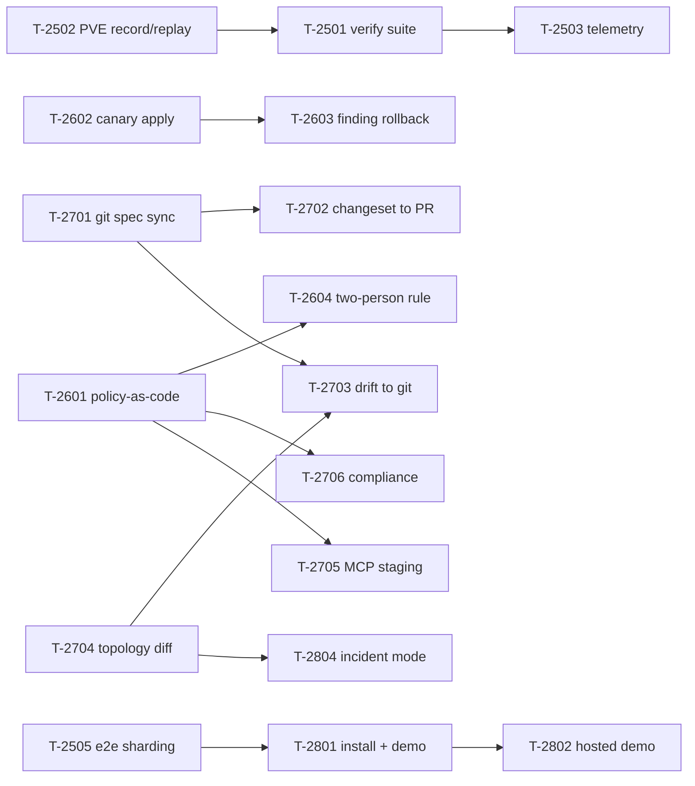

# Arc 5 — Adoptable, not just proven

**Status: planned 2026-08-10.** The four arcs before this one are described in
[`roadmap.md`](roadmap.md) (Phases 0–7, v1.0), [`roadmap-next.md`](roadmap-next.md) (8–12, v2.0),
[`roadmap-universal.md`](roadmap-universal.md) (13–17, v3.0) and
[`roadmap-proven.md`](roadmap-proven.md) (18–21, v3.1 → v4.0). Phases 22 (online help), 23
(certificate management) and 24 ([operator leverage](roadmap-leverage.md)) sit outside that
structure.

Arc 4 asked *"is it true?"* Arc 5 asks the two questions that follow: **"can anyone else run it?"**
and **"can the answer to the first question be produced by a machine instead of a person?"**

## Why an arc, and why these twenty-five

Scoped from the audit at `42ba175` (2026-08-10), read against
[`status-matrix.md`](status-matrix.md) and [`project-status.md`](project-status.md). Those two
documents agree on an uncomfortable shape:

| Dimension | Figure | What it means here |
|---|---|---|
| Feature delivery | **91%** (152/167 cards) | Adding a sixth networking domain is not the constraint |
| Backend implementation | **97%** (68 ● / 6 ◐ / 3 ○ of 77) | Nearly everything exists |
| Hardware validation | **9%** (12/130 items) | Nearly nothing is *proven* where it matters |
| External consumers | **0** | No apt repo, no registry, no provider, no installer |

Twenty-five candidates survived a check against the tree. The organising finding is that
**the highest-value remaining work is assembly and proof, not new features** — the majority of
these cards wire together subsystems that already ship, or make an existing claim checkable by a
command rather than by a human with a clipboard.

Three candidates were dropped on contact with the repository. Do not re-add them; if a report
claims one is missing, the report is wrong:

| Dropped candidate | Why |
|---|---|
| Failure-impact / "what breaks if X dies" analysis | **Already ships** as `internal/failsim` (T-1604), with a binding soundness contract |
| Explainable security posture score | **Already ships** as `internal/posture` (T-1607), with named contributing factors |
| Traffic anomaly detection from learned baselines | **Already ships** as `internal/baseline` (T-1601) |

## The four phases

| Phase | Theme | Cards | Question it answers |
|---|---|---|---|
| **25** | Proof that runs itself | 6 | Can the 9% figure move without a human on a ladder? |
| **26** | Guardrails | 5 | Can the change engine refuse a bad change, not just narrate it? |
| **27** | Config as code | 6 | Can the cluster's network live in git and stay there? |
| **28** | Adoption | 8 | Can someone who has never met us run this? |

Phase 25 comes first because everything after it is a claim that needs proving, and Phase 25 is
what does the proving.

## Invariants carried forward

Unchanged, and not renegotiated by anything below:

- **Proxmox stays the source of truth.** T-2701's git sync makes a repository the source of
  *intent*; the live PVE config remains the source of *fact*, and the two are reconciled by
  producing a changeset, never by declaring the repo authoritative.
- **Every mutation flows through the change engine.** This arc adds three new entry points to
  staging — git sync (T-2701), MCP tools (T-2705), and batch reconciliation (T-2703). All three
  stage and none of them apply. There is still exactly one write path.
- **Cluster-aware by default.** T-2602's canary apply is the first card that deliberately treats
  nodes non-uniformly; it does so by ordering the existing fan-out, not by bypassing it.
- **A guardrail that cannot fail is not a guardrail.** Every policy, gate, and check introduced
  here ships with a fixture that makes it fire. This is the direct lesson of `T-2108`, where four
  defects sat under green tests whose fixtures invented the shape the code expected.
- **Proof is not self-report.** No card in Phase 25 is complete because a report says the check
  ran. Each one is complete when a command emits an artifact somebody else can re-run.

## The twenty-five cards

### Phase 25 — Proof that runs itself

| # | Card | Item | Pri |
|---|---|---|---|
| 1 | `T-2501` | Self-executing hardware validation suite (`vnproxctl verify`) | P0 |
| 2 | `T-2502` | Record/replay real PVE traffic into `pvemock` fixtures | P0 |
| 3 | `T-2503` | Opt-in compatibility telemetry | P1 |
| 4 | `T-2504` | Nightly soak + resource-leak gate | P1 |
| 5 | `T-2505` | E2E sharding, isolation, and flake quarantine | P1 |
| 6 | `T-2506` | Performance regression budget gate | P2 |

### Phase 26 — Guardrails

| # | Card | Item | Pri |
|---|---|---|---|
| 7 | `T-2601` | Policy-as-code guardrails at the validate stage | P0 |
| 8 | `T-2602` | Canary / staged multi-node apply | P0 |
| 9 | `T-2603` | Finding-triggered auto-rollback inside the confirm window | P0 |
| 10 | `T-2604` | Enforced two-person rule on protected op classes | P1 |
| 11 | `T-2605` | Post-apply topology preview | P2 |

### Phase 27 — Config as code

| # | Card | Item | Pri |
|---|---|---|---|
| 12 | `T-2701` | Git-backed spec sync (pull → plan → changeset) | P0 |
| 13 | `T-2702` | Changeset → pull request | P1 |
| 14 | `T-2703` | Drift-to-git reconciliation | P1 |
| 15 | `T-2704` | Point-in-time topology diff | P1 |
| 16 | `T-2705` | Mutating MCP tools that stage, never apply | P1 |
| 17 | `T-2706` | Compliance profiles and evidence export | P1 |

### Phase 28 — Adoption

| # | Card | Item | Pri |
|---|---|---|---|
| 18 | `T-2801` | One-command install + built-in demo mode | P0 |
| 19 | `T-2802` | Hosted read-only demo and guided tour | P2 |
| 20 | `T-2803` | Hosted signed registry for blueprints and plugins | P1 |
| 21 | `T-2804` | Incident mode — one timeline across diagnosis, capture, findings | P1 |
| 22 | `T-2805` | Multi-user presence and changeset locking | P1 |
| 23 | `T-2806` | Map annotation layer | P2 |
| 24 | `T-2807` | Scheduled digest reports | P2 |
| 25 | `T-2808` | In-app assistant over the MCP read tools | P2 |

**Six of the twenty-five** close or subsume something already filed and deferred with a reason.
The parenthesised numbers are this list's own numbering:

| Deferred item | Picked up by |
|---|---|
| `T-1802`, `T-1803`, `T-1804` — hardware, multi-node, and failure-injection proof, all marked *human only* | `T-2501` (1) |
| The standing "9% hardware validation" item `project-status.md` ranks P0 | `T-2501` (1), `T-2502` (2), `T-2503` (3) |
| `T-2409` — per-spec e2e store isolation, open and blocked | `T-2505` (5) |
| `T-2101` — Terraform provider / Ansible collection, needing a spec substrate | `T-2701` (12) |
| `T-2104` — hosted registry, with a finished client and no server | `T-2803` (20) |

## Dependencies

Hard edges only. `T-2502` precedes `T-2501` because a validation suite asserting against
hand-written fixtures proves nothing new. `T-2601` precedes `T-2705` and `T-2604` because both
are policy consumers. `T-2602` precedes `T-2603` because a rollback trigger needs a staged apply
to interrupt. `T-2704` precedes `T-2703` because reconciliation needs a diff to reconcile.

## Explicit non-goals for this arc

- **No sixth networking domain.** Same reason `roadmap-proven.md` and `roadmap-leverage.md` give,
  now with more force: 91% feature delivery against 9% validation means new features widen the
  gap this arc exists to close.
- **No general device management.** T-2701's git sync covers the vnprox spec, not arbitrary
  device config. The switch-push boundary in [`features.md`](features.md) still holds.
- **vnprox does not become a CI system.** T-2702 opens a pull request through a host's existing
  API; it does not run, gate, or merge one.
- **Telemetry is opt-in, anonymous, and inspectable, or it does not ship.** T-2503 must be able to
  print exactly what it would send, and default to sending nothing.
- **The MCP surface never applies.** T-2705 raises the ceiling from read-only to stage-only. An
  AI operator still cannot commit a change to a network.
- **No retention change.** vnprox still does not become a flow or metrics warehouse.

## Exit demo

A stranger runs one command on a laptop with no Proxmox anywhere and gets a working vnprox
against a synthetic cluster. Convinced, they install it on their real cluster from a signed apt
repository, point it at their network spec in git, and watch it produce a changeset reconciling
intent with reality — which their org's policy file rejects, because it would put a guest on
VLAN 1. They fix the spec, the changeset passes, and it applies to one node first; a `error`
finding appears eleven seconds later and the apply rolls itself back before touching node two,
without anyone watching. The incident timeline that assembles itself afterwards contains the
diagnosis ladder output, the capture, and the topology diff showing exactly what differed. None
of that required us, and `vnproxctl verify --suite=hardware` on their cluster mails back a report
that moves the validation figure for everyone.
