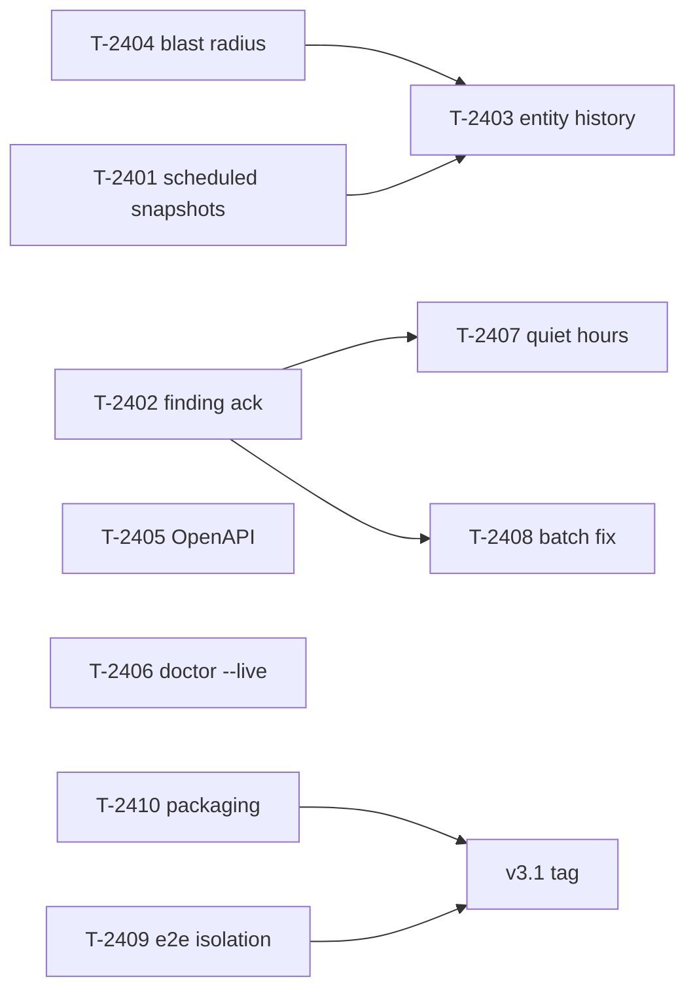

# Operator-leverage roadmap — Phase 24

**Status: shipped** (planned 2026-08-08; all ten cards delivered across two passes on 2026-08-08
and 2026-08-09 — see `planning/tasks/phase-24.md`'s delivery records — and folded into the
`v3.5.0` line). The four arcs before this one are described in
[`roadmap.md`](roadmap.md) (Phases 0–7, v1.0), [`roadmap-next.md`](roadmap-next.md) (8–12, v2.0),
[`roadmap-universal.md`](roadmap-universal.md) (13–17, v3.0) and
[`roadmap-proven.md`](roadmap-proven.md) (18–21, v3.1 → v4.0). Phases 22 (online help) and 23
(certificate management) shipped outside that structure. The `v3.1` tag this document plans toward below **was never cut** — phases 18 and 19
shipped inside the `v3.0.x` line, this phase folded into `v3.5.0`, and Arc 4 closed as `v4.0.0`.
Read every version number below as the plan at the time, not the release ledger.

This phase is not a fifth arc. It is a single phase of **leverage work**: ten items chosen
because the product's feature surface is now large enough that the binding constraint has moved
from *"can vnprox do this"* to *"can one operator stay on top of what vnprox is telling them."*

## Why these ten

Phase 24 was scoped from a full-stack audit at `7a8ef6d` (2026-08-08). Every candidate was
checked against the code before it was written down — three initially-obvious ideas were dropped
on contact with the repository:

| Dropped candidate | Why |
|---|---|
| Post-confirm revert of a committed changeset | **Already ships.** `Service.Rollback` builds a restoring draft from the changeset's own pre-apply snapshot (`apply_restore.go`) for any changeset inside the rollback window |
| Standalone map SVG/PNG export | **Already ships** as `web/src/topology/ExportMapMenu.tsx`. `features.md` still calls it a known gap (T-607); that line is stale, not the product |
| Four-eyes approval / no self-approval | **Already ships** — `ApprovalPolicy.AllowSelfApproval`, enforced server-side in `ReviewApprove` |

What survived divides into three groups.

**Signal management (4 items).** vnprox runs 43 health checks across 15 sources, ingests flows
and conntrack, and detects drift continuously. It has no way to say *"I know, that one is
deliberate"*, no way to stop a flapping link paging a hundred times, and no way to fix twenty
findings without creating twenty changesets. A stream nobody can triage becomes wallpaper, and
wallpaper is indistinguishable from a broken check.

**Change confidence (3 items).** The change engine's guarantees are strong and its *narration* is
thin. Before an apply you get a semantic diff and a plan; you do not get "this touches 2 nodes
and 14 guests briefly lose their path." After an apply you can find the changeset, but standing
on a bridge in the inspector there is no way to ask what has been done to it and by whom. And
the store keeps a restore point for every change vnprox made — and none at all for the ones it
did not, which is exactly the class the drift checker exists to catch.

**Reach and trust (3 items).** `api.md` is 1,316 hand-written lines describing 186 routes with
no machine-readable form, which is the missing prerequisite under the Terraform provider,
generated clients, and a docs site. And two known-open engineering defects — a shared e2e store
and a red packaging job — sit between the current tree and a defensible `v3.1` tag.

## Invariants carried forward

Unchanged, and not renegotiated by anything below:

- **Proxmox stays the source of truth.** Scheduled snapshots (T-2401) read `/etc/network/interfaces`
  and store it as app-owned *evidence*; nothing in this phase makes vnprox's copy authoritative.
- **Every mutation flows through the change engine.** T-2408's batch fix stages one changeset; it
  does not apply it, and it introduces no second write path.
- **Cluster-aware by default.** Every new read fans out or is explicitly documented as local.
- **Acknowledgement is not suppression.** T-2402 must never make a finding invisible — a muted
  finding stays retrievable, stays counted in its own bucket, and un-mutes itself on expiry.

## The ten items

| # | Card | Item | Group | Pri |
|---|---|---|---|---|
| 1 | `T-2401` | Scheduled automatic config snapshots | Change confidence | P0 |
| 2 | `T-2402` | Finding acknowledgement and mute, with expiry | Signal | P0 |
| 3 | `T-2403` | Entity change history ("blame") in the inspector | Change confidence | P0 |
| 4 | `T-2404` | Blast-radius preview before apply | Change confidence | P0 |
| 5 | `T-2405` | OpenAPI 3.1 document + route-completeness gate | Reach | P0 |
| 6 | `T-2406` | `vnproxctl doctor --live` — close the four skipped checks | Signal | P1 |
| 7 | `T-2407` | Alert quiet hours and digest coalescing | Signal | P1 |
| 8 | `T-2408` | Batch-fix findings into one changeset | Signal | P1 |
| 9 | `T-2409` | Per-spec e2e store isolation | Trust | P1 |
| 10 | `T-2410` | Packaging matrix `cluster-ssh` root cause | Trust | P1 |

Six of the ten are net-new capability. Four close cards that were filed and deferred with a
reason: `T-1904-followup-02` (6), `T-2108-followup-01` (9), `T-1806-bug-02` (10), and T-607's
long-standing "findings cannot be triaged" complaint (2).

## Dependencies

Only two edges are hard: T-2407 and T-2408 both act on the finding identity T-2402 stabilises,
and T-2403's history feed reads the snapshot kinds T-2401 introduces. Everything else can land in
any order.

## Explicit non-goals for this phase

- **No new networking domain**, for the reason `roadmap-proven.md` gives: a fifth pile of
  features on a foundation that is 9% hardware-validated makes the trust problem worse.
- **No i18n and no PWA.** Both are real (`T-2006`, `T-2005`) and both are too large to land
  half-done; a partially-extracted string catalogue is worse than none.
- **No suppression semantics.** See the invariant above. If a check is wrong, fix the check.
- **No retention change.** vnprox still does not become a flow or metrics warehouse.

## Exit demo

An operator mutes a known-intentional MTU finding for 30 days with a reason; the remaining
fourteen auto-fixable findings are staged into **one** changeset; its blast-radius panel says
which two nodes and eleven guests it touches and that the management path is clear; they approve
and apply it; a colleague later clicks the same bridge and sees that change, who made it, and the
scheduled snapshot taken two hours before an unrelated out-of-band `ifreload` — restoring from
which is one click. Meanwhile the flapping WAN link that would have paged 200 times has sent one
digest, `doctor --live` is green on all ten checks rather than six, and the release pipeline is
green enough to tag.
