# Next-gen roadmap — v1.4 → v2.0

**This arc (Phases 8–12) is shipped**, cut as `v2.0.0` — see `CHANGELOG.md`'s `[2.0.0]` entry
(note that tag also absorbed Phases 13–15 of the arc after this one, since it was applied after
those phases had already merged onto the same branch). The v1 roadmap (`docs/roadmap.md`,
Phases 0–7) shipped before it. This document describes the second arc: five phases that turn
vnprox from "the visual network manager for a PVE cluster" into **the all-in-one visual
networking tool for Proxmox** — one pane of glass where you *see*, *understand*, *change*,
*verify*, and *automate* every layer of a Proxmox network, across any number of clusters.

The arc after this one — Phases 13–17, v2.1 → v3.0, the *universal* networking tool — lives in
[`roadmap-universal.md`](roadmap-universal.md); it too is shipped, complete as of `v3.0.4`. The
fourth arc — Phases 18–21, hardware validation, operability, and distribution — lives in
[`roadmap-proven.md`](roadmap-proven.md); **it too is shipped, cut as `v4.0.0` on 2026-08-14**
(its `v3.1`/`v3.2`/`v3.3` version plan was never tagged — phases 18 and 19 landed inside the
`v3.0.x` line and Arc 5 took `v3.5.0`). Arc 5 — Phases 25–28, [`roadmap-adopted.md`](roadmap-adopted.md)
— is shipped as `v3.5.0`, and **Arc 6, [`roadmap-earned.md`](roadmap-earned.md) (Phases 29–33,
v4.1 → v5.0), is active**.

Inputs: the Post-1.0 (P2) backlog in `docs/roadmap.md`, the gaps flagged at T-607, and field
feedback since v1.0 (Phase 7's origin). Every item below either extends a feature already in
production or promotes a backlog/flagged item; net-new capabilities are marked **(new)**.

Same rules as v1: phases end in a demoable increment, releases cut where marked, and the arc is
decomposed into task cards — see `planning/implementation-plan-next.md` for the dependency
graph, model assignments, and the per-phase card files (`planning/tasks/phase-8.md` … `phase-12.md`).
Priorities within a phase: **P0** = must ship in that phase's release, **P1** = ships in that
release line as capacity allows.

```mermaid
gantt
    dateFormat X
    axisFormat %s
    section Build
    Phase 8 Verified networking      :p8, 0, 3
    Phase 9 Cockpit UI and UX        :p9, after p8, 5
    Phase 10 Flows and observability :p10, after p9, 4
    Phase 11 Network as code         :p11, after p10, 4
    Phase 12 Beyond the cluster      :p12, after p11, 5
```

(Axis units are relative effort, not calendar time, as in the v1 roadmap. Phase 9 depends on 8
only for badge/finding surfaces; 10 and 11 are largely independent of each other and can
parallelize at the task level.)

## Invariants carried forward

These are not up for renegotiation in this arc:

- **Proxmox stays the source of truth**; vnprox's store holds only app-owned data. Federation
  (Phase 12) federates *views and workflows*, never config ownership.
- **Every mutation flows through the change engine** — including the new write surfaces in this
  arc (scheduled changesets, GitOps-generated changesets, switch-port push).
- **Cluster-aware by default**; Phase 12 raises that bar to *multi*-cluster-aware.
- **Mock-first development**: `internal/pvemock/` grows fixtures for every new surface (flow
  records, federation peers, switch drivers) so CI never needs hardware.

---

## Phase 8 — Verified networking → **v1.4**

Theme: *prove the network does what the config says.* v1 shows intent (config) and observed
state (drift, findings) separately; Phase 8 closes the loop by testing the live data path and
catching cross-node breakage **before** apply instead of after. This phase promotes every
remaining verification item flagged at T-607.

- **P0 — Pre-apply cross-node consistency validator** (promoted from P2 backlog, T-607 flag):
  a genuine validator class in `internal/change` that folds the *cluster-wide* projected state —
  VLAN carried on one node's trunk but not its migration peer, MTU asymmetry across a bond pair,
  bridge present on some nodes of a zone but not others. Today only the async drift checker
  catches these, after the fact; this makes them stage-time findings with fix patches.
- **P0 — Live path verification via QEMU guest agent** (promoted from P2 backlog): the path
  simulator (Phase 5) gains a "verify live" action — inject a real probe (ping/TCP handshake)
  from source guest toward destination via the guest agent, compare the *observed* result
  against the *simulated* verdict, and flag divergence (the strongest possible drift signal).
  Simulation-only remains the default; probes are explicit, audited actions.
- **P0 — Health-check pack 2**: extend `internal/findings` with VXLAN/EVPN encapsulation-overhead
  MTU (promoted from a changeset-time advisory to a continuous check — plain path-MTU asymmetry
  already ships in the v1 drift checker), orphan VNet (zone deleted), EVPN anycast gateway
  inconsistency across nodes, corosync link degradation, and "trunk carries VLANs no guest
  uses" (informational). Same stable-id/hysteresis contract as the v1 checks.
- **P1 — LACP actor/partner state parsing** (T-607 flag): the bond inspector's live LACP view
  gains actor/partner system ID, key, and per-slave sync/collecting/distributing bits — turning
  "bond is up" into "bond is *negotiated correctly*". Feeds a new `lacp_partner_mismatch`
  health check.
- **P1 — ARP/neighbor tables as an IPAM enrichment source** (T-607 flag): merge per-node
  neighbor tables into the IPAM address list as `observed` records — surfaces squatters and
  stale allocations the PVE IPAM never sees.

Exit demo: stage a changeset that would strand a VLAN on one node → blocked with a fix patch;
run a live probe that contradicts the simulator → divergence finding on the map.

## Phase 9 — Cockpit UI & UX → **v1.5** *(the frontend phase)*

Theme: *one cockpit, any scale, any operator.* v1's frontend grew page-by-page across six
phases; Phase 9 is a deliberate, frontend-only consolidation pass that makes the map the true
center of the product and brings the whole surface up to one design bar. No new backend
capabilities — every item below renders data that already exists, which is what makes this
phase safe to execute as pure UI/UX work.

- **P0 — Topology map v2**: move rendering to canvas/WebGL with level-of-detail semantics —
  full faceplates when zoomed in, per-node summary capsules when zoomed out (the
  physical-layer collapse flagged at T-607 for clusters materially beyond the topology.md §4
  scale target), edge bundling for guest-dense bridges, and a minimap. Switch/Graph toggle,
  layer toggles, and saved layouts carry over unchanged.
- **P0 — Command palette**: a ⌘K palette unifying the existing spotlight search with *actions*
  ("edit vmbr0", "new VLAN zone", "open drafts", "simulate path from…"), full keyboard-first
  navigation building on `web/src/keyboard`, and jump-to-anything across all pages. Every UI
  action gets a palette verb; the palette becomes the product's second interface.
- **P0 — Home dashboard**: a network-at-a-glance landing page — open findings by severity,
  drift status, pending/awaiting-confirm changesets, mgmt-path redundancy per node, top
  talkers, and recent audit entries — each tile deep-linking into its page. Today the product
  opens on the map with no summary layer.
- **P0 — Design-system and accessibility pass**: consolidate the component set into one
  documented library (density modes, consistent form/table/drawer patterns), dark theme,
  and WCAG 2.1 AA: complete keyboard navigation (map included — roving focus across entities),
  screen-reader labels for every map entity and badge, and reduced-motion support.
- **P0 — Map export** (T-607 flag): dedicated export-the-map-as-SVG/PNG control honoring
  current layers/filters/zoom, separate from the config-doc export; plus a print stylesheet.
- **P1 — Saved views & annotations**: named presets of layer+filter+zoom+selection, shareable
  as URLs; sticky-note annotations pinned to map entities (stored in the layout store, already
  app-owned data).
- **P1 — Inspector v2**: pin multiple inspectors, side-by-side entity compare (two bonds, two
  nodes' bridges), and inline sparkline history in every metrics tab.
- **P1 — Responsive triage layout**: read-only tablet/phone layout for on-call use — dashboard,
  findings, changeset confirm/rollback actions (commit-confirm from a phone is the killer
  feature; all other mutations stay desktop-only).

Exit demo: a 30-node simulated cluster (`testdata/genscale`) rendered fluidly at 60fps with
level-of-detail collapse; an operator completes "find guest → edit NIC → apply → confirm"
without touching the mouse; the same session replayed with a screen reader.

## Phase 10 — Flows & observability → **v1.6**

Theme: *from counters to conversations.* v1 shows throughput (who is busy); Phase 10 shows
flows (who talks to whom), and pushes vnprox's signals into the observability stack the rest
of the infrastructure already uses.

- **P0 — Prometheus exporter** (promoted from P2 backlog): `/metrics` exposing per-interface/
  bridge/guest-NIC rates, finding counts by severity, drift status, and changeset states —
  the existing sampler already computes these; this is an export surface.
- **P0 — Flow collection (lite) + flow explorer** (promoted from P2 backlog): NetFlow/sFlow/
  IPFIX ingestion into a bounded ring store (same retention philosophy as metrics — vnprox is
  not a long-term flow warehouse), a flow explorer table (filter by guest/VLAN/subnet/port),
  and **flows painted on the map** as animated edges — the topology map becomes a live traffic
  diagram. Sources: sFlow from OVS bridges, NetFlow from an edge router, or the optional
  sampler below.
- **P1 — Host-local flow sampling**: eBPF/conntrack-based per-bridge flow sampling on nodes
  where no sFlow source exists — same explorer, zero external dependencies. Runs only when
  enabled per node; flagged needs-hardware-validation from day one.
- **P0 — Alert routing**: findings and drift events routed to webhooks (generic + Gotify/
  ntfy/Slack shapes) with per-severity/per-source rules — the findings stream finally pages
  someone. Config UI lives in Settings.
- **P1 — Firewall log analytics**: aggregate the v1 log viewer into rule hit counts, top
  blocked sources/destinations, and an **unused-rule report** ("no hits in N days") feeding a
  `fw_rule_unused` informational finding — closing the loop between firewall editing and
  reality.
- **P1 — History playback**: scrub the map's traffic paint back through the retained metric/
  flow window ("what did the network look like at 02:00") using the existing history store.

Exit demo: a noisy-neighbor incident solved entirely in vnprox — alert fires via webhook, the
dashboard shows the hot bridge, flow explorer names the guest pair, history playback shows when
it started.

## Phase 11 — Network as code & automation → **v1.7**

Theme: *the change engine becomes a platform.* Everything the UI can do becomes drivable,
declarative, and schedulable — with the same staged-validate-diff-apply-confirm safety
guarantees, because every path below terminates in an ordinary changeset.

- **P0 — Declarative cluster network spec**: export the entire network intent (bridges, bonds,
  VLANs, SDN, firewall, IPAM ranges) as one versionable YAML document — blueprints v2,
  cluster-scoped. Import diffs the spec against live state and generates a changeset; the
  drift checker learns to diff against a *pinned* spec, turning vnprox into a GitOps
  reconciler with a human confirm step.
- **P0 — Scheduled changesets / maintenance windows**: stage now, apply at 02:00, with the
  commit-confirm timer requiring an explicit ack (webhook/UI/CLI) inside the window or
  auto-rolling back — the existing rollback machinery is what makes unattended apply safe.
  Mgmt-path-touching changesets (Phase 7's `touchesMgmtPath`) are excluded from unattended
  apply.
- **P0 — Event stream**: authenticated WS/webhook firehose of audit, changeset lifecycle,
  drift, and finding events — the integration primitive the alert routing (Phase 10) and CI
  hooks build on.
- **P1 — Terraform provider + Ansible collection** **(new)**: thin shims over the changeset
  API (plan = validate+diff, apply = apply+confirm). Published separately; the daemon's only
  new surface is API-token auth scoped for automation.
- **P1 — `vnproxctl` parity**: the CLI reaches full parity with the UI's read and changeset
  surfaces (today it covers a subset), gaining `vnproxctl apply spec.yaml` for the GitOps flow
  and machine-readable (`-o json`) everything.
- **P1 — Blueprint sharing**: signed, parameterized blueprint bundles exportable/importable
  across installations — the community layer on top of blueprints v2.

Exit demo: a PR to a git repo holding the cluster spec → CI calls `vnproxctl apply --plan` →
review shows the diff → merge applies during the night window → morning dashboard shows the
committed changeset and a clean drift report.

## Phase 12 — Beyond the cluster → **v2.0**

Theme: *every network a Proxmox shop runs, one tool.* The v2.0 cut is the multi-cluster
release; the remaining P2 backlog items land here because they all cross today's cluster
boundary.

- **P0 — Multi-cluster federation** (promoted from P2 backlog): one vnprox instance (or a
  designated primary) attaches multiple PVE clusters; global topology with per-cluster
  drill-down, global search and command palette across clusters, cross-cluster IPAM view
  (the same subnet used twice is now *visible*), per-cluster changesets with a global audit
  trail. Config ownership stays strictly per-cluster.
- **P0 — External subnet records + deeper IPAM sync** (promoted from P2 backlog): model
  non-PVE subnets (office LANs, upstream transit, colo ranges) as first-class IPAM records,
  and upgrade NetBox/phpIPAM from read-merge to bidirectional sync with conflict findings.
- **P1 — DNS management** (promoted from P2 backlog): surface and edit PVE SDN's DNS plugin
  (PowerDNS) — zone/record visibility on the map (names on guests), record edits via
  changesets.
- **P1 — Switch config push, guarded** (promoted from P2 backlog): the read-write physical
  step beyond LLDP-read — driver-based (OpenConfig/gNMI first, vendor drivers behind it),
  scoped to *ports facing PVE nodes only* (VLAN membership, descriptions, LACP), every push a
  changeset with validate/diff/confirm and the mgmt-path interlocks extended to the uplink
  ports. Explicit per-switch opt-in; ships dark until enabled.
- **P1 — PBS network awareness** (promoted from P2 backlog): read-only — PBS hosts appear on
  the map with their interfaces and the backup traffic path highlighted, so backup-network
  sizing stops being guesswork.
- **P1 — OIDC SSO** **(new)**: OIDC login alongside the PVE ticket bridge for federated
  deployments where per-cluster PVE credentials stop scaling; PVE caps still gate every
  cluster-scoped action.

Exit demo: three clusters on one screen; a duplicate-subnet conflict between two of them found
by global IPAM; a VLAN rolled out end-to-end — switch ports, bridges, SDN zone, firewall —
from one guided flow.

---

## Explicit non-goals for this arc

Unchanged from v1 unless listed: vnprox still does not replace the PVE firewall engine, still
does not manage arbitrary non-Proxmox devices (switch push is limited to PVE-facing ports),
and still does not retain flows/metrics long-term (export to Prometheus/your TSDB instead).
General-purpose NMS ambitions (SNMP polling estates, non-Proxmox hypervisors) remain out.

## Compatibility & versioning

Target PVE 9.x and 10.x across this arc; each new PVE release gets a compatibility validation
task within one phase of its release, as in v1. Semver continues: v2.0 marks federation (the
first release where a vnprox instance is no longer 1:1 with a cluster). DB schema migrations
remain forward-only. The changeset API is declared stable at v1.7 (Phase 11) — automation
consumers get a documented deprecation policy from that point.
