# Proven-in-production roadmap — v3.1 → v4.0

**Status: proposed, not started.** The three arcs before this one are shipped:
`roadmap.md` (Phases 0–7, v1.0) made vnprox the visual network manager for a PVE cluster;
`roadmap-next.md` (Phases 8–12, v2.0) made it the all-in-one visual networking tool for
Proxmox; `roadmap-universal.md` (Phases 13–17, v3.0) made it the universal networking tool
and an open platform. With v3.0.4 every card in all three is implemented.

This arc is different in kind, and deliberately so.

The honest read of where vnprox stands: **the feature surface is enormous and the evidence
behind it is thin.** `planning/reports/needs-hardware-validation.md` holds 105 open items
against 1 validated — three arcs of networking features developed entirely against
`internal/pvemock`, with one single-node PVE box (`pvecube`) as the only real hardware ever
touched. The product's core promise is *safe* network change on a cluster that will lock you
out if you get it wrong. That promise is currently backed by mocks.

So this arc adds comparatively few new capabilities. It is about earning the trust the
existing feature set already claims: **prove it on iron, make it operable when it goes
wrong, close the gaps the build left flagged, and put it where people can actually get it.**

## Invariants carried forward

Unchanged from every prior arc, and not up for renegotiation here:

- **Proxmox stays the source of truth.** vnprox's store holds only app-owned data.
- **Every mutation flows through the change engine** — stage → validate → diff → apply →
  confirm/rollback. Phase 18's item 4 exists precisely because one corner of this doesn't
  hold today.
- **Cluster-aware by default**, multi-cluster-aware since v2.0.
- **Mock-first development**: `internal/pvemock` stays the development substrate. This arc
  adds hardware validation *on top of* it, and never as a replacement — a feature that can
  only be tested on real hardware is a feature that stops being tested.

## Priority-ranked summary

All 25 items, most urgent first. P0 = the arc's release line depends on it; P1 = ships in
that release as capacity allows; P2 = wanted, cut first under pressure.

| # | Pri | Item | Phase |
|---|-----|------|-------|
| 1 | P0 | Hardware-validation burndown (105 open items) | 18 |
| 2 | P0 | Real multi-node cluster validation | 18 |
| 3 | P0 | Failure-injection proof of commit-confirm | 18 |
| 4 | P0 | Close the unattended-rollback gap for `fw.*` / `sdn.apply` | 18 |
| 5 | P0 | Trustworthy CI + branch protection | 18 |
| 6 | P0 | Backup, restore, and disaster recovery of vnprox's own state | 19 |
| 7 | P0 | Support bundle export | 19 |
| 8 | P0 | Federation cluster editor UI | 20 |
| 9 | P0 | Publish the Terraform provider and Ansible collection | 21 |
| 10 | P0 | Signed apt repository and a trustworthy install path | 21 |
| 11 | P1 | Upgrade-chain testing across all 32 migrations | 18 |
| 12 | P1 | Scale validation on real cluster data | 18 |
| 13 | P1 | Self-observability: RED metrics for the daemon | 19 |
| 14 | P1 | `vnproxctl doctor` preflight and self-check | 19 |
| 15 | P1 | Retention, rotation, and compaction | 19 |
| 16 | P1 | Peer-API CA pinning | 19 |
| 17 | P1 | Physical-layer progressive collapse | 19 |
| 18 | P1 | Flagged-follow-up burndown | 20 |
| 19 | P1 | Change review: approvals, comments, side-by-side diff | 20 |
| 20 | P1 | Accessibility and design-system second pass | 20 |
| 21 | P1 | PVE compatibility matrix and automated compat testing | 21 |
| 22 | P1 | Hosted blueprint/plugin registry | 21 |
| 23 | P2 | Mobile PWA with push for findings and confirms | 20 |
| 24 | P2 | Localization (i18n), German first | 20 |
| 25 | P2 | Proxmox-community distribution and a docs site | 21 |

```mermaid
gantt
    dateFormat X
    axisFormat %s
    section Build
    Phase 18 Proven on iron        :p18, 0, 5
    Phase 19 Operable in the field :p19, after p18, 4
    Phase 20 Sharper daily use     :p20, after p18, 4
    Phase 21 Ecosystem and reach   :p21, after p19, 4
```

(Axis units are relative effort, not calendar time, as in every prior roadmap. Phase 20
depends on 18 only for the CI and validation groundwork and can parallelize with 19 at the
task level; Phase 21 should not start until 19 has made a bad install diagnosable, since
distribution multiplies the cost of every unsupportable failure.)

---

## Phase 18 — Proven on iron → **v3.1**

Theme: *stop shipping on faith.* Nothing in this phase is a feature. Everything in it is
evidence that the features already shipped do what their docs say on real Proxmox.

- **P0 — Hardware-validation burndown.** `planning/reports/needs-hardware-validation.md`
  has 105 unchecked items and exactly one validated (the pmxcfs secret-store work in T-608,
  which found two real bugs on first contact with hardware — a 1-for-1 hit rate that is the
  whole argument for this phase). Work the checklist section by section against a real
  cluster, checking items off with the PVE version tested, and treat every divergence found
  as a bug card rather than a doc amendment. Prioritize the sections gating safety: PVE API
  behavior, the peer API, the distributed rollback/local-timer protocol, and the host writer.
- **P0 — Real multi-node cluster validation.** Everything cluster-aware — peer discovery,
  fan-out reads, cross-node changesets, distributed rollback timers, single-writer HA lease
  fencing (T-1704) — has only ever run against a *single-node* cluster and mocks. pmxcfs
  cross-node replication in particular is explicitly listed as not-yet-validated. A three-node
  cluster is the minimum bar; HA lease fencing cannot be meaningfully tested below two.
- **P0 — Failure-injection proof of commit-confirm.** The product's central safety claim is
  "if the change locks you out, it reverts itself." That path has never been exercised on
  hardware against a real lockout: pull the management link mid-apply, kill `vnproxd` inside
  the confirm window, hard-reset the node, partition the cluster, let the timer expire with
  no session alive. Each scenario gets a written expected outcome first, then a run. Anything
  that doesn't self-heal is a release blocker, not a finding.
- **P0 — Close the unattended-rollback gap for `fw.*` and `sdn.apply`.** Flagged in
  `planning/reports/T-502.md` and never resolved: PVE firewall and SDN writes require the
  *user's* ticket, so once the HTTP request that started an apply has ended there is no
  credential available to revert them. A `fw.*`-only changeset that reaches `awaiting_confirm`
  and then times out — or whose daemon crashes mid-window — **is not automatically reverted**,
  unlike node-file changes. This is a real hole in the core guarantee, spanning two op
  families, that no single task felt entitled to fix. It needs an architectural decision
  (a narrowly-scoped daemon-held PVE token? a pre-authorized revert ticket captured at apply
  time? an explicit "this op family is confirm-only" contract surfaced in the UI?) and then
  the implementation. Whatever the answer, the UI must stop implying a safety net that isn't
  there for those ops.
- **P0 — Trustworthy CI and branch protection.** The `check` and `fuzz` jobs fail
  independently of the diff, and `main` has no branch protection — so the signal everyone
  ignores is also the signal nothing enforces. Fix the flakes (or delete the jobs), pin the
  toolchain, make `npm audit`'s known-transitive advisories an explicit allowlist with expiry
  dates instead of a permanent red X, then turn on required checks. Until this lands, every
  other item in this arc is validated by hand.
- **P1 — Upgrade-chain testing across all 32 migrations.** Schema migrations are
  forward-only and there are 32 of them, but no test walks a v1.0-era database up to current.
  Build a fixture corpus of databases at historical schema versions and assert every one
  opens, migrates, and serves. Package upgrade/downgrade semantics (conffile handling, service
  restart, key preservation) get the same treatment on a real install.
- **P1 — Scale validation on real cluster data.** `docs/features/topology.md` §4 documents a
  scale target and `docs/testing/topology-performance.md` measures it synthetically. Measure
  it against a real cluster's real config — projection time, payload size, first paint,
  interaction latency — and publish the numbers, including where they break down.

Exit demo: the hardware checklist is majority-green with the PVE versions recorded; a
three-node cluster survives a scripted lockout during an apply and heals itself unattended;
CI is green, required, and believed.

## Phase 19 — Operable in the field → **v3.2**

Theme: *what happens when it goes wrong at someone else's site.* vnprox is very good at
observing a Proxmox cluster and comparatively blind to itself. Every item here is something
an operator needs at 3 a.m. and does not currently have.

- **P0 — Backup, restore, and disaster recovery of vnprox's own state.** There is no backup
  story at all. The SQLite store holds changesets, pre/post snapshots, audit history, layout,
  tenants, and blueprint state; `/etc/vnprox/keys` holds the session key that makes sealed
  credentials readable. Lose the box and you lose the audit trail and every rollback snapshot
  — the artifacts you most want after an incident. Ship `vnproxctl backup` / `restore` with a
  documented, versioned, integrity-checked archive; make key material's inclusion an explicit
  opt-in with a loud warning; document the restore-to-a-different-node path; and test restore
  across schema versions alongside item 11.
- **P0 — Support bundle export.** One command producing one redacted archive: version, config
  (secrets stripped), schema version, collector health, recent findings and drift, the last N
  changesets with their diffs, daemon logs, peer reachability, and the host's own network
  state. Redaction is the hard part and must be tested adversarially — a support bundle that
  leaks a PVE token or a WireGuard private key is worse than no support bundle. This is the
  single highest-leverage item for anyone who ever has to debug someone else's install.
- **P1 — Self-observability: RED metrics for the daemon.** Today's exporter reports
  cluster-derived gauges (`vnprox_findings_open`, `vnprox_drift_open`, `vnprox_changesets`,
  interface counters) plus build and session info. It reports almost nothing about *vnprox*:
  no HTTP request rate/error/duration, no per-collector poll duration and failure counters, no
  change-engine apply/confirm/rollback outcome counters, no store size or query latency, no
  peer-RPC health, no WS connection count. Add them, and ship a Grafana dashboard for the
  daemon next to the existing cluster one.
- **P1 — `vnproxctl doctor`.** A preflight and self-check: config sanity, PVE reachability and
  token privileges, port conflicts (the PBS `:8007` collision the installer already knows
  about), key file permissions, pmxcfs availability, peer secret consistency across nodes,
  schema version, clock skew, disk headroom for snapshots. Runs before install and any time
  afterwards, exits non-zero with an actionable message.
- **P1 — Retention, rotation, and compaction.** Audit rows, flow records, capacity samples,
  latency-mesh history, snapshots, and `.pcap` captures all accumulate with no documented
  ceiling. Give each a retention policy, a configurable default, enforcement, and a
  `VACUUM`/compaction path — plus a finding when the store approaches a disk limit, since the
  failure mode today is a full root filesystem on a hypervisor.
- **P1 — Peer-API CA pinning.** `internal/peer.Client` inherits the system trust store rather
  than pinning the cluster's own `/etc/pve/pve-root-ca.pem`, which is how real peer daemons
  present themselves. Flagged in the hardware checklist and unresolved. The peer API carries
  cluster-wide network mutations; it should not accept any publicly-trusted certificate.
- **P1 — Physical-layer progressive collapse.** The last unclosed gap from T-607's docs audit:
  `docs/features/topology.md` §4 documents physical-layer collapse to a per-node summary, and
  only guest-layer collapse was ever built. Either implement it or amend the doc — but the
  documented behavior has been fiction for four releases.

Exit demo: a deliberately broken install is diagnosed from a support bundle alone, without
SSH; the daemon's own Grafana dashboard shows the apply that caused it; the box is restored
from backup onto different hardware with its audit trail intact.

## Phase 20 — Sharper daily use → **v3.3**

Theme: *finish what the build left open, and make the everyday paths pleasant.* Smaller items,
high daily contact.

- **P0 — Federation cluster editor UI.** `/federation/clusters` has full CRUD routes, audit
  coverage, and capability gating — and no UI whatsoever. Attaching a cluster today means
  hand-crafting a `POST` with a credential. This is the largest UI-versus-API gap in the
  product, and it gates the multi-cluster story that v2.0 was named after. It also gives
  `wgTunnelSource` (v3.0.4) its first real consumer.
- **P1 — Flagged-follow-up burndown.** A backlog sweep of the small, well-specified gaps
  implementation reports left behind, each already scoped by its own report: the firewall
  rule deep-link that navigates but never focuses its target row (T-505); `internal/sim`'s
  `RuleRef.RulesetRef` unpopulated for guest-origin rules, forcing a frontend workaround
  (T-504); no security-group inspector surface, so the microsegmentation planner can only be
  launched per-guest (T-1603); no per-step audit granularity in the diagnosis ladder (T-1307).
  Individually minor, collectively the difference between "feature exists" and "feature is
  finished."
- **P1 — Change review: approvals, comments, side-by-side diff.** The changeset is the
  product's unit of work and its review surface is thin. Add per-op comments, an explicit
  approval step (the tenant request-changeset queue proved the model), a side-by-side
  before/after config diff next to the semantic diff, and a shareable review link. This is
  where a team — as opposed to a single admin — actually lives.
- **P1 — Accessibility and design-system second pass.** Phase 9 did the first pass and an
  `a11y.spec.ts` exists. Do it again with the surface that has since roughly doubled: keyboard
  reachability of every wizard and inspector, focus management in dialogs, contrast in both
  themes, screen-reader labeling on the map's interactive elements, and a documented
  reduced-motion path.
- **P2 — Mobile PWA with push.** T-909 shipped a responsive triage layout; the natural next
  step is an installable PWA with web-push for new critical findings and for
  awaiting-confirm changesets — the exact "confirm it from your phone" moment Phase 17's own
  exit demo describes but never quite delivered.
- **P2 — Localization.** No i18n scaffolding exists; every string is inline English. Proxmox's
  user base is heavily German-speaking. Extracting strings is cheap now and gets more
  expensive with every screen added — German first, then whatever the community offers.

Exit demo: a second cluster is attached entirely through the UI; a colleague reviews and
comments on the resulting changeset from a phone, approves it, and confirms it after apply.

## Phase 21 — Ecosystem and reach → **v4.0**

Theme: *make it gettable and integrable.* The platform work in v3.0 built the seams; almost
none of them have anything on the other side yet.

- **P0 — Publish the Terraform provider and Ansible collection.** T-1106 shipped the stable
  API contract and a conformance suite (`internal/apicontract/`) and explicitly did *not*
  create `terraform-provider-vnprox` or `ansible-collection-vnprox` — those were always
  "separate, publishable repositories." They still don't exist. The contract is frozen and
  conformance-tested; the artifacts everyone would actually consume are missing. Build both
  against the existing suite, publish to the Terraform Registry and Ansible Galaxy, and wire
  their CI to this repo's conformance tests so a contract break fails loudly.
- **P0 — Signed apt repository and a trustworthy install path.** Today's install is
  "download a `.deb` from GitHub Releases and hope." For software that runs as root on a
  hypervisor and rewrites its network config, that is not good enough. Stand up a signed apt
  repository with a documented key, reproducible builds where practical, published checksums,
  and an upgrade path `apt` can drive. Blueprint bundle signing (T-1107) already established
  the key-handling conventions to reuse.
- **P1 — PVE compatibility matrix and automated compat testing.** `docs/roadmap.md` commits
  to "a compatibility validation task within one phase of each new PVE release" — a promise
  with no mechanism behind it. Build a matrix (PVE 8.2 / 9.x / next), run the conformance and
  integration suites against each, and publish the results per vnprox release so an operator
  can tell at a glance whether their combination is tested.
- **P1 — Hosted blueprint and plugin registry.** T-1705 shipped a local hub with signature and
  capability gates. Give it something to talk to: a hosted index, a submission and review
  process, capability manifests surfaced before install, and a seeded library of real-world
  blueprints (homelab single-node, three-node Ceph cluster, VLAN-segmented SMB, DMZ with
  WireGuard site-to-site). A plugin system with no plugins is scaffolding.
- **P2 — Proxmox-community distribution and a docs site.** Get vnprox in front of the people
  who would use it: a proper docs site built from `docs/` (the material is already strong and
  currently reaches nobody), a Proxmox forum presence, and a serious look at what inclusion in
  a community repository would require.

Exit demo: a fresh PVE node adds the signed repo, `apt install vnprox`, and is running; the
same cluster is then described in Terraform, planned, and applied through the provider — with
`vnproxctl doctor` green and a compatibility matrix confirming the PVE version is tested.

---

## What this arc deliberately does not do

- **No new networking domain.** Three arcs added depth (packets, guests, k8s, edge, WAN,
  physical switches) and breadth (multi-cluster, tenants, plugins, MCP). A fourth pile of
  features on an unvalidated foundation makes the trust problem worse, not better.
- **No re-litigating architecture.** The change engine, the store's app-owned-data-only rule,
  and the Proxmox-is-authoritative invariant all stand. Phase 18's item 4 fixes a hole *in*
  the change-engine guarantee; it does not open a second mutation path.
- **No AI-facing surface expansion.** T-1701's MCP server is read-plus-staging by design and
  stays that way. If anything, this arc's evidence work is what would eventually justify
  trusting it further.

## Decomposition

Not yet decomposed into task cards. When it is, follow the established convention:
`planning/implementation-plan-proven.md` for the dependency graph and model assignments, with
per-phase card files `planning/tasks/phase-18.md` … `phase-21.md`.

One process note specific to this arc: Phase 18 cannot be executed by an implementation agent
under `CLAUDE.md`'s current constraint that agents have no live PVE access. Its cards are
**human-run validation** with agent support for building harnesses, fixtures, and the bug
cards that fall out — the reverse of every prior phase's split, and worth stating in the
cards so nobody tries to close a hardware item against a mock.
