# Universal networking roadmap — v2.1 → v3.0

**This arc (Phases 13–17) is shipped**, cut as `v3.0.0` (patched to `v3.0.2` for a packaging
fix) — see `CHANGELOG.md`'s `[3.0.0]`/`[2.0.0]` entries; Phases 13–15 actually landed under the
`v2.0.0` tag (applied after they'd already merged), Phases 16–17 under `v3.0.0`. One card landed
late: **T-1407 ("tunnel-aware federation transport")** shipped post-v3.0.2 as `v3.0.3`, after a
docs/plans-vs-implementation audit found it was the one phase-14 card with no code — see
`planning/reports/T-1407.md`. Its two flagged follow-ups (reconciling the peer-level
`wireguard_peers.cluster_id` annotation with `clusters.wg_tunnel_id`, and giving the linkage a UI)
shipped as `v3.0.4` — see `planning/reports/T-1407-followups.md`. The arc is now complete.

The arc after this one — Phases 18–21 — lives in [`roadmap-proven.md`](roadmap-proven.md). It is
**shipped, cut as `v4.0.0` on 2026-08-14**; its `v3.1 → v4.0` version plan was never followed
literally, since `v3.1`, `v3.2` and `v3.3` were never tagged (phases 18 and 19 landed inside the
`v3.0.x` line, and Arc 5 took `v3.5.0`). It was deliberately not another feature arc: with all
three shipped arcs' cards implemented, the binding constraint was no longer capability but
evidence (105 open items in `planning/reports/needs-hardware-validation.md` against 1 validated
at the time it was written), operability, and reach.

The first arc (`roadmap.md`, Phases 0–7) made vnprox the visual network manager for a PVE
cluster. The second arc (`roadmap-next.md`, Phases 8–12) made it the all-in-one visual
networking tool for Proxmox — verified, observable, automatable, multi-cluster. This document
is the third arc: five phases that make vnprox **the universal networking tool for Proxmox** —
covering every network a Proxmox shop actually runs, not just the one PVE's config files
describe.

"Universal" means closing four gaps that survive v2.0:

1. **Depth** — vnprox sees config and flows, but not packets, latency, or the network *inside*
   guests. When something breaks, operators still drop to `tcpdump` and `ip route` in guest
   consoles.
2. **Reach** — the network doesn't end at the bridge. WAN links, VPN tunnels between sites,
   NAT edges, IPv6 rollout, and the overlay networks Kubernetes builds *on top of* PVE guests
   are all invisible today.
3. **Judgment** — vnprox reports what *is* (findings, drift) but not what *should be*: no
   learned baselines, no security posture derived from observed traffic, no "what breaks if
   this switch dies."
4. **Openness** — everything vnprox knows is reachable only through its own UI/CLI/API. It
   should be a platform other tools — and AI operators — build on.

Every item below is net-new unless marked *(extends …)*. Same contract as prior arcs: phases
end in a demoable increment, releases cut where marked, **P0** = must ship in the phase's
release, **P1** = ships in that release line as capacity allows. The arc is decomposed into
task cards — see `planning/implementation-plan-universal.md` for the dependency graph, model
assignments, and the per-phase card files (`planning/tasks/phase-13.md` … `phase-17.md`).

```mermaid
gantt
    dateFormat X
    axisFormat %s
    section Build
    Phase 13 Deep sight          :p13, 0, 4
    Phase 14 Edge and reach      :p14, after p13, 5
    Phase 15 Workload networks   :p15, after p14, 4
    Phase 16 Network intelligence:p16, after p15, 4
    Phase 17 Open platform       :p17, after p16, 4
```

(Axis units are relative effort, not calendar time. Phase 13 and 14 are independent and can
interleave at the task level; Phase 16 consumes data surfaces from 13 and 15; Phase 17's
platform work depends only on API stability, declared at v1.7.)

## Invariants carried forward

Unchanged and not up for renegotiation:

- **Proxmox stays the source of truth** for PVE config. New domains this arc touches things
  Proxmox does not own (WireGuard peers, capture sessions, QoS shapes) — for those, the owning
  system's state is authoritative and vnprox stores only intent + audit, per the same rule.
- **Every mutation flows through the change engine** — tunnels, NAT rules, QoS shapes,
  segmentation policies, tenant-requested changes, AI-proposed changes. No exceptions; the new
  surfaces are exactly where the staged-validate-diff-apply-confirm guarantee earns its keep.
- **Cluster-aware (and now federation-aware) by default.** Anything added in this arc must
  work across peers and across federated clusters.
- **Mock-first development**: `internal/pvemock/` and sibling mocks grow fixtures for every
  new surface (capture agents, WireGuard state, k8s API, Ceph status, OIDC tenants). Items
  that can only be proven on real hardware are flagged needs-hardware-validation from day one.
- **Bounded retention**: vnprox is still not a warehouse. Captures, latency series, and
  baselines all get explicit size/age bounds and export paths.

---

## Phase 13 — Deep sight: the troubleshooting layer → **v2.1**

Theme: *when it breaks, you never leave vnprox.* Today the product is excellent at the
config-and-counters layer; the moment a problem needs packets or guest internals, the operator
falls back to SSH. Phase 13 builds the tools they fall back *to*, with the map as the entry
point.

- **P0 — Distributed packet capture**: right-click any entity on the map — bridge, bond, guest
  NIC, SDN VNet — and capture there, with BPF filter builder, time/size/packet caps enforced
  server-side, simultaneous multi-point capture (same flow captured on both nodes proves where
  loss happens), and in-browser decode of common protocols (Ethernet/VLAN/ARP/IP/ICMP/TCP/UDP/
  DNS/DHCP) with pcap download for Wireshark. Captures are audited actions gated by a
  dedicated permission; payload bytes are never persisted server-side beyond the bounded
  capture file.
- **P0 — Latency & loss mesh**: continuous low-rate probes node↔node on every shared VLAN/
  fabric (corosync, migration, storage, guest networks), rendering a latency heatmap and
  per-link jitter/loss history — the "smokeping between everything that matters" view.
  Feeds `path_latency_degraded` / `path_loss` findings with hysteresis, and gives the Phase 8
  live-probe verdicts a historical baseline. *(extends the Phase 8 probe machinery.)*
- **P0 — Guest network interior** *(extends the Phase 8 guest-agent channel)*: an opt-in
  inspector tab showing a guest's inside view — interfaces, addresses, routing table, DNS
  config, listening sockets, default-gateway reachability — via the QEMU guest agent (and the
  LXC equivalent from the host side). The map can finally answer "the bridge is fine, is the
  *guest* misconfigured?" and diff guest-claimed addresses against IPAM.
- **P0 — Conntrack & NAT table explorer**: live per-node conntrack view filtered by guest/
  flow, with state, timers, and NAT translations — the missing link between the flow explorer
  (sampled, historical) and "what is this connection doing *right now*."
- **P1 — Path MTU prober**: active per-path MTU discovery across bridges, bonds, VXLAN/EVPN
  tunnels and (Phase 14) WireGuard links, annotating map edges with *verified* MTU and turning
  the MTU findings from config-derived to measured. *(extends health pack 2.)*
- **P1 — Guided diagnosis flows**: a "Diagnose" action on any guest/edge that runs the
  relevant ladder automatically — config check → simulator → live probe → guest interior →
  conntrack → capture — and produces a single readable verdict page. This is the scaffolding
  Phase 17's AI operator will drive.

Exit demo: a guest with intermittent packet loss diagnosed entirely in vnprox — latency mesh
localizes it to one bond slave, dual-point capture proves the drop, the finding links the fix;
total SSH sessions opened: zero.

## Phase 14 — Edge & reach: the network beyond the bridge → **v2.2**

Theme: *the cluster's network doesn't end at the cluster.* Every real deployment has a WAN
edge, most homelabs have NAT and a VPN, and multi-site shops (which federation made visible in
v2.0) need the sites *connected*, not just listed side by side.

- **P0 — WireGuard site-to-site & mesh**: first-class WireGuard management — model tunnels as
  map edges between federated clusters (or to standalone endpoints), generate keys/configs via
  changesets, monitor handshake age/transfer/endpoint drift, and offer a guided "connect two
  clusters" flow that yields a routed site-to-site link with firewall rules staged in the same
  changeset. Peers outside vnprox's control are modeled as external endpoints (config export,
  read-only status).
- **P0 — Edge & NAT cockpit**: surface the cluster's egress reality — default routes, the
  upstream gateway(s), PVE-host NAT/masquerade and port-forward rules (including PVE 9 SDN
  simple-zone NAT), and guest-level DNAT paths — as a dedicated "Edge" map layer, editable via
  changesets. Answers "how does traffic actually leave, and what's exposed inbound?" —
  today's blind spot between the firewall editor and the physical layer.
- **P0 — IPv6 enablement suite**: promote IPv6 from "addresses render correctly" to a managed
  capability — RA/SLAAC/DHCPv6 visibility per segment, dual-stack drift findings (v4 path
  works, v6 path broken — the classic silent failure), an IPv6 planning grid in IPAM
  (prefix delegation aware), and a guided dual-stack rollout wizard per VLAN/VNet built on
  blueprints. The latency mesh and simulator (Phases 13/5) learn to run per-family.
- **P1 — WAN & upstream health**: per-uplink availability/latency/loss to configurable
  reference targets, multi-WAN visibility where it exists, and `wan_degraded` findings routed
  through alerting — the tile on the dashboard that tells you it's the ISP, not the cluster.
- **P1 — Ingress visibility**: read-only discovery of the reverse-proxy layer (HAProxy, nginx,
  Caddy, Traefik via their status endpoints/config, where the operator points vnprox at them)
  so the map can draw the full inbound path: WAN → port-forward → proxy guest → backend guest.
  Read-only in this arc; write support deliberately deferred.
- **P1 — Tunnel-aware federation transport** *(extends Phase 12 federation)*: federation peers
  reachable only over a vnprox-managed WireGuard tunnel get health-checked as a unit (tunnel
  down ⇒ peer unreachable ⇒ one finding, not twenty).

Exit demo: two federated clusters joined by a wizard-built WireGuard tunnel; a dual-stack VLAN
rolled out by the IPv6 wizard; the Edge layer showing exactly which ports the lab exposes to
the internet — with one of them flagged as forwarding to a powered-off guest.

## Phase 15 — Workload & infrastructure networks → **v2.3**

Theme: *the networks Proxmox carries, not just the ones it configures.* Kubernetes clusters,
Ceph, and migration/backup traffic all run *on* PVE networking but are invisible to it. vnprox
already knows the underlay; this phase maps the payloads onto it.

- **P0 — Kubernetes overlay mapping**: point vnprox (read-only kubeconfig) at k8s clusters
  running in PVE guests and it correlates nodes→guests, renders pod/service CIDRs as an
  overlay layer on the topology map, attributes flow-explorer traffic to *k8s services*
  (CNI-aware for the common cases: Flannel VXLAN, Calico, Cilium), and cross-checks
  NodePort/LoadBalancer exposure against PVE firewall rules. Read-only forever — vnprox will
  not manage k8s — but the "why is this pod unreachable" answer now includes the underlay half
  nobody else shows.
- **P0 — Ceph network awareness**: render Ceph public/cluster networks as first-class map
  layers — which OSDs ride which bonds, replication vs client traffic attribution in the flow
  explorer, and findings for the classic footguns (Ceph and corosync sharing a saturated link,
  MTU mismatch on the cluster network, single-NIC Ceph). Read-only; PVE's Ceph tooling keeps
  ownership.
- **P0 — Service-network attribution**: classify migration, backup (PBS, *extends Phase 12*),
  Ceph, and corosync traffic in the flow explorer and history playback, and add a per-service
  dashboard tile — "storage traffic is eating the guest VLAN" becomes a glance, then a finding
  (`service_traffic_on_wrong_network`).
- **P1 — QoS & traffic shaping**: manage per-guest-NIC rate limits (existing PVE knob) and
  per-service tc/HTB shapes on bridges through changesets, with the simulator learning shape
  awareness and the map showing where shaping is active. The safety story: shapes are staged,
  diffed, and rollback-able like any other change.
- **P1 — SR-IOV & accelerated NIC lifecycle**: inventory PF/VF topology, map VFs to guests
  (today they're invisible passthrough devices), validate VLAN/MAC spoof-check consistency
  between VF config and the equivalent bridge policy, and stage VF provisioning via
  changesets. Flagged needs-hardware-validation from day one.
- **P1 — Migration network planner**: pre-flight check for live migrations and evacuations —
  bandwidth headroom on the migration network vs guest RAM/dirty rate, warning before a
  Friday-night evacuation saturates the corosync link. *(extends the latency mesh and service
  attribution.)*

Exit demo: a k8s service outage traced through pod → node-guest → bridge → bond in one view;
a Ceph rebalance visibly saturating a shared link raising the finding that the cluster network
should move to the idle bond — with the changeset one click away.

## Phase 16 — Network intelligence → **v2.4**

Theme: *from reporting state to exercising judgment.* vnprox now sees more of the network than
any single tool in the stack. Phase 16 turns that corpus — flows, baselines, topology, config
— into opinions: what's abnormal, what's risky, what breaks next.

- **P0 — Flow baselining & anomaly findings**: learn per-guest/per-segment traffic baselines
  (talkers, ports, volumes, time-of-day shape) over the retained window and raise findings on
  significant deviation — new outbound port from a DB guest, 10× volume spike, guest talking
  to a subnet it never touched. Statistical and explainable (every anomaly names its baseline
  and deviation); explicitly not a black-box IDS.
- **P0 — Microsegmentation planner**: from observed flows, compute the minimal firewall
  policy that preserves observed-good traffic — presented as reviewable suggested rulesets per
  guest/security-group ("these 4 rules cover 30 days of traffic; everything else was noise"),
  staged through ordinary changesets with a monitor-only dry-run mode that reports *would-have
  -blocked* flows before anyone enforces anything. The path from "flat trusted LAN" to
  segmented, on evidence instead of guesswork.
- **P0 — Failure impact simulation**: "what breaks if X dies?" for any node, bond, switch,
  uplink, or tunnel — computed from real topology: guests losing connectivity, VLANs stranded,
  quorum/Ceph risk, mgmt-path loss, single-point-of-failure inventory as a standing dashboard
  score. The planning complement to the Phase 5 path simulator, and the pre-flight check the
  maintenance-window scheduler (Phase 11) runs automatically before unattended applies.
- **P1 — Rogue-service detection**: detect rogue DHCP servers, unexpected IPv6 RAs, ARP/ND
  spoofing, and unknown MACs on protected segments from data the collectors already gather —
  classic LAN attacks and classic homelab accidents alike, raised as high-severity findings.
- **P1 — Capacity forecasting**: trend link/segment utilization and IPAM pool consumption
  against history; findings when a link's growth curve crosses its capacity inside the
  configured horizon ("vmbr1 uplink full in ~5 weeks"). *(extends history retention with
  downsampled long-term aggregates — the one deliberate retention extension of this arc.)*
- **P1 — Posture score & report**: one periodically-computed network security/resilience
  score with named contributing factors (SPOF count, unsegmented guests, exposed ports,
  anomaly rate, drift hygiene) and a scheduled exportable report — the artifact that turns
  vnprox findings into management-legible progress. *(extends the Phase 6 config-doc export.)*

Exit demo: the planner proposes a 6-rule policy for a NAS guest from 30 days of flows; dry-run
shows zero would-have-blocked legitimate flows; enforcement staged and confirmed. The failure
simulator flags that one switch takes down both corosync links — the SPOF that federation-era
growth quietly introduced.

## Phase 17 — The open platform → **v3.0**

Theme: *vnprox stops being only a product and becomes infrastructure.* Everything it knows and
everything it can safely do gets a programmable, extensible, multi-party surface — including
for AI operators, with the change engine as the safety boundary that makes that sane.

- **P0 — MCP server & AI operator readiness**: a first-class MCP (Model Context Protocol)
  server exposing vnprox's read surfaces (topology, findings, flows, IPAM, simulations,
  diagnostics ladders) and its *staging* surfaces (draft changesets, run diagnostics, run
  simulations) — never direct apply. An LLM operator can investigate an incident with the
  Phase 13 diagnosis tools and propose a staged fix; a human (or the Phase 11 confirm
  machinery) remains the apply/confirm authority, with AI-originated changesets labeled in
  audit. This is the arc's thesis applied to AI: capability through the change engine, not
  around it.
- **P0 — Plugin SDK**: stable extension points for the surfaces third parties keep asking to
  extend — switch drivers (beyond Phase 12's OpenConfig/gNMI), flow/telemetry ingestors,
  finding packs, ingress discoverers (Phase 14's list becomes pluggable), and dashboard
  tiles. Versioned Go plugin API + out-of-process gRPC option, capability-scoped, with
  plugins declared in the audit trail. Existing built-ins migrate onto the same interfaces to
  prove them.
- **P0 — Multi-tenancy & self-service**: delegated views and workflows on top of the
  federation-era permission model — a tenant (team, customer, family member) sees only their
  guests/VLANs/subnets, can *request* changes (a new VLAN, a port opening, an IP reservation)
  through request-changesets that route to an approver, and gets their own scoped dashboards
  and alert routes. Approval chains reuse the Phase 11 scheduled/confirm machinery; OIDC
  (Phase 12) supplies the identities.
- **P0 — vnproxd HA**: active/standby daemon with state replication and VIP or DNS failover,
  so the network tool is not itself the SPOF the Phase 16 simulator would flag. Commit-confirm
  timers and scheduled applies survive failover — the hard requirement that makes this P0
  rather than polish.
- **P1 — Blueprint & plugin hub**: an opt-in public registry for the signed blueprint bundles
  (Phase 11) and SDK plugins — browse, install, update, with signature verification and a
  vetted tier. The community layer that makes "universal" self-sustaining.
- **P1 — Embeddable views**: read-only, token-scoped embeds of the map, dashboards, and
  posture report for wikis/NOC screens/status pages — plus Grafana panel plugins backed by
  the Prometheus exporter and event stream. *(extends Phase 10/11 surfaces.)*

Exit demo: an on-call AI assistant (via MCP) triages a 3 a.m. alert — runs the diagnosis
ladder, identifies the failed bond slave, stages the failover changeset — and the on-call
human confirms it from their phone (Phase 9's triage layout). Next morning: a tenant's VLAN
request approved from the same queue, and the whole incident visible on the NOC's embedded
dashboard. v3.0 ships.

---

## Explicit non-goals for this arc

- **Not a general-purpose NMS**: still no SNMP-polling of arbitrary estates, no non-Proxmox
  hypervisors. Kubernetes/Ceph/ingress integrations exist to explain *Proxmox-carried*
  networks, and stay read-only.
- **Not an IDS/IPS**: anomaly findings are explainable statistics over vnprox's own flow data;
  packet-inspection security (Suricata et al.) remains someone else's product. Same for SIEM
  ambitions — vnprox exports events, it doesn't ingest others'.
- **Not a k8s manager**: no CNI configuration, no k8s writes, ever.
- **Not a VPN concentrator for road warriors**: WireGuard support targets site-to-site/
  infrastructure links; per-user remote access stays out of scope.
- **Not long-term storage**: capacity forecasting's downsampled aggregates are the only
  retention extension; raw flow/capture/latency data stays bounded, with export paths.

## Compatibility & versioning

Target PVE 10.x and 11.x across this arc, tracking new PVE SDN capabilities (fabrics, NAT
zones) with a compatibility validation task within one phase of each PVE release, as before.
v3.0 marks the platform release: the plugin API, MCP surface, and event stream all become
stable, documented interfaces with the same deprecation policy the changeset API adopted at
v1.7. DB schema migrations remain forward-only; HA replication (Phase 17) is built on that
guarantee.
