# Roadmap

Phases map 1:1 to the implementation plan (`planning/implementation-plan.md`). Each phase ends with a working, demoable increment; releases cut where marked.

**This arc (Phases 0–7) is shipped.** Five arcs followed it, all shipped: Phases 8–12 (v1.4 → v2.0) in [`roadmap-next.md`](roadmap-next.md), which absorbs the Post-1.0 backlog below; Phases 13–17 (v2.1 → v3.0) in [`roadmap-universal.md`](roadmap-universal.md); Phases 18–21 (v3.1 → v4.0, cut as v4.0.0) in [`roadmap-proven.md`](roadmap-proven.md); Phase 24 in [`roadmap-leverage.md`](roadmap-leverage.md) (Phases 22–23 sit outside the arc structure); and Phases 25–28 (v3.5.0) in [`roadmap-adopted.md`](roadmap-adopted.md). Note that `v3.1`, `v3.2` and `v3.3` were **never tagged** — phases 18 and 19 shipped inside the `v3.0.x` line and Arc 5 took `v3.5.0` — so the phase-to-version mapping above is the plan, not the release ledger. **The active arc is Phases 29–33 (v4.1 → v5.0) in [`roadmap-earned.md`](roadmap-earned.md); Phase 29 has shipped** (see `planning/tasks/phase-29.md`'s delivery record) — it consolidates every open item left by the arcs above into a single backlog, including two the arcs above counted as delivered and were not (`T-2006` localization, `T-2102`'s apt-repo *hosting*).

```mermaid
gantt
    dateFormat X
    axisFormat %s
    section Build
    Phase 0 Foundations           :p0, 0, 2
    Phase 1 Read-only visibility  :p1, after p0, 4
    Phase 2 Change engine + editing :p2, after p1, 5
    Phase 3 Discovery & cluster   :p3, after p2, 3
    Phase 4 SDN & IPAM            :p4, after p3, 4
    Phase 5 Firewall & simulator  :p5, after p4, 4
    Phase 6 Monitoring & polish   :p6, after p5, 3
```

(Axis units are relative effort, not calendar time — agent-executed phases parallelize heavily; see the implementation plan's dependency graph.)

## Phase 0 — Foundations
Repo scaffolding, Go daemon skeleton, config, TLS, systemd/deb packaging skeleton, React app shell, CI, **mock PVE server** (the development linchpin — everything downstream tests against it).

## Phase 1 — Read-only visibility → **v0.1 (private preview)**
PVE client, host collectors (interfaces parser, netlink), inventory graph, auth (PVE ticket bridge + caps), topology API + map UI (all four layers, inspector, search), single-node complete / multi-node via PVE API only.

## Phase 2 — Change engine + core editing → **v0.5 (beta)**
Changesets end-to-end (validate/diff/plan/apply/commit-confirm/rollback), snapshots + time machine, audit, bridge/bond/VLAN/interface editors, guest NIC ops incl. bulk, raw editor escape hatch, safety interlocks, onboarding confirmation of protected interfaces.

## Phase 3 — Discovery & true cluster
Peer API (secret, HMAC, fan-out), LLDP collection + switch merging + VLAN cross-check, ports table, drift detection, cross-node validation live, per-node local rollback timers, MAC/FDB browser (P1).

## Phase 4 — SDN & IPAM → **v0.8**
SDN cockpit (tree, map overlay, pending-state diff), zone wizards (all five types), SDN apply orchestration, EVPN/BGP status, visual IPAM (grids, conflicts, next-free), DHCP ranges/leases/reservations (P1 items as capacity allows), OVS editing.

## Phase 5 — Firewall & simulator → **v0.9**
Firewall editors (all scopes, objects, resolved view), rule effects preview, path simulator, firewall log viewer (P1).

## Phase 6 — Operations & 1.0 polish → **v1.0**
Live traffic on map + history + health checks, blueprints + starters + capture, onboarding walkthrough final, config doc export, docs freeze, packaging polish (apt repo, signed), upgrade path testing, security pass (T-604 hardening), performance pass against scale targets.

## Post-1.0 (P2 backlog)
Every item below was scheduled in a `roadmap-next.md`/`roadmap-universal.md` phase and shipped. One item, **physical-layer-to-per-node-summary collapse**, had not been implemented as of the T-607 audit despite `docs/features/topology.md` §4 documenting it since v1.0; [`roadmap-proven.md`](roadmap-proven.md)'s Phase 19 (T-1907) has since closed it (`internal/topology/collapse_physical.go`, mirroring the guest-layer mechanism — see that doc section). Kept here for provenance: Prometheus exporter · live path verification via guest agent · multi-cluster federation · NetFlow/sFlow integrations · external subnet records in IPAM · DNS management · switch config push (read-write physical) · PBS network awareness · ARP/neighbor IPAM enrichment source (flagged, T-607) · dedicated map-export-as-SVG/PNG control, separate from the existing config-doc export (flagged, T-607)  · LACP actor/partner state parsing in the bond inspector (flagged, T-607) · a genuine pre-apply cross-node consistency validator class (flagged, T-607 — today only the async drift checker catches this, after the fact).

## Compatibility policy
Target PVE 8.2+ and 9.x at v1.0. New PVE releases get a compatibility validation task within one phase of their release. vnprox version scheme: semver; DB schema migrations forward-only.

The mechanism behind that promise is [`docs/compatibility.md`](compatibility.md) (T-2103): a mock-validated matrix (`internal/apicontract/compat`) regenerated by `make compat-matrix` and re-run and republished on every release, plus the separate, hardware-validated `vnproxctl telemetry` (T-2503) — see that doc for why the two are never merged into one claim.
