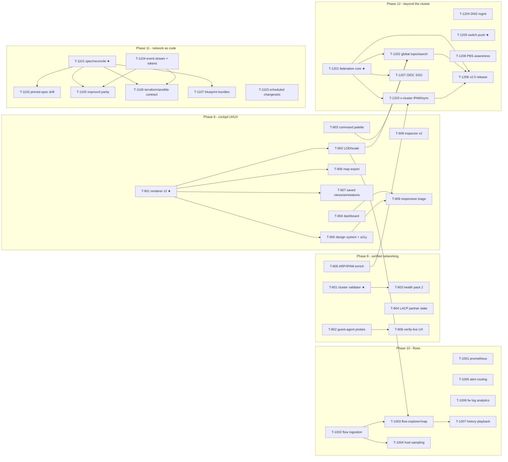

# Implementation plan — next-gen arc (Phases 8–12)

Companion to `docs/roadmap-next.md`, same contract as the v1 plan (`planning/implementation-plan.md`): the arc is decomposed into **37 tasks across 5 phases**, each specified as a self-contained task card in `planning/tasks/phase-N.md`, written to be executed by an AI sub-agent — Claude **Sonnet 5** unless the card says otherwise. Task numbering continues the v1 scheme: `T-8NN` … `T-12NN`; `depends:` entries with v1 IDs (T-001…T-703) refer to shipped code, not open work.

## How to dispatch a task to a sub-agent

Identical to v1 — standard dispatch prompt (fill in the ID):

> You are implementing part of vnprox. Working directory: the vnprox repo root.
> 1. Read `CLAUDE.md` and follow it exactly.
> 2. Read your task card **T-NNNN** in `planning/tasks/phase-N.md`, including its listed context documents.
> 3. Implement the task. Do not start work on other task cards; do not refactor code owned by other tasks except where your card says to integrate with it.
> 4. Definition of done: every acceptance criterion on the card passes and `make check` is green.
> 5. Finish with the report format from `CLAUDE.md`, and append it to `planning/reports/T-NNNN.md`.

Rules for the orchestrator (human or agent):

- Respect the dependency graph below; tasks whose dependencies are all merged may run **in parallel** (worktree isolation for concurrent tasks touching the same packages).
- **Model selection:** default `sonnet-5`. Cards marked `model: strong` — **T-801** (cluster-fold validator core), **T-901** (renderer core), **T-1101** (reconciliation core), **T-1201** (federation core), **T-1205** (switch write path) — use the strongest available model (Opus/Fable class) with high reasoning effort.
- **Frontend tasks** (all of Phase 9; T-806, T-1003, T-1005–T-1007, T-1202 and the other UI-bearing cards) prove their acceptance criteria with the frontend toolchain: Vitest + Testing Library for logic-bearing components, and the `web/e2e` Playwright harness for interaction, rendering, accessibility (axe), and performance evidence. UI bugs get reproduced in the harness, not diagnosed from minified traces.
- After each task lands, run `make check` on the integrated tree before dispatching dependents. CI budget note: `make check` and packaging tests run locally on the dev host (see `planning/reports/` conventions); GitHub Actions is not the gate.
- Review checkpoints (human or strong-model review before proceeding): **T-801** (validator semantics — false positives here poison trust in staging), **T-901** (renderer architecture before 8 tasks build on it), **T-1101** (spec/reconcile semantics about to freeze), **T-1103** (unattended apply — safety analysis section), **T-1205** (first write path to non-Proxmox hardware), pre-release **T-1208**.
- If a card conflicts with reality (doc drift, dependency task delivered differently), the agent flags it in its report; the orchestrator updates docs/cards before dispatching dependents. Docs stay authoritative.

## Dependency graph

Intra-arc edges only; v1 dependencies (all shipped) are listed on each card. ★ = `model: strong`.

Wide-parallelism examples: Phase 8 has four independent entry tasks (T-801, T-802, T-804, T-805); once T-901 lands, T-902/T-905/T-906/T-907 unblock together while T-903/T-904/T-908 never waited on it; T-1001/T-1002/T-1005/T-1006 are mutually independent; T-1103/T-1104 start alongside T-1101; in Phase 12, T-1204/T-1205/T-1206 don't need federation and can start on day one.

Cross-phase note: Phase 10 and Phase 11 are independent of each other and can interleave at the task level once Phase 9's T-902 has landed (T-1003's only phase-9 dependency).

## Task index

| Phase | Tasks | Theme | Release | File |
|---|---|---|---|---|
| 8 | T-801…T-806 | Verified networking: cluster validator, live probes, health pack 2, LACP, ARP/IPAM | v1.4 | [tasks/phase-8.md](tasks/phase-8.md) |
| 9 | T-901…T-909 | Cockpit UI & UX: renderer v2, LOD, palette, dashboard, design system/a11y, export, views, inspector, mobile | v1.5 | [tasks/phase-9.md](tasks/phase-9.md) |
| 10 | T-1001…T-1007 | Flows & observability: exporter, flow ingestion/explorer, sampling, alerts, fw analytics, playback | v1.6 | [tasks/phase-10.md](tasks/phase-10.md) |
| 11 | T-1101…T-1107 | Network as code: spec/reconcile, pinned drift, scheduling, events/tokens, CLI, TF/Ansible, bundles | v1.7 | [tasks/phase-11.md](tasks/phase-11.md) |
| 12 | T-1201…T-1208 | Beyond the cluster: federation, global views, x-cluster IPAM, DNS, switch push, PBS, SSO, release | v2.0 | [tasks/phase-12.md](tasks/phase-12.md) |

## Card format

Unchanged from v1: **ID · Title · model (`sonnet-5` unless noted) · size (S/M/L) · depends · context docs · objective · deliverables · acceptance criteria**, with acceptance criteria objectively checkable against named fixtures. New fixture families this arc introduces: flow-datagram captures (`testdata/flows/`), multi-cluster pvemock profiles, a mock gNMI switch, and a mock OIDC provider — cards that need one specify creating it as a deliverable.

## Standing constraints (arc-wide)

Restating the roadmap's invariants as orchestration rules, because every card inherits them:

1. **Change engine only.** Scheduled applies, spec imports, CLI/Terraform calls, DNS edits, switch pushes — every mutation path produces an ordinary changeset. The two boundary cases (external-IPAM sync writes in T-1203, switch writes in T-1205) define their own staged/audited confirm paths on the card.
2. **No interlock overrides, ever.** Unattended operation (T-1103) excludes `touchesMgmtPath` changesets server-side; switch push (T-1205) extends the mgmt-path interlocks to uplink ports.
3. **Proxmox owns config; federation owns nothing.** The store gains only app-owned data this arc: cluster registry, schedules, tokens, alert rules, annotations, saved views, external subnet records, switch credentials.
4. **Mock-first.** No card's acceptance criteria may require hardware; anything unprovable against mocks goes into `planning/reports/needs-hardware-validation.md` via the card's report.
5. **Frozen contracts.** `internal/topology` projection shapes are frozen for Phase 9 (renderer swap is presentation-only); the changeset API is declared stable at the end of Phase 11 — contract changes after that require a deprecation note in `docs/api.md`.

## What is deliberately *not* pre-specified

Same philosophy as v1: exact function signatures, file-by-file structure, and UI pixel details stay with the implementing agent; cards pin contracts (routes, types, event shapes, fixtures, budgets). Two additions this arc: performance claims (T-901's frame budget, T-1208's scale pass) must name their measurable proxy on the card, and external-repo deliverables (T-1106) pin the daemon-side contract here while leaving provider internals to their own repos.
