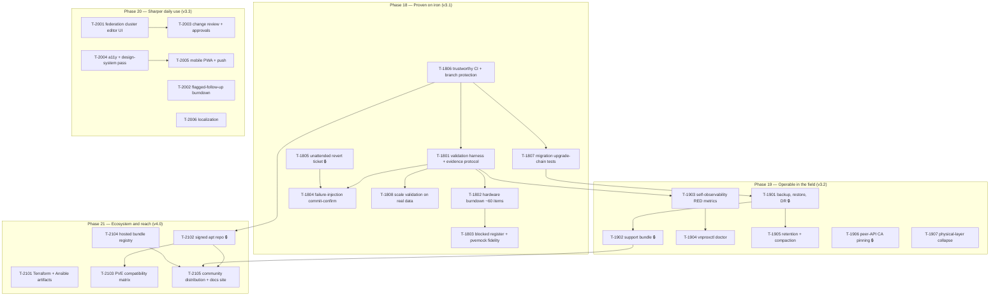

# Implementation plan — proven-in-production arc (Phases 18–21)

Companion to `docs/roadmap-proven.md`, same contract as the prior plans
(`planning/implementation-plan.md`, `-next.md`, `-universal.md`): the arc is decomposed into
**26 tasks across 4 phases**, each specified as a self-contained task card in
`planning/tasks/phase-N.md`, written to be executed by an AI sub-agent — Claude **Sonnet**-class
unless the card says otherwise. Task numbering continues the scheme: `T-18NN` … `T-21NN`;
`depends:` entries with IDs from prior arcs (`T-001`…`T-1707`, plus the post-v3.0.2 `T-1407` and
its v3.0.4 follow-ups) refer to **shipped code**, not open work.

This arc's decisions are recorded as **D1–D7** in `docs/roadmap-proven.md`'s Decisions section.
Cards cite them by ID. Changing a decision means reopening every card that cites it.

## What is different about this arc

Prior arcs built capability. This one produces **evidence, operability, and reach** — which
changes how tasks are executed in two ways every orchestrator must internalize:

1. **No agent touches Proxmox hardware (D5).** `CLAUDE.md`'s "you do NOT have a live Proxmox
   cluster" constraint stands unchanged, including for `pvecube`. Validation cards are split:
   an agent builds the harness and the expected-outcome table, a **human runs it**, and an agent
   triages the returned evidence. An agent may never tick a hardware checklist item it did not
   receive evidence for.
2. **"Validated" ≠ "mock-validated".** An item closed against `internal/pvemock` is
   mock-validated and must be recorded as such, however faithful T-1803 makes the mock. The
   blocked register (T-1803) is the authoritative list of what remains unproven on iron.

## How to dispatch a task to a sub-agent

Identical to prior arcs — standard dispatch prompt (fill in the ID):

> You are implementing part of vnprox. Working directory: the vnprox repo root.
> 1. Read `CLAUDE.md` and follow it exactly.
> 2. Read your task card **T-NNNN** in `planning/tasks/phase-N.md`, including its listed context documents.
> 3. Implement the task. Do not start work on other task cards; do not refactor code owned by other tasks except where your card says to integrate with it.
> 4. Definition of done: every acceptance criterion on the card passes and `make check` is green.
> 5. Finish with the report format from `CLAUDE.md`, and append it to `planning/reports/T-NNNN.md`.

For a card marked **`kind: validation`**, add:

> 6. This is a validation card. You have no access to Proxmox hardware. Your deliverable is the
>    harness, the expected-outcome table, and the triage — never an assertion about observed
>    hardware behavior. Produce the harness, then STOP and hand off for a human run. When
>    evidence is returned to you, triage it: tick items, commit the evidence blob under
>    `planning/validation/evidence/`, and open a bug card for every divergence.

Rules for the orchestrator (human or agent):

- Respect the dependency graph below; tasks whose dependencies are all merged **and
  review-cleared** may run **in parallel** (worktree isolation for concurrent tasks touching the
  same packages).
- **Model selection:** default executor is a **Sonnet-class sub-agent**. Cards marked
  `model: strong` — **T-1805** (unattended revert ticket), **T-1803** (multi-node mock fidelity),
  **T-1901** (backup/restore incl. key material), **T-1902** (support-bundle redaction),
  **T-1906** (peer CA pinning) — use an **Opus/Fable-class model with high reasoning effort**.
  Design work (card drafting, contract changes, safety analyses) is Opus-class regardless.
- **Adversarial review** carries forward as a standing rule from the previous arc: every merged
  task receives an adversarial Opus-class code review before any dependent task dispatches.
- **Heavyweight review checkpoints** (🔒 = security-sensitive): 🔒 **T-1805** (a sealed PVE
  ticket at rest, and an unattended code path that wields it), 🔒 **T-1901** (backup archives
  that may contain the session key), 🔒 **T-1902** (a support bundle that must not leak a token
  or a private key), 🔒 **T-1906** (peer trust anchor), 🔒 **T-2102** (package signing key
  handling), **T-1803** (a mock people will trust as a proxy for hardware — an over-permissive
  mock is worse than none).
- **Frontend cards** (T-1907, T-2001, T-2003, T-2004, T-2005, T-2006) prove their acceptance
  criteria with the frontend toolchain: Vitest + Testing Library for logic-bearing components,
  Playwright specs under `web/e2e/` for flows.
- **Validation cards** (`kind: validation`: T-1801, T-1802, T-1804, T-1808) are **two-turn
  minimum** by construction and must not be dispatched with an expectation of same-turn
  completion.

## Dependency graph

Edges are hard prerequisites only. Notable roots that can start immediately: **T-1806** (CI —
start here, everything downstream is validated by hand until it lands), **T-1805** (the revert
ticket is pure backend work with no validation dependency), **T-1907**, **T-2001**, **T-2002**,
**T-2004**, **T-2006**, **T-2101**, **T-2104**.

## Phases

| Phase | Tasks | Theme | Release | Cards |
|-------|-------|-------|---------|-------|
| 18 | T-1801…T-1808 | Proven on iron: evidence protocol, hardware burndown, blocked register + mock fidelity, failure injection, the revert-ticket hole, CI, migrations, scale | v3.1 | [tasks/phase-18.md](tasks/phase-18.md) |
| 19 | T-1901…T-1907 | Operable in the field: backup/restore, support bundle, self-metrics, doctor, retention, CA pinning, physical collapse | v3.2 | [tasks/phase-19.md](tasks/phase-19.md) |
| 20 | T-2001…T-2006 | Sharper daily use: federation UI, follow-up burndown, change review, a11y, PWA, i18n | v3.3 | [tasks/phase-20.md](tasks/phase-20.md) |
| 21 | T-2101…T-2105 | Ecosystem and reach: TF/Ansible artifacts, signed apt repo, compat matrix, registry, distribution | v4.0 | [tasks/phase-21.md](tasks/phase-21.md) |

## Sequencing advice

1. **T-1806 first, alone.** Until CI is green and required, every other card's "`make check` is
   green" definition-of-done is a claim rather than a gate.
2. **T-1805 early and in parallel.** It is the one genuine correctness hole in the product's
   core safety guarantee, it has no validation dependency, and T-1804's failure-injection
   scenarios need it to exist in order to prove the fw-only case heals.
3. **T-1801 before any other validation card.** The evidence protocol is what makes the burndown
   a bounded number of human turns instead of sixty.
4. **T-1803 after T-1802 has run at least once**, so the mock's new failure modes are informed
   by what real hardware actually did, not by what the card author guessed it would do.
5. **Phase 20 can run alongside Phase 19** — it shares no packages with the operability work
   except `vnproxctl` (T-1904 vs. nothing in 20) and is UI-weighted throughout.
6. **Do not start Phase 21 before T-1902 merges.** Distribution multiplies the cost of every
   unsupportable failure; the support bundle is what makes a stranger's broken install
   diagnosable.

## Card-author notes

- **The roadmap's 25 items map to 26 cards.** Roadmap item 1 ("hardware-validation burndown")
  splits into T-1801 (harness + evidence protocol) and T-1802 (the burndown itself), because the
  harness is a prerequisite deliverable with its own acceptance criteria. Every other item is
  1:1.
- **Phases 20 and 21 were carded before Phase 18 ran** (D4's accepted risk). Their cards are
  written against today's code and today's assumptions. Expect T-1802/T-1804 findings to add
  bug cards and possibly to revise Phase 20–21 scope; that is the anticipated cost of planning
  the whole arc up front, not a planning failure.
- **`planning/reports/needs-hardware-validation.md` is the burndown's source of truth** and is
  edited in place by T-1802's triage turns (items ticked with the PVE version tested). Do not
  fork it into a second checklist.
- **New directories this arc introduces**: `planning/validation/` (harness scripts, expected-
  outcome tables, and committed evidence blobs under `evidence/`). Named here so two cards do
  not invent two different layouts.
