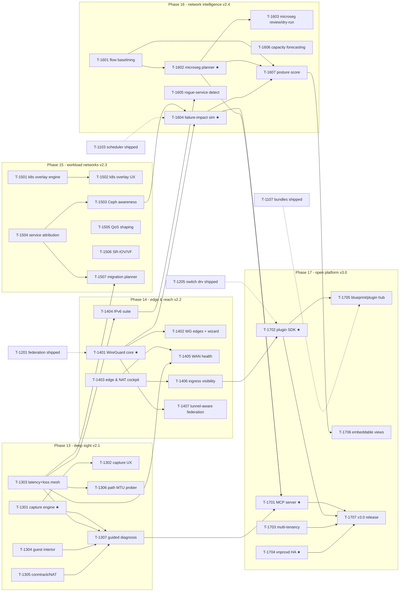

# Implementation plan — universal networking arc (Phases 13–17)

Companion to `docs/roadmap-universal.md`, same contract as the prior plans
(`planning/implementation-plan.md`, `planning/implementation-plan-next.md`): the arc is
decomposed into **35 tasks across 5 phases**, each specified as a self-contained task card in
`planning/tasks/phase-N.md`, written to be executed by an AI sub-agent — Claude **Sonnet**-class
unless the card says otherwise. Task numbering continues the scheme: `T-13NN` … `T-17NN`;
`depends:` entries with arc-1 IDs (T-001…T-703) or arc-2 IDs (T-801…T-1208) refer to shipped
code, not open work.

## How to dispatch a task to a sub-agent

Identical to prior arcs — standard dispatch prompt (fill in the ID):

> You are implementing part of vnprox. Working directory: the vnprox repo root.
> 1. Read `CLAUDE.md` and follow it exactly.
> 2. Read your task card **T-NNNN** in `planning/tasks/phase-N.md`, including its listed context documents.
> 3. Implement the task. Do not start work on other task cards; do not refactor code owned by other tasks except where your card says to integrate with it.
> 4. Definition of done: every acceptance criterion on the card passes and `make check` is green.
> 5. Finish with the report format from `CLAUDE.md`, and append it to `planning/reports/T-NNNN.md`.

Rules for the orchestrator (human or agent):

- Respect the dependency graph below; tasks whose dependencies are all merged **and
  review-cleared** may run **in parallel** (worktree isolation for concurrent tasks touching the
  same packages).
- **Model selection:** default executor is a **Sonnet-class sub-agent**. Cards marked
  `model: strong` — **T-1301** (capture engine/permission model), **T-1401** (WireGuard core),
  **T-1602** (microseg planner core), **T-1604** (failure-impact sim core), **T-1701** (MCP
  surface), **T-1702** (plugin SDK API), **T-1704** (vnproxd HA) — use an **Opus/Fable-class
  model with high reasoning effort**. Design work (card drafting, contract changes, safety
  analyses) is Opus-class regardless of the executing card's model.
- **Adversarial review (new this arc, standing rule):** every merged task receives an
  adversarial code review by an **Opus-class reviewer** before any dependent task dispatches.
  Findings at or above `major` severity reopen the task — it does not count as "merged" for
  dependency purposes until the review clears. This is additive to the heavyweight checkpoints
  below, and exists because this arc opens payload handling, key material, an AI write-adjacent
  surface, tenant isolation, and daemon HA — surfaces where a missed defect is a security
  incident, not a cosmetic bug.
- **Heavyweight review checkpoints** (deeper semantics-and-safety review before dependents build
  on the surface; 🔒 = security-sensitive): 🔒 **T-1301** (capture payload handling, cap
  enforcement), 🔒 **T-1401** (WireGuard key custody, mgmt-path coverage), **T-1602/T-1603**
  (microseg dry-run soundness — a false "safe to block" is an outage), **T-1604** (impact-model
  soundness before it gates T-1103 unattended pre-flight), 🔒 **T-1701** (no apply/confirm verb
  reachable via MCP; AI changesets labeled in audit), 🔒 **T-1702** (plugin capability
  scope/sandbox before the API freezes), 🔒 **T-1703** (tenant authz — server-side, cross-tenant
  leakage), 🔒 **T-1704** (split-brain of in-flight commit-confirm timers), **T-1707**
  (pre-release security + platform-freeze pass).
- **Frontend tasks** (T-1302, T-1402, T-1502, T-1603, and the other UI-bearing cards) prove
  their acceptance criteria with the frontend toolchain: Vitest + Testing Library for
  logic-bearing components, and the `web/e2e` Playwright harness for interaction, rendering,
  accessibility (axe), and performance evidence. UI bugs get reproduced in the harness, not
  diagnosed from minified traces.
- After each task lands, run `make check` on the integrated tree before dispatching dependents.
  CI budget note: `make check` and packaging tests run locally on the dev host; GitHub Actions
  is not the gate.
- If a card conflicts with reality (doc drift, dependency task delivered differently), the agent
  flags it in its report; the orchestrator updates docs/cards before dispatching dependents.
  Docs stay authoritative.

## Dependency graph

Intra-arc edges only; shipped-arc deps are listed on each card. ★ = `model: strong`. Dotted
edges to `*helper` nodes mark the load-bearing shipped-arc dependencies that most shape
sequencing.

Wide-parallelism examples: P13 has four independent entry tasks (T-1301/T-1303/T-1304/T-1305).
P14's roots are T-1401 and T-1403; T-1404 additionally waits on T-1303 (its per-family mesh
extension), so it is not shipped-deps-only. P15's four mutually independent entries are
T-1501/T-1504/T-1505/T-1506. P16's genuinely dependency-free roots are T-1601 and T-1606;
T-1605 waits on T-1404 (IPv6 RA visibility — its `unexpected_ra` check stays dark until then),
and T-1604 is the phase's cross-phase dependency magnet (T-1401, T-1503, shipped T-1103). P17's
independent platform roots are T-1702/T-1703/T-1704; T-1701 joins once its Phase 13/16 inputs
land, and T-1707 is the join of all four.

Cross-phase notes: Phases 13 and 14 interleave at the task level (T-1306's WireGuard-MTU path
and T-1307's tunnel ladder steps light up once T-1401 lands, but neither blocks on Phase 14).
Phase 16's independent roots (T-1601, T-1606) can begin as soon as shipped flow/metrics
surfaces allow; T-1604 waits on its specific 13/14/15 inputs. In Phase 17, T-1702 and T-1704
can begin early; T-1701 waits on the Phase 13/16 diagnostic and simulation surfaces it exposes.

## Task index

| Phase | Tasks | Theme | Release | File |
|---|---|---|---|---|
| 13 | T-1301…T-1307 | Deep sight: capture, latency mesh, guest interior, conntrack, MTU, diagnosis | v2.1 | [tasks/phase-13.md](tasks/phase-13.md) |
| 14 | T-1401…T-1407 | Edge & reach: WireGuard, edge/NAT, IPv6, WAN health, ingress, tunnel federation | v2.2 | [tasks/phase-14.md](tasks/phase-14.md) |
| 15 | T-1501…T-1507 | Workload networks: k8s, Ceph, service attribution, QoS, SR-IOV, migration planner | v2.3 | [tasks/phase-15.md](tasks/phase-15.md) |
| 16 | T-1601…T-1607 | Network intelligence: baselining, microseg, failure sim, rogue detect, forecast, posture | v2.4 | [tasks/phase-16.md](tasks/phase-16.md) |
| 17 | T-1701…T-1707 | Open platform: MCP, plugin SDK, tenancy, HA, hub, embeds, v3.0 release | v3.0 | [tasks/phase-17.md](tasks/phase-17.md) |

## Card format

Unchanged from prior arcs: **ID · Title · model (Sonnet-class unless noted) · size (S/M/L) ·
depends · context docs · objective · deliverables · acceptance criteria**, with acceptance
criteria objectively checkable against named fixtures. Strong-executor cards additionally carry
a **safety-analysis section** (T-703/T-1103/T-1205-style) cross-referenced by test names before
the card counts as done. New fixture families this arc introduces (each a deliverable of the
card that first needs it): mock capture agent + pcap corpus (T-1301), synthetic latency/loss
series (T-1303), guest-interior fixtures (T-1304), conntrack fixtures (T-1305), WireGuard state
fixtures (T-1401), edge/NAT fixtures (T-1403), IPv6 RA/SLAAC/DHCPv6 fixtures (T-1404),
reverse-proxy status doubles (T-1406), mock kubeconfig + k8s API with CNI variants (T-1501),
Ceph status fixtures (T-1503), SR-IOV PF/VF fixtures (T-1506), flow-baseline corpora (T-1601),
mock MCP client (T-1701), plugin conformance harness (T-1702), mock OIDC tenants (T-1703), and
a two-daemon HA replication harness (T-1704).

## Standing constraints (arc-wide)

Restating the roadmap's invariants as orchestration rules, because every card inherits them:

1. **Change engine only — including AI- and tenant-originated changes.** WireGuard tunnels,
   NAT/route ops, QoS shapes, VF provisioning, microseg policy, tenant request-changesets, and
   AI-proposed changesets from MCP all flow stage→validate→diff→apply→confirm/rollback. No card
   introduces a second mutation path; plugins may *stage*, never bypass.
2. **Read-only, forever, for carried-payload domains.** Kubernetes, Ceph, and ingress/
   reverse-proxy integrations carry no write scope; regression tests assert zero write surface.
3. **New domains store intent + audit only.** WireGuard on-node state, capture sessions, QoS
   shapes, k8s/Ceph read models — the owning system stays authoritative; vnprox never persists
   a shadow copy as authoritative state.
4. **Bounded retention, one deliberate exception.** Captures, latency/loss series, conntrack
   views, and baselines carry explicit size/age bounds and export paths; T-1606's downsampled
   long-term aggregates are the arc's only retention extension — named, bounded, exportable.
5. **No interlock overrides, ever.** mgmt-path interlocks extend to WireGuard tunnels carrying
   the management path; unattended apply still excludes `touchesMgmtPath` server-side with no
   bypass; the MCP surface cannot reach apply/confirm; T-1604 gates the scheduler's unattended
   pre-flight without granting an override.
6. **Mock-first / needs-hardware-validation.** No acceptance criterion may require hardware;
   anything provable only on real hardware (SR-IOV, WireGuard kernel quirks, real CNI/Ceph/IdP
   variance, VIP failover timing) is flagged from day one into
   `planning/reports/needs-hardware-validation.md`.
7. **Cluster- and federation-aware by default.** Capture, mesh, conntrack, WireGuard, k8s/Ceph
   overlays, tenancy, and HA all work across peers and federated clusters, not localhost-only.
8. **Docs stay authoritative.** New routes/ops/types land in `docs/api.md` /
   `docs/data-model.md` / `docs/security.md` in the same change.

## What is deliberately *not* pre-specified

Same philosophy as prior arcs: exact function signatures, file-by-file structure, and UI pixel
details stay with the implementing agent; cards pin contracts (routes, types, event shapes,
fixtures, budgets). Additions this arc: statistical claims (T-1601's anomaly explanations,
T-1606's forecasts) must name their measurable proxy on the card; external-repo deliverables
(T-1705's registry client, T-1706's Grafana panels) pin the daemon-side contract here while
leaving external internals to their own repos; and the platform interfaces frozen at v3.0
(plugin API, MCP surface, event stream) may evolve freely *until* T-1707 declares the freeze.
