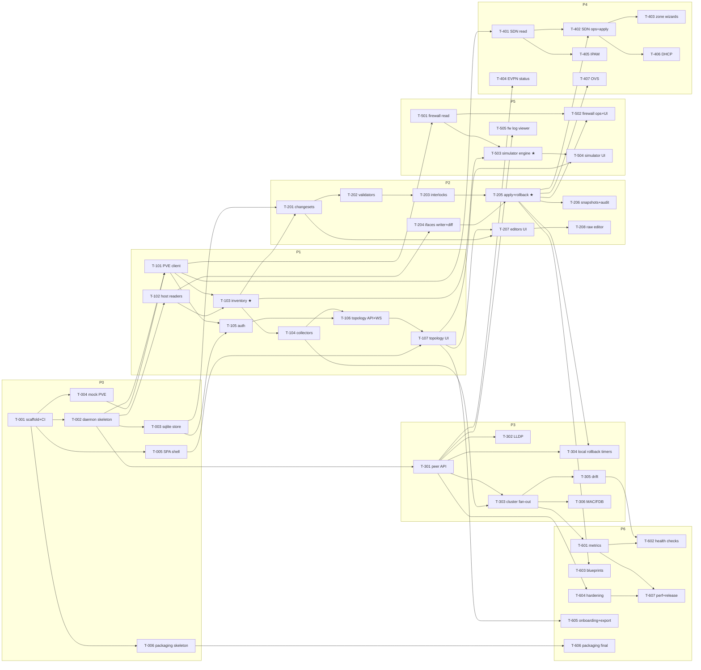

# Implementation plan

> **Scope note (2026-08-27).** The dependency graph and dispatch rules below describe **Phases 0–6,
> the v1.0 build** — 37 tasks, T-001…T-607, all long since delivered. Everything after v1.0 was
> planned in `planning/tasks/phase-N.md` files that were never folded back into this index, so for
> a year this document silently described a seventh of the project. The full phase index now lives
> in **[Task index](#task-index)** below and covers Phases 0–41. The v1.0 dependency graph is kept
> as-is for provenance; it is history, not a live plan. Post-1.0 sequencing lives in each phase
> file, and the current forward plan is
> [`planning/roadmap-open-source.md`](roadmap-open-source.md).

The v1.0 build was decomposed into **37 tasks across 7 phases**, each specified as a self-contained task card in `planning/tasks/phase-N.md`, written to be executed by an AI sub-agent (Claude **Sonnet 5** unless the card says otherwise). Phases match `docs/roadmap.md`.

## How to dispatch a task to a sub-agent

Standard dispatch prompt (fill in the ID):

> You are implementing part of vnprox. Working directory: the vnprox repo root.
> 1. Read `CLAUDE.md` and follow it exactly.
> 2. Read your task card **T-NNN** in `planning/tasks/phase-N.md`, including its listed context documents.
> 3. Implement the task. Do not start work on other task cards; do not refactor code owned by other tasks except where your card says to integrate with it.
> 4. Definition of done: every acceptance criterion on the card passes and `make check` is green.
> 5. Finish with the report format from `CLAUDE.md`, and append it to `planning/reports/T-NNN.md`.

Rules for the orchestrator (human or agent):

- Respect the dependency graph below; tasks whose dependencies are all merged may run **in parallel** (worktree isolation recommended for concurrent tasks touching the same packages).
- **Model selection:** default `sonnet-5`. Cards marked `model: strong` (T-103, T-205, T-503) involve subtle correctness cores — use the strongest available model (Opus/Fable class) with high reasoning effort.
- After each task lands, run `make check` on the integrated tree before dispatching dependents.
- Review checkpoints (human or strong-model review before proceeding): end of Phase 0 (contracts about to freeze), T-205 (safety core), T-301 (security boundary), T-503 (truth core), pre-release T-607.
- If a card conflicts with reality (doc drift, dependency task delivered differently), the agent must flag it in its report; the orchestrator updates docs/cards before dispatching dependents. Keep the docs authoritative.

## Dependency graph

★ = `model: strong`. Wide parallelism examples: once T-205 lands, T-206/T-304/T-402/T-407/T-502/T-603 unblock together; P3's T-301 chain is independent of P2's editor chain.

## Task index

| Phase | Tasks | Theme | File |
|---|---|---|---|
| 0 | T-001…T-006 | Foundations: scaffold, daemon, store, mock PVE, SPA shell, packaging | [tasks/phase-0.md](tasks/phase-0.md) |
| 1 | T-101…T-107 | Read-only visibility: PVE client, host readers, inventory, auth, topology | [tasks/phase-1.md](tasks/phase-1.md) |
| 2 | T-201…T-208 | Change engine: changesets, validators, interlocks, apply/rollback, editors | [tasks/phase-2.md](tasks/phase-2.md) |
| 3 | T-301…T-306 | Cluster & discovery: peer API, LLDP, fan-out, drift | [tasks/phase-3.md](tasks/phase-3.md) |
| 4 | T-401…T-407 | SDN & IPAM: cockpit, wizards, EVPN, IPAM, DHCP, OVS | [tasks/phase-4.md](tasks/phase-4.md) |
| 5 | T-501…T-505 | Firewall & simulator | [tasks/phase-5.md](tasks/phase-5.md) |
| 6 | T-601…T-607 | Operations & 1.0: metrics, health, blueprints, hardening, release | [tasks/phase-6.md](tasks/phase-6.md) |

### Post-1.0 phases

Delivered unless marked otherwise. Cards live in each phase file; these were planned as waves
rather than as one dependency graph, which is why they were never merged into the mermaid diagram
above.

| Phase | Theme | File |
|---|---|---|
| 7 | Post-1.0: functional-by-default SDN and the management path | [tasks/phase-7.md](tasks/phase-7.md) |
| 8 | Verified networking | [tasks/phase-8.md](tasks/phase-8.md) |
| 9 | Cockpit UI & UX | [tasks/phase-9.md](tasks/phase-9.md) |
| 10 | Flows & observability | [tasks/phase-10.md](tasks/phase-10.md) |
| 11 | Network as code & automation | [tasks/phase-11.md](tasks/phase-11.md) |
| 12 | Beyond the cluster (v2.0) | [tasks/phase-12.md](tasks/phase-12.md) |
| 13 | Deep sight: the troubleshooting layer (v2.1) | [tasks/phase-13.md](tasks/phase-13.md) |
| 14 | Edge & reach: the network beyond the bridge (v2.2) | [tasks/phase-14.md](tasks/phase-14.md) |
| 15 | Workload & infrastructure networks (v2.3) | [tasks/phase-15.md](tasks/phase-15.md) |
| 16 | Network intelligence | [tasks/phase-16.md](tasks/phase-16.md) |
| 17 | The open platform (v3.0) — platform API freeze (D10) | [tasks/phase-17.md](tasks/phase-17.md) |
| 18 | Proven on iron (v3.1) | [tasks/phase-18.md](tasks/phase-18.md) |
| 19 | Operable in the field (v3.2) | [tasks/phase-19.md](tasks/phase-19.md) |
| 20 | Sharper daily use (v3.3) | [tasks/phase-20.md](tasks/phase-20.md) |
| 21 | Ecosystem and reach (v4.0) | [tasks/phase-21.md](tasks/phase-21.md) |
| 22 | Online help | [tasks/phase-22.md](tasks/phase-22.md) |
| 23 | Certificate management | [tasks/phase-23.md](tasks/phase-23.md) |
| 24 | Operator leverage | [tasks/phase-24.md](tasks/phase-24.md) |
| 25 | Proof that runs itself | [tasks/phase-25.md](tasks/phase-25.md) |
| 26 | Guardrails | [tasks/phase-26.md](tasks/phase-26.md) |
| 27 | Config as code | [tasks/phase-27.md](tasks/phase-27.md) |
| 28 | Adoption | [tasks/phase-28.md](tasks/phase-28.md) |
| 29 | Make v4.0 true | [tasks/phase-29.md](tasks/phase-29.md) |
| 30 | The visible product | [tasks/phase-30.md](tasks/phase-30.md) |
| 31 | All of Proxmox networking | [tasks/phase-31.md](tasks/phase-31.md) |
| 32 | Proven on iron | [tasks/phase-32.md](tasks/phase-32.md) |
| 33 | In the world | [tasks/phase-33.md](tasks/phase-33.md) |
| 34 | Stripe-style cockpit shell (+ [followup](tasks/phase-34-followup.md)) | [tasks/phase-34.md](tasks/phase-34.md) |
| 35 | Device-model topology, and the badge that cried drift | [tasks/phase-35.md](tasks/phase-35.md) |
| 36 | Actionable findings: every flagged item offers its fix | [tasks/phase-36.md](tasks/phase-36.md) |
| 37 | Close the gap between "shipped" and "working" | [tasks/phase-37.md](tasks/phase-37.md) |
| **38** | **Open the source** — planned, not started | [tasks/phase-38.md](tasks/phase-38.md) |
| **39** | **Deepen the map** — planned, not started | [tasks/phase-39.md](tasks/phase-39.md) |
| **40** | **Operate at scale** — planned, not started | [tasks/phase-40.md](tasks/phase-40.md) |
| **41** | **Intelligence & envelope** — planned, not started | [tasks/phase-41.md](tasks/phase-41.md) |
| **42–51** | **The visual product** — 100 enhancements, planned, cards not yet stubbed | [roadmap-visual.md](roadmap-visual.md) |

Phases 38–41 are the 50 enhancements scoped in
[`planning/roadmap-open-source.md`](roadmap-open-source.md), which also carries their sequencing,
the Wave 0 debt gate that precedes them, and the owner decisions on the critical path.

Phases 42–51 are the 100 visual enhancements scoped in
[`planning/roadmap-visual.md`](roadmap-visual.md) — design language, canvas quality, and a
picture-first counterpart for every table-first page. Their card stubs (`tasks/phase-42.md` …
`tasks/phase-51.md`) are written when a phase is dispatched, not up front.

## Card format

Every card: **ID · Title · model (`sonnet-5` unless noted) · size (S/M/L) · depends · context docs · objective · deliverables · acceptance criteria**. Acceptance criteria are the definition of done and are written to be objectively checkable (a test passes, an endpoint returns a shape, a UI behavior demonstrable against a named pvemock fixture).

## What is deliberately *not* pre-specified

Exact function signatures, file-by-file structure within a package, and UI pixel details — cards specify contracts (routes, types, behaviors, fixtures) and leave construction to the implementing agent. Where two tasks share a contract, that contract lives in `docs/api.md` / `docs/data-model.md`, which is why those documents are frozen: **changing a contract requires updating the doc in the same change and flagging it**, never a silent divergence.
