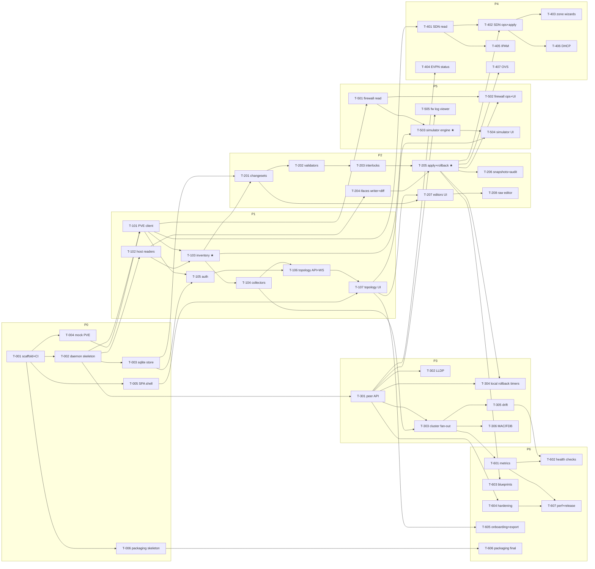

# Implementation plan

The build is decomposed into **37 tasks across 7 phases**, each specified as a self-contained task card in `planning/tasks/phase-N.md`, written to be executed by an AI sub-agent (Claude **Sonnet 5** unless the card says otherwise). Phases match `docs/roadmap.md`.

## How to dispatch a task to a sub-agent

Standard dispatch prompt (fill in the ID):

> You are implementing part of vnprox. Working directory: the vnprox repo root.
> 1. Read `CLAUDE.md` and follow it exactly.
> 2. Read your task card **T-NNN** in `planning/tasks/phase-N.md`, including its listed context documents.
> 3. Implement the task. Do not start work on other task cards; do not refactor code owned by other tasks except where your card says to integrate with it.
> 4. Definition of done: every acceptance criterion on the card passes and `make check` is green.
> 5. Finish with the report format from `CLAUDE.md`, and append it to `planning/reports/T-NNN.md`.

Rules for the orchestrator (human or agent):

- Respect the dependency graph below; tasks whose dependencies are all merged may run **in parallel** (worktree isolation recommended for concurrent tasks touching the same packages).
- **Model selection:** default `sonnet-5`. Cards marked `model: strong` (T-103, T-205, T-503) involve subtle correctness cores — use the strongest available model (Opus/Fable class) with high reasoning effort.
- After each task lands, run `make check` on the integrated tree before dispatching dependents.
- Review checkpoints (human or strong-model review before proceeding): end of Phase 0 (contracts about to freeze), T-205 (safety core), T-301 (security boundary), T-503 (truth core), pre-release T-607.
- If a card conflicts with reality (doc drift, dependency task delivered differently), the agent must flag it in its report; the orchestrator updates docs/cards before dispatching dependents. Keep the docs authoritative.

## Dependency graph

★ = `model: strong`. Wide parallelism examples: once T-205 lands, T-206/T-304/T-402/T-407/T-502/T-603 unblock together; P3's T-301 chain is independent of P2's editor chain.

## Task index

| Phase | Tasks | Theme | File |
|---|---|---|---|
| 0 | T-001…T-006 | Foundations: scaffold, daemon, store, mock PVE, SPA shell, packaging | [tasks/phase-0.md](tasks/phase-0.md) |
| 1 | T-101…T-107 | Read-only visibility: PVE client, host readers, inventory, auth, topology | [tasks/phase-1.md](tasks/phase-1.md) |
| 2 | T-201…T-208 | Change engine: changesets, validators, interlocks, apply/rollback, editors | [tasks/phase-2.md](tasks/phase-2.md) |
| 3 | T-301…T-306 | Cluster & discovery: peer API, LLDP, fan-out, drift | [tasks/phase-3.md](tasks/phase-3.md) |
| 4 | T-401…T-407 | SDN & IPAM: cockpit, wizards, EVPN, IPAM, DHCP, OVS | [tasks/phase-4.md](tasks/phase-4.md) |
| 5 | T-501…T-505 | Firewall & simulator | [tasks/phase-5.md](tasks/phase-5.md) |
| 6 | T-601…T-607 | Operations & 1.0: metrics, health, blueprints, hardening, release | [tasks/phase-6.md](tasks/phase-6.md) |

## Card format

Every card: **ID · Title · model (`sonnet-5` unless noted) · size (S/M/L) · depends · context docs · objective · deliverables · acceptance criteria**. Acceptance criteria are the definition of done and are written to be objectively checkable (a test passes, an endpoint returns a shape, a UI behavior demonstrable against a named pvemock fixture).

## What is deliberately *not* pre-specified

Exact function signatures, file-by-file structure within a package, and UI pixel details — cards specify contracts (routes, types, behaviors, fixtures) and leave construction to the implementing agent. Where two tasks share a contract, that contract lives in `docs/api.md` / `docs/data-model.md`, which is why those documents are frozen: **changing a contract requires updating the doc in the same change and flagging it**, never a silent divergence.
